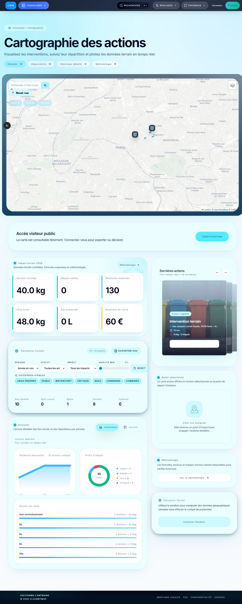

# CleanMyMap

<p align="center">
  
</p>

<p align="center">
  <strong>Plateforme citoyenne pour déclarer, visualiser et exporter des actions de dépollution.</strong>
</p>

<p align="center">
  <a href="https://cleanmymap.vercel.app">Demo</a> ·
  <a href="https://github.com/maxd4/CleanMyMap/issues">Issues</a> ·
  <a href="https://github.com/maxd4/CleanMyMap/blob/main/documentation/README.md">Documentation</a>
</p>

<p align="center">
  
  
  
  
  
  
</p>

## Aperçu rapide

<table align="center">
  <tr>
    <td align="center" width="33%">
      <strong>Live demo</strong><br />
      <a href="https://cleanmymap.vercel.app">cleanmymap.vercel.app</a><br />
      Version publique
    </td>
    <td align="center" width="33%">
      <strong>Documentation</strong><br />
      <a href="./documentation/README.md">Index du projet</a><br />
      Architecture, design system, sécurité
    </td>
    <td align="center" width="33%">
      <strong>Stack</strong><br />
      Next.js · TypeScript · Supabase<br />
      Clerk · Vercel
    </td>
  </tr>
</table>

## En bref

CleanMyMap est une monorepo civic-tech centrée sur le terrain, la cartographie et le pilotage.

- Déclarer des actions de dépollution et suivre leurs impacts.
- Explorer les rubriques du produit par blocs fonctionnels.
- Gérer les accès, les rôles et les parcours selon le profil utilisateur.
- Synchroniser les données avec Supabase, Clerk et Vercel.
- Maintenir une documentation riche pour l'équipe, les agents IA et l'exploitation.

## Origine / About

CleanMyMap a été initié et conçu par **Maxence Deroome**. Le lancement initial du dépôt est horodaté au **5 mars 2026** dans l'historique Git.

La page de référence "Origin / About" est documentée ici:
- [`documentation/origin-about.md`](./documentation/origin-about.md)
- [`AUTHORS.md`](./AUTHORS.md)

Règles de traçabilité recommandées:
- publier des releases datées et identifiées par des tags Git
- signer les tags et releases quand c'est possible
- conserver une attribution claire dans les commits, la documentation et l'historique

Statut licence:
- le projet reste publié en open source, mais le choix exact de licence est encore à arbitrer
- les options étudiées pour un projet bénévole et communautaire sont principalement AGPLv3, GPLv3, MPL 2.0 et Apache 2.0
- la décision finale sera prise après avis de personnes compétentes, afin de garder une trace claire sans figer le cadre trop tôt

## Ce qui est actif

- L'application de production est dans [`apps/web`](./apps/web).
- Le code Python de maintenance est archivé dans [`maintenance/python`](./maintenance/python) et n'est plus dans le runtime actif.
- La documentation structurée vit dans [`documentation`](./documentation).

## Aperçu produit

<p align="center">
  
</p>

## Démarrage rapide

```bash
npm install
npm run dev
```

Puis ouvrir `http://localhost:3000` si le port est libre, sinon le script bascule automatiquement vers le premier port disponible suivant.

## Commandes utiles

```bash
npm run dev                 # Démarrer l'application web
npm run build               # Build de production
npm run lint                # ESLint
npm run typecheck           # Vérification TypeScript
npm run test                # Tests unitaires
npm run checks              # Vérification globale du projet
npm run screenshots         # Captures d'écran de documentation
```

## Architecture du dépôt

| Chemin | Rôle |
| --- | --- |
| [`apps/web`](./apps/web) | Application Next.js, routes API, composants UI |
| [`documentation`](./documentation) | Architecture, design system, sécurité, opérations, sessions |
| [`scripts`](./scripts) | Automatisations de maintenance et garde-fous |
| [`companion-app`](./companion-app) | Application compagnon mobile |
| [`maintenance/python`](./maintenance/python) | Outils Python de maintenance hors runtime |

## Documentation clé

- [`documentation/README.md`](./documentation/README.md)
- [`documentation/architecture/README.md`](./documentation/architecture/README.md)
- [`documentation/design-system/README.md`](./documentation/design-system/README.md)
- [`documentation/security/README.md`](./documentation/security/README.md)
- [`documentation/operations/README.md`](./documentation/operations/README.md)
- [`apps/web/README.md`](./apps/web/README.md)

## Qualité et sécurité

- Garde-fous locaux dans [`PRE_PUSH_GUARD.md`](./PRE_PUSH_GUARD.md)
- Règles persistantes dans [`AGENTS.md`](./AGENTS.md)
- Audit secrets: `npm run security:secrets`
- Validation complète: `npm run checks`

## Flow de contribution

1. Lire [`AGENTS.md`](./AGENTS.md) et le contexte projet.
2. Travailler dans la branche courante, sans worktree parallèle.
3. Lancer les vérifications utiles.
4. Mettre à jour la documentation quand une structure ou un comportement change.
5. Pour les contributions externes significatives, demander un engagement DCO ou un CLA selon le niveau de gouvernance retenu.

## Notes d'exploitation

Pour l'initialisation backend et les variables d'environnement, voir [`apps/web/README.md`](./apps/web/README.md).

## Licence

ISC
