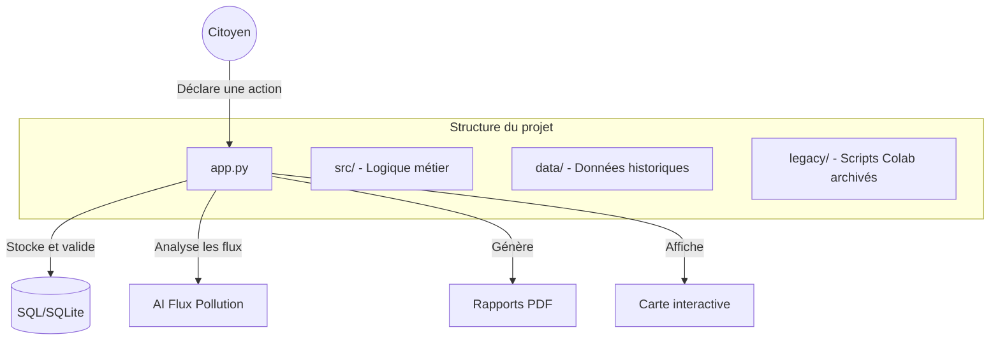

# 🌿 Clean my Map • Plateforme citoyenne pour les actions bénévoles de dépollution

https://cleanmymap.streamlit.app

**Clean my Map** est une solution bénévole engagée en faveur de l'environnement. Son objectif principal est de mutualiser les résultats des actions bénévoles de dépollution des rues (cleanwalk). La visualisation se fait sur une carte interactive.
D'autres fonctionnalités permettent un engagement et un partage sur l'écologie, mais aussi sur l'aide humanitaire et sociale et le développement durable.

Cet outil transforme chaque ramassage bénévole en donnée scientifique utile pour inciter à l'action.

## ✅ Mises à jour récentes
- **Moteur de routage IA v2** : itinéraires sélectifs (Mégots vs Déchets) et adaptation au groupe.
- **Protocole scientifique simplifié** : inventaire par macro-catégories pour gagner du temps terrain.
- **Espace décision** : export de jeux de données pour chercheurs et générateur de courriers officiels.
- Les indicateurs **S** et **C** ont été réalignés sur les **fréquences physiques**.

## 🚀 Vision et impact
L'objectif est de rendre visible l'invisible. Un seul mégot pollue jusqu'à 1000 litres d'eau ; **Clean my Map** permet de mesurer précisément l'impact de chaque action citoyenne et d'accompagner les collectivités vers des solutions durables.

### Fondamentaux du projet
- **Engagement** : valorisation des bénévoles et des partenaires locaux ("Médaille Verte").
- **Science** : export de données anonymisées aux standards E-PRTR pour la recherche (Surfrider, ADEME).
- **Intelligence** : prédiction des flux de pollution par analyse topographique (ruissellement).

---

## 🏗️ Architecture du système



### Structure des fichiers
- `app.py` : point d'entrée principal de l'application Streamlit.
- `src/` : moteur de l'application (base de données, services, UI).
- `data/` : fichiers de données historiques (Excel) et base locale.
- `legacy/` : archives des anciens scripts de recherche et Colab.
- `requirements.txt` : dépendances Python du projet.

---

## 🛠️ Installation et déploiement

### 1. Cloner le projet
```bash
git clone https://github.com/votre-compte/cleanmymap-app.git
cd cleanmymap-app
```

### 2. Installer les dépendances
```bash
pip install -r requirements.txt
```

### 3. Lancer l'application
```bash
streamlit run app.py
```

---

## 🔐 Sécurité et configuration
L'application utilise une authentification Google (OIDC) pour l'accès administrateur.
Configurez vos secrets dans le dashboard Streamlit ou via un fichier `.env` :

- `CLEANMYMAP_ADMIN_SECRET_CODE` : code de double authentification.
- `CLEANMYMAP_SHEET_URL` : source de données historique (Google Sheets).
- `SENDGRID_API_KEY` : envoi de la Gazette automatisée.

---

## 🤝 Contribution et science citoyenne
Les données de **Clean my Map** sont ouvertes à la communauté scientifique. Les administrateurs peuvent générer un export anonymisé dans l'onglet Admin pour les besoins de recherche environnementale.

---
*Projet propulsé par les Brigades Vertes - Veiller ensemble sur notre territoire.*

## 🧪 Clone de travail local (`APPLI`)
Pour travailler sur une copie locale dédiée, un clone du repo peut être créé dans `/workspace/APPLI` :

```bash
git clone /workspace/CleanmyMap /workspace/APPLI
```

## Journal de changements, monitoring UX et E2E
- Journal de changements produit : visible directement dans l'app (bloc repliable).
- Monitoring UX : suivi en base des erreurs de validation et des actions cassées.
- Dashboard admin : indicateurs UX (30 jours) + journal des événements.
- Tests E2E Playwright : flux critiques déclaration, carte, rapport.

### Lancer les tests E2E
```bash
npx.cmd playwright test
```

Configuration : `playwright.config.cjs`  
Specs : `e2e/tests/critical-flows.spec.js`

## Sécurité admin
- `CLEANMYMAP_ADMIN_SECRET_CODE` : secret requis pour l'espace admin.
- `CLEANMYMAP_ADMIN_EMAILS` : liste d'emails Google autorisés (séparés par des virgules).
- `CLEANMYMAP_ADMIN_REQUIRE_ALLOWLIST` : `1` (défaut) impose une allowlist admin non vide.
- Si l'allowlist est absente ou vide, l'accès admin est bloqué (deny by default) avec message explicite.
- `CLEANMYMAP_ADMIN_MAX_ATTEMPTS` : nombre max de tentatives avant verrouillage temporaire.
- `CLEANMYMAP_ADMIN_LOCKOUT_MINUTES` : durée de verrouillage en minutes.
- `CLEANMYMAP_ADMIN_BACKOFF_MAX_SECONDS` : attente exponentielle max entre tentatives.

## Setup test reproductible
- Installer l'environnement : `powershell -ExecutionPolicy Bypass -File scripts/setup_test_env.ps1`
- Exécuter tous les checks : `powershell -ExecutionPolicy Bypass -File scripts/run_checks.ps1`

## Déblocage accès repo (Windows)
- Commande unique de déblocage des accès et vérifications d'écriture :
  - `powershell -ExecutionPolicy Bypass -File scripts/unblock_repo_access.ps1 -Root .`
- Ce script :
  - arrête les process du repo (optionnel),
  - retire le flag read-only hors `.git`,
  - ré-applique les ACL FullControl pour l'utilisateur courant,
  - active `git core.longpaths` et ajoute le repo en `safe.directory`,
  - valide l'accès lecture/écriture sur des fichiers clés.

## Maintenance UI et cleanup (portable)

### Commandes principales
- Régénérer la baseline UI (action mainteneur, commit intentionnel) :
  - `python -m scripts.ui_inventory regenerate --write-baseline`
- Vérifier la dérive UI (lecture seule) :
  - `python -m scripts.ui_inventory check --baseline docs/wiki/ui_inventory.baseline.json`
- Diagnostic cleanup non destructif :
  - `python -m scripts.ui_inventory cleanup --dry-run`
- Compatibilité legacy (shim déprécié) :
  - `python scripts/regenerate_ui_inventory_baseline.py --root .`

### Artefacts canoniques
- Baseline versionnée : `docs/wiki/ui_inventory.baseline.json`
- Snapshot runtime (non versionné) : `artifacts/ui_inventory.current.json`
- Diff runtime (non versionné) : `artifacts/ui_inventory.diff.md`

### Quand exécuter quoi
- `regenerate --write-baseline` : après changement intentionnel de structure UI (onglets, renderers, admin components).
- `check` : avant PR et automatiquement en CI (`.github/workflows/ui-inventory.yml`).
- `cleanup --dry-run` : pour identifier les références UI orphelines/manquantes sans modifier les fichiers.
- `python scripts/ci_cleanup.py --root . --check` : vérification hygiène explicite dans la CI principale (`.github/workflows/ci.yml`).
- `python scripts/normalize_utf8.py --root . --check` : vérification explicite encodage UTF-8 (sans BOM) + détection mojibake dans la CI principale.
- `python scripts/normalize_utf8.py --root . --write` : normalisation locale non destructive des fichiers texte versionnés.

### Différence baseline vs cleanup
- `scripts.ui_inventory regenerate --write-baseline` : met à jour la référence.
- `scripts.ui_inventory check` : compare l'état courant à la référence (dérive = code retour 3).
- `scripts.ui_inventory cleanup --dry-run` : rapport de nettoyage non destructif.

### Action UI "maintenance"
- Emplacement : onglet `Espace Collectivités`, section `maintenance & sauvegarde`.
- Usage : cliquer sur `Lancer un diagnostic maintenance (sans modification)`.
- Comportement :
  - affiche un statut global `Conforme` / `Points à corriger`,
  - détaille les règles en langage métier + actions recommandées,
  - applique un cache court (5 min) et un cooldown session (~45s),
  - n'efface, ne réécrit et ne modifie aucun fichier.

## Documentation requirements (mandatory)

## Temporary Documentation Freeze (Token-Saving)

Status: ACTIVE (re-enabled after documentation refresh, 2026-04-02).

During this temporary freeze, documentation updates are paused to save tokens for all files except `plan.txt` at the repository root.

- Deferred documentation items are tracked in: `plan.txt` (section "Documentation freeze backlog").
- Documentation updates resume only when this explicit event occurs:
  - Functional milestone reached and confirmed: `pytest -v` passes and critical integration flows (map, report, CSV export) are validated.

Documentation is a **deliverable**, not an optional follow-up. A change is not complete until both locations below are updated.

- Every new feature, bug fix, behavioral change, configuration change, UX/UI change, architectural change, or significant implementation update must be documented in:
  - this `README.md` (user-facing summary + entry in "Latest documented update"),
  - the software wiki under `docs/wiki/` (structured technical entry with all required fields).
- Documentation must be clear, accurate, up to date, consistent across both locations, and useful to both end users and developers.
- If one location is missing, the change is considered undocumented.

### Documentation checklist (mandatory before closing any task)

```text
[ ] README: "Latest documented update" entry added
[ ] Wiki CHANGELOG: structured entry added (What / Why / Where / Validation / Compatibility)
[ ] If user-facing: usage described for end users
[ ] If dev-facing: maintenance/extension guidance present
[ ] No contradictions between README and wiki
[ ] Dedicated wiki page created/updated if change is architectural
```

### Wiki index
- Index: `docs/wiki/README.md`
- Policy (full checklist): `docs/wiki/DOCUMENTATION_POLICY.md`
- Changelog: `docs/wiki/CHANGELOG.md`
- Maintenance commands: `docs/wiki/MAINTENANCE.md`
- UI Inventory contract: `docs/wiki/UI_INVENTORY.md`
- Navigation architecture: `docs/wiki/NAVIGATION_ARCHITECTURE.md`

### Latest documented update
- `2026-04-02`: **Maintainability & Preventive Quality Hardening** - Routing/admin contracts aligned, allowlist policy wiring fixed, Supabase/admin secret handling hardened, deprecated references removed from active scripts, and preventive guardrails added (static checks, root hygiene, module import sweep, runtime DB seed robustness). CI now includes explicit bootstrap smoke (`python -c "import app"`).
- `2026-03-28`: **AI Routing Engine v2 & Selective Missions** — upgraded to a greedy TSP algorithm with priority targeting (Mégots/Déchets), neighborhood geocoding, and group-size logistics.
- `2026-03-28`: **Simplified Participatory Science Protocol** — switch to macro-category auditing (Plastique, Verre, Métal, Papier) and streamlined brand identification for faster volunteer field operations.
- `2026-03-28`: **Institutional Dashboard & Research Export** — added research-grade CSV exports and official mayoral letter generator (PDF) with localized impact statistics.
- `2026-03-28`: **Documentation policy strengthened** — `docs/wiki/DOCUMENTATION_POLICY.md` fully rewritten with per-field content requirements, quality rules, prohibited patterns, and a 12-item delivery checklist. Documentation is now treated as a mandatory deliverable for every change.
- `2026-03-28`: **Navigation architecture refactored** — 6 piliers (19 tabs) restructured into 5 piliers (16 visibles + 2 par URL) aligned on user intent: Tableau de bord / Agir / Explorer / Mon espace / Coordination. Météo moved into Agir (1 click from declaration). Sidebar extended to 3 quick-access buttons. Full reference in `docs/wiki/NAVIGATION_ARCHITECTURE.md`.
- `2026-03-27`: volunteer feedback form added to the declaration flow (suggestions + bug reports, validation, DB persistence).
- `2026-03-27`: monolith reduction pass on `app.py` completed: impact reporting and Google Sheet ingestion extracted into dedicated services (`src/services/impact_reporting.py`, `src/services/sheet_actions.py`) with regression tests.
- `2026-03-27`: UI monolith split started: map/report/admin tabs extracted from `app.py` into dedicated modules (`src/ui/map.py`, `src/ui/report.py`, `src/ui/admin.py`) and typed domain dataclasses introduced in `src/models/domain.py`.
- `2026-03-28`: maintenance diagnostic UI switched to a shared read-only audit engine (`src/maintenance/cleanup_audit.py`) used by both UI and `scripts/ci_cleanup.py`, with FR-first summaries, cache TTL, and session cooldown.
- `2026-03-28`: admin UI refactor continued with sub-components (`auth`, `map_review`, `moderation`, `exports`) under `src/ui/admin_components/`, reducing dependency injection width in `ui/admin.py`.
- `2026-03-28`: UI inventory commands unified under `python -m scripts.ui_inventory` with new baseline contract (`docs/wiki/ui_inventory.baseline.json`), dedicated warn-only workflow (`.github/workflows/ui-inventory.yml`), and backward-compatible regeneration shim.
- `2026-03-28`: P1 security pass completed: centralized popup sanitation (`sanitize_popup_row`) now applies to map popups/tooltips (including secondary map generator), with XSS regression tests.
- `2026-03-28`: community validation now consumes `PendingPublicPreview` redacted contracts only (no public exposure of pending `adresse`/`association`/`date`).
- `2026-03-28`: active-tab dispatch hardened in `app.py` (`if active == ...`) so non-active sections are no longer executed on rerun; heavy public datasets are loaded lazily for relevant tabs only.
- `2026-03-28`: E2E Playwright suite expanded with end-to-end security regression scenarios (map XSS payload, pending redaction, report/export visibility, maintenance diagnostic flow).
- `2026-03-28`: P2 robustness/performance pass: structured JSON logging (`src/logging_utils.py`), targeted exception handling in critical paths, vectorized map computations (`compute_score_series`, `calculate_trends`, `get_heatmap_data`, route filtering with vectorized haversine), and UTF-8 normalization CLI (`scripts/normalize_utf8.py`) wired as an explicit CI check.
- `2026-03-28`: E2E admin test-mode added for full critical flow testing via environment variables (`CLEANMYMAP_E2E_MODE`, `CLEANMYMAP_E2E_ADMIN_EMAIL`) with admin moderation + CSV/PDF export assertions in Playwright.
- `2026-03-28`: dedicated UI wording cleanup pass: hardened runtime mojibake repair (`src/text_utils.py`), removed silent duplicate override of `_repair_mojibake_text` in `app.py`, and strengthened text-focused regression tests (`tests/test_text_utils.py`) without changing business behavior.
- `2026-03-28`: P2 hardening completion pass: explicit schema-migration logging in `src/database.py` (no silent migration fallback), stable map perf contract completed with `build_heatmap_series()` in `src/map_utils.py`, E2E admin fallback isolated in `src/services/admin_auth.py`, and stronger encoding CLI tests for `scripts/normalize_utf8.py` (`--check` / `--write`).
- `2026-03-28`: visual refresh inspired by a Figma-style civic dashboard direction (marine/cyan/green palette) applied in `inject_visual_polish()` to improve hierarchy, active states, and navigation emphasis while preserving existing UX structure.
- `2026-03-28`: public testing flow moved forward in navigation: `sandbox` grouped at the start with `home`, `declaration`, and `map` so users can test map/form behavior earlier in the journey.

## Runtime SQLite separation (P3)
- Official runtime DB routing variable: `CLEANMYMAP_DB_PATH`.
- Resolution order implemented:
  1. `CLEANMYMAP_DB_PATH`
  2. OS state directory outside the repository:
     - Windows: `%LOCALAPPDATA%/CleanMyMap/runtime/cleanmymap.db`
     - Linux/macOS: `${XDG_STATE_HOME:-~/.local/state}/cleanmymap/runtime/cleanmymap.db`
- Runtime folder is auto-created before SQLite connection.
- Effective runtime DB path is emitted via structured log event `db_path_resolved`.
- Runtime DB files are excluded from version control (`.gitignore`) and `data/cleanmymap.db` is removed from git index.

### Initialize runtime DB and anonymized seed
- Schema only:
  - `python scripts/init_runtime_db.py`
- Schema + anonymized seed:
  - `python scripts/init_runtime_db.py --seed data/seed/runtime_seed_anonymized.json`
- Override DB path explicitly:
  - `python scripts/init_runtime_db.py --db-path <path> --seed data/seed/runtime_seed_anonymized.json`
- Deterministic reset of seeded tables for dev/test:
  - `python scripts/init_runtime_db.py --db-path <path> --seed data/seed/runtime_seed_anonymized.json --reset-seeded-tables`

### CI guardrail
- Main CI now runs:
  - `python scripts/check_runtime_db_tracking.py --root .`
- This step fails if runtime SQLite files are tracked by git.
