# 🌿 Clean my Map • Plateforme Citoyenne pour les Actions Bénévoles de Dépollution

https://cleanmymap.streamlit.app

**Clean my Map** est une solution bénévole engagée en faveur de l'environnement dont le but principal est de mutualiser les résultats des actions bénévoles de dépollution des rues (cleanwalk). La visualisation se fait sur une carte interactive.
D'autres fonctionnalités permettent un engagement et un partage sur l'écologie, bien sûr, mais aussi sur l'aide humanitaire et sociale et le développement durable.

Cet outil transforme chaque ramassage bénévole en une donnée scientifique précieuse pour inciter à l'action.

## âœ... Mises à  Jour Récentes
- Les indicateurs **S** et **C** ont été réalignés sur les **fréquences physiques**.
- L'ancien **historique GMT en table fixe** n'est plus utilisé.

## 🚀 Vision & Impact
L'objectif est de rendre visible l'invisible. Un seul mégot pollue 1000 litres d'eau ; **Clean my Map** permet de mesurer précisément l'impact de chaque action citoyenne et d'accompagner les collectivités vers des solutions durables.

### Fondamentaux du projet :
- **Engagement** : Valorisation des bénévoles et des partenaires locaux ("Médaille Verte").
- **Science** : Export de données anonymisées aux standards E-PRTR pour la recherche (Surfrider, ADEME).
- **Intelligence** : Prédiction des flux de pollution par analyse topographique (Ruissellement).

---

## ðŸ-️ Architecture du Système

```mermaid
graph TD
    User((Citoyen)) -->|Déclare une action| App[app.py]
    App -->|Stocke & Valide| DB[(SQL/SQLite)]
    App -->|Analyse Flux| AI[AI Flux Pollution]
    App -->|Génère| PDF[Rapports PDF]
    App -->|Affiche| Map[Carte interactive]
    
    subgraph "Structure du Projet"
        App
        src[src/ - Logique métier]
        data[data/ - Données historiques]
        legacy[legacy/ - Scripts Colab archives]
    end
```



### ðŸ"‚ Structure des fichiers

- `app.py` : point d'entrée principal de l'application streamlit.
- `src/` : contient le moteur de l'application (base de données, mailer, pages).
- `data/` : stockage des fichiers de données historiques (excel) et base de données locale.
- `legacy/` : archives des anciens scripts de recherche et colab.
- `requirements.txt` : liste des dépendances pour le déploiement cloud.

---

## 🛠️ Installation & Déploiement

### 1. Cloner le projet
```bash
git clone https://github.com/votre-compte/cleanmymap-app.git
cd cleanmymap-app
```

### 2. Installer les dépendances
```bash
pip install -r requirements.txt
```

### 3. Lancer l'application
```bash
streamlit run app.py
```

---

## ðŸ" Sécurité & Configuration
L'application utilise une authentification Google (OIDC) pour l'accès administrateur. 
Configurez vos secrets dans le dashboard Streamlit ou via un fichier `.env` :

- `CLEANMYMAP_ADMIN_SECRET_CODE` : Code de double authentification.
- `CLEANMYMAP_SHEET_URL` : Source de données historique (Google Sheets).
- `SENDGRID_API_KEY` : Pour l'envoi de la Gazette Automatisée.

---

## 🤝 Contribution & Science Citoyenne
Les données de **Clean my Map** sont ouvertes à la communauté scientifique. Les administrateurs peuvent générer un export anonymisé dans l'onglet Admin pour les besoins de recherche environnementale.

---
*Projet propulsé par les Brigades Vertes - Veiller ensemble sur notre territoire.*

## 🧪 Clone de travail local (`APPLI`)
Pour travailler sur une copie locale dédiée, un clone du repo peut être créé dans le dossier `/workspace/APPLI` :

```bash
git clone /workspace/CleanmyMap /workspace/APPLI
```

## Journal de changements, Monitoring UX et E2E
- Journal de changements produit: visible directement dans l'app (bloc repliable).
- Monitoring UX: suivi en base des erreurs de validation et des actions cassees.
- Dashboard admin: indicateurs UX (30 jours) + journal des evenements.
- Tests E2E Playwright: flux critiques declaration, carte, rapport.

### Lancer les tests E2E
```bash
npx.cmd playwright test
```

Configuration: `playwright.config.cjs`  
Specs: `e2e/tests/critical-flows.spec.js`

## Sécurité admin
- `CLEANMYMAP_ADMIN_SECRET_CODE` : secret requis pour l'espace admin.
- `CLEANMYMAP_ADMIN_EMAILS` : liste d'emails Google autorisés (séparés par des virgules).
- `CLEANMYMAP_ADMIN_REQUIRE_ALLOWLIST` : `1` (default) impose une allowlist admin non vide.
- Si l'allowlist est absente ou vide, l'acces admin est bloque (deny by default) avec message explicite de configuration.
- `CLEANMYMAP_ADMIN_MAX_ATTEMPTS` : nombre max de tentatives avant verrouillage temporaire.
- `CLEANMYMAP_ADMIN_LOCKOUT_MINUTES` : durée de verrouillage en minutes.
- `CLEANMYMAP_ADMIN_BACKOFF_MAX_SECONDS` : attente exponentielle max entre tentatives.

## Setup test reproductible
- Installer l'environnement: `powershell -ExecutionPolicy Bypass -File scripts/setup_test_env.ps1`
- Exécuter tous les checks: `powershell -ExecutionPolicy Bypass -File scripts/run_checks.ps1`

## Deblocage acces repo (Windows)
- Commande unique de deblocage des acces et verifications d'ecriture:
  - `powershell -ExecutionPolicy Bypass -File scripts/unblock_repo_access.ps1 -Root .`
- Ce script:
  - arrete les process du repo (optionnel),
  - retire le flag read-only hors `.git`,
  - re-applique les ACL FullControl pour l'utilisateur courant,
  - active `git core.longpaths` et ajoute le repo en `safe.directory`,
  - valide l'acces lecture/ecriture sur des fichiers cles.

## Maintenance UI et cleanup (portable)

### Commandes principales
- Regenerer la baseline UI (action mainteneur, commit intentionnel):
  - `python -m scripts.ui_inventory regenerate --write-baseline`
- Verifier la derive UI (lecture seule):
  - `python -m scripts.ui_inventory check --baseline docs/wiki/ui_inventory.baseline.json`
- Diagnostic cleanup non destructif:
  - `python -m scripts.ui_inventory cleanup --dry-run`
- Compatibilite legacy (shim deprecie):
  - `python scripts/regenerate_ui_inventory_baseline.py --root .`

### Artefacts canoniques
- Baseline versionnee: `docs/wiki/ui_inventory.baseline.json`
- Snapshot runtime (non versionne): `artifacts/ui_inventory.current.json`
- Diff runtime (non versionne): `artifacts/ui_inventory.diff.md`

### Quand executer quoi
- `regenerate --write-baseline`: apres changement intentionnel de structure UI (onglets, renderers, admin components).
- `check`: avant PR et automatiquement en CI (`.github/workflows/ui-inventory.yml`).
- `cleanup --dry-run`: pour identifier les references UI orphelines/manquantes sans modifier les fichiers.
- `python scripts/ci_cleanup.py --root . --check`: verification hygiene explicite dans la CI principale (`.github/workflows/ci.yml`).
- `python scripts/normalize_utf8.py --root . --check`: verification explicite encodage UTF-8 (sans BOM) + detection mojibake dans la CI principale.
- `python scripts/normalize_utf8.py --root . --write`: normalisation locale non destructive des fichiers texte versionnes.

### Difference baseline vs cleanup
- `scripts.ui_inventory regenerate --write-baseline`: met a jour la reference.
- `scripts.ui_inventory check`: compare l'etat courant a la reference (derive = code retour 3).
- `scripts.ui_inventory cleanup --dry-run`: rapport de nettoyage non destructif.

### Action UI "maintenance"
- Emplacement: onglet `Espace Collectivites`, section `maintenance & sauvegarde`.
- Usage: cliquer sur `Lancer un diagnostic maintenance (sans modification)`.
- Comportement:
  - affiche un statut global `Conforme` / `Points a corriger`,
  - detaille les regles en langage metier + actions recommandees,
  - applique un cache court (5 min) et un cooldown session (~45s),
  - n'efface, ne reecrit et ne modifie aucun fichier.

## Documentation requirements (mandatory)
- Every new feature, bug fix, behavioral change, or significant implementation update must be documented in both:
  - this `README.md` (user-facing summary),
  - the software wiki under `docs/wiki/` (technical and maintenance details).
- Documentation must remain clear, accurate, up to date, and usable by both end users and developers.
- If one side is missing (README or wiki), the change is considered undocumented.

### Wiki
- Index: `docs/wiki/README.md`
- Policy: `docs/wiki/DOCUMENTATION_POLICY.md`
- Changelog: `docs/wiki/CHANGELOG.md`

### Latest documented update
- `2026-03-27`: Volunteer feedback form added to the declaration flow (suggestions + bug reports, validation, DB persistence).
- `2026-03-27`: Monolith reduction pass on `app.py` completed: impact reporting and Google Sheet ingestion extracted into dedicated services (`src/services/impact_reporting.py`, `src/services/sheet_actions.py`) with regression tests.
- `2026-03-27`: UI monolith split started: map/report/admin tabs extracted from `app.py` into dedicated modules (`src/ui/map.py`, `src/ui/report.py`, `src/ui/admin.py`) and typed domain dataclasses introduced in `src/models/domain.py`.
- `2026-03-28`: Maintenance diagnostic UI switched to a shared read-only audit engine (`src/maintenance/cleanup_audit.py`) used by both UI and `scripts/ci_cleanup.py`, with FR-first summaries, cache TTL, and session cooldown.
- `2026-03-28`: Admin UI refactor continued with sub-components (`auth`, `map_review`, `moderation`, `exports`) under `src/ui/admin_components/`, reducing dependency injection width in `ui/admin.py`.
- `2026-03-28`: UI inventory commands unified under `python -m scripts.ui_inventory` with new baseline contract (`docs/wiki/ui_inventory.baseline.json`), dedicated warn-only workflow (`.github/workflows/ui-inventory.yml`), and backward-compatible regeneration shim.
- `2026-03-28`: P1 security pass completed: centralized popup sanitation (`sanitize_popup_row`) now applies to map popups/tooltips (including secondary map generator), with XSS regression tests.
- `2026-03-28`: Community validation now consumes `PendingPublicPreview` redacted contracts only (no public exposure of pending `adresse`/`association`/`date`).
- `2026-03-28`: Active-tab dispatch hardened in `app.py` (`if active == ...`) so non-active sections are no longer executed on rerun; heavy public datasets are loaded lazily for relevant tabs only.
- `2026-03-28`: E2E Playwright suite expanded with end-to-end security regression scenarios (map XSS payload, pending redaction, report/export visibility, maintenance diagnostic flow).
- `2026-03-28`: P2 robustness/performance pass: structured JSON logging (`src/logging_utils.py`), targeted exception handling in critical paths, vectorized map computations (`compute_score_series`, `calculate_trends`, `get_heatmap_data`, route filtering with vectorized haversine), and UTF-8 normalization CLI (`scripts/normalize_utf8.py`) wired as an explicit CI check.
- `2026-03-28`: E2E admin test-mode added for full critical flow testing via environment variables (`CLEANMYMAP_E2E_MODE`, `CLEANMYMAP_E2E_ADMIN_EMAIL`) with admin moderation + CSV/PDF export assertions in Playwright.
- `2026-03-28`: Dedicated UI wording cleanup pass: hardened runtime mojibake repair (`src/text_utils.py`), removed silent duplicate override of `_repair_mojibake_text` in `app.py`, and strengthened text-focused regression tests (`tests/test_text_utils.py`) without changing business behavior.
- `2026-03-28`: P2 hardening completion pass: explicit schema-migration logging in `src/database.py` (no silent migration fallback), stable map perf contract completed with `build_heatmap_series()` in `src/map_utils.py`, E2E admin fallback isolated in `src/services/admin_auth.py`, and stronger encoding CLI tests for `scripts/normalize_utf8.py` (`--check` / `--write`).
- `2026-03-28`: Visual refresh inspired by a Figma-style civic dashboard direction (marine/cyan/green palette) applied in `inject_visual_polish()` to improve hierarchy, active states, and navigation emphasis while preserving existing UX structure.
- `2026-03-28`: Public testing flow moved forward in navigation: `sandbox` is now grouped at the start with `home`, `declaration`, and `map` so users can test map/form behavior earlier in the journey.


## Runtime SQLite separation (P3)
- Official runtime DB routing variable: `CLEANMYMAP_DB_PATH`.
- Resolution order implemented:
  1. `CLEANMYMAP_DB_PATH`
  2. OS state directory outside the repository:
     - Windows: `%LOCALAPPDATA%/CleanMyMap/runtime/cleanmymap.db`
     - Linux/macOS: `${XDG_STATE_HOME:-~/.local/state}/cleanmymap/runtime/cleanmymap.db`
- Runtime folder is auto-created before SQLite connection.
- Effective runtime DB path is emitted via structured log event `db_path_resolved`.
- Runtime DB files are excluded from version control (`.gitignore`) and `data/cleanmymap.db` is removed from git index.

### Initialize runtime DB and anonymized seed
- Schema only:
  - `python scripts/init_runtime_db.py`
- Schema + anonymized seed:
  - `python scripts/init_runtime_db.py --seed data/seed/runtime_seed_anonymized.json`
- Override DB path explicitly:
  - `python scripts/init_runtime_db.py --db-path <path> --seed data/seed/runtime_seed_anonymized.json`
- Deterministic reset of seeded tables for dev/test:
  - `python scripts/init_runtime_db.py --db-path <path> --seed data/seed/runtime_seed_anonymized.json --reset-seeded-tables`

### CI guardrail
- Main CI now runs:
  - `python scripts/check_runtime_db_tracking.py --root .`
- This step fails if runtime SQLite files are tracked by git.
