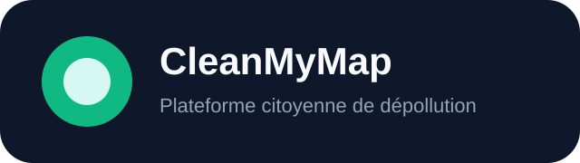
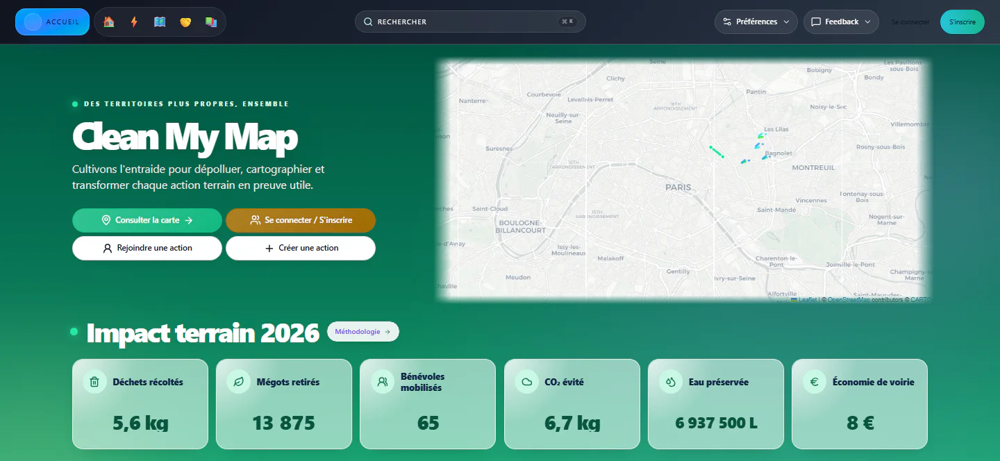
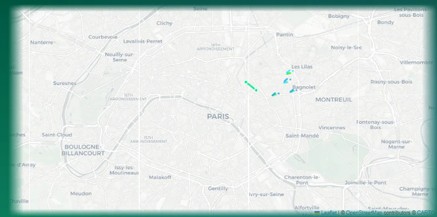

# CleanMyMap

<p align="center">
  
</p>

<p align="center">
  <strong>Agir localement. Mesurer collectivement.</strong>
</p>

<p align="center">
  Une plateforme civic-tech pour repérer, organiser, réaliser, mesurer et partager des actions citoyennes de dépollution.
</p>

<p align="center">
  <a href="https://cleanmymap.fr">Voir CleanMyMap</a> ·
  <a href="https://cleanmymap.fr/actions/map">Explorer la carte</a> ·
  <a href="./documentation/README.md">Documentation</a>
</p>

<p align="center">
  
  <a href="https://github.com/maxd4/CleanMyMap/actions/workflows/ci.yml"></a>
  <a href="https://github.com/maxd4/CleanMyMap/actions/workflows/codeql.yml"></a>
  
  
</p>

## Aperçu du produit

<p align="center">
  
</p>

<p align="center"><em>Vue réelle de l'accueil : une carte pour repérer les actions et des indicateurs pour rendre l'impact lisible.</em></p>

## Pourquoi CleanMyMap&nbsp;?

Organiser une action de dépollution oblige souvent à assembler plusieurs outils séparés pour repérer un besoin, préparer une intervention, organiser les participants, coordonner le terrain, déclarer ce qui a été fait, mesurer l'impact et partager les résultats.

CleanMyMap rassemble ces étapes dans un même parcours local. La plateforme relie l'action terrain, la cartographie, la preuve d'impact et la coordination entre citoyens, associations, collectivités et autres acteurs du territoire.

## La boucle produit

<p align="center"><strong>Repérer → Préparer → Agir → Mesurer → Partager</strong></p>

Ces étapes forment une boucle continue de connaissance et d'action terrain : les observations aident à préparer les interventions, les actions produisent des éléments mesurables, puis les résultats rendent les prochaines décisions plus lisibles.

## Capacités principales

- **Agir** — signaler, rejoindre, préparer ou organiser une action de terrain.
- **Cartographie & Impact** — visualiser les actions, l'état du territoire et les impacts documentés.
- **Réseau & Discussions** — coordonner les bénévoles et les acteurs locaux.
- **Apprendre** — comprendre les déchets et les bonnes pratiques grâce aux ressources et parcours pédagogiques.
- **Open data & transparence** — consulter la documentation, les méthodes et les données exposées selon leurs contrats réels.

<p align="center">
  
</p>

<p align="center"><em>Aperçu cartographique réel de la homepage, avec les actions visibles autour de Paris et les attributions OpenStreetMap et CARTO.</em></p>

Les rubriques et leurs routes canoniques sont décrites dans la [matrice produit](./documentation/product/matrice-rubriques.md) et l'[index des pages du site](./documentation/pages_site/INDEX.md).

## Transparence et méthodologie

CleanMyMap ne se limite pas à une interface :

- la [méthodologie de la carte d'actions](./documentation/product/methodologie-carte-actions.md) décrit les lectures, projections, couleurs et limites de la carte ;
- le [protocole scientifique](./documentation/product/SCIENTIFIC_PROTOCOL.md) distingue les mesures, estimations et conditions d'interprétation ;
- la [gouvernance des données](./documentation/architecture/data-governance.md) documente les frontières de lecture, de persistance et de sécurité ;
- la [documentation sécurité](./documentation/security/README.md) complète les règles d'authentification, d'autorisation et de protection des données ;
- la section [Open data](https://cleanmymap.fr/sections/open-data) présente les données exposées par le produit selon leurs contrats ;
- le [code du projet](https://github.com/maxd4/CleanMyMap) est consultable publiquement.

## Architecture

```text
Web — Next.js / React
├── Clerk — identité, authentification et rôles
├── Supabase / PostgreSQL — données et persistance
└── Vercel — déploiement web

Mobile — Expo / React Native
```

Le web et le mobile sont deux applications déployables d'un même monorepo. Ils partagent les contrats métier nécessaires, Clerk et Supabase, sans constituer deux produits indépendants.

## Stack détaillée

Les versions exactes sont définies dans les manifestes du dépôt. Les principaux repères sont :

- Next.js 16 avec App Router ;
- React 19 ;
- TypeScript 7 ;
- Tailwind CSS 4 ;
- Supabase / PostgreSQL ;
- Clerk ;
- Vercel ;
- Expo / React Native pour l'application mobile.

## Structure du dépôt

| Chemin | Rôle |
| --- | --- |
| `apps/web/` | Application web Next.js, routes API et composants |
| `apps/web/supabase/` | Configuration et migrations Supabase du workspace web |
| `apps/mobile/` | Application mobile de suivi GPS, encore à stabiliser sur l'identité et la finalisation des missions |
| `documentation/` | Architecture, produit, sécurité, design system, opérations et pages |
| `scripts/` | Garde-fous, audits et maintenance Node |
| `maintenance/python/` | Outils Python de maintenance hors runtime principal |

## Source de vérité

Pour tout travail ciblé sur le dépôt :

1. lire l'état actuel de GitHub ;
2. inspecter les fichiers réellement concernés ;
3. ne pas appliquer aveuglément un ancien plan ou une ancienne conversation ;
4. lire `AGENTS.md`.

Documentation principale :

- [`documentation/README.md`](./documentation/README.md)
- [`documentation/architecture/README.md`](./documentation/architecture/README.md)
- [`documentation/design-system/README.md`](./documentation/design-system/README.md)
- [`documentation/security/README.md`](./documentation/security/README.md)
- [`documentation/pages_site/INDEX.md`](./documentation/pages_site/INDEX.md)
- [`apps/web/README.md`](./apps/web/README.md)

## Démarrage

Pré-requis :

- Node.js 24.x, selon le contrat versionné dans `apps/web/.nvmrc` ;
- dépendances npm installées.

```bash
npm install
npm run dev
```

Le script de développement utilise le port `3000` s'il est libre, sinon il choisit le premier port disponible suivant.

## Commandes utiles

```bash
npm run typecheck
npm run lint
npm run test
npm run test:security
npm run test:regression-gates
npm run build

npm run checks:changed
npm run checks
npm run checks:maintenance
npm run test:e2e:list
npm run test:e2e

npm run security:secrets
npm run check:root-files
npm run check:doc-governance
npm run check:stack-doc-drift
npm run check:agent-skills

npm run audit:vercel-quota
npm run report:vercel-surface
```

## Validation

Pour une boucle rapide :

```bash
npm run checks:changed
```

Pour une livraison importante :

```bash
npm run checks
```

La lane maintenance reste disponible à part :

```bash
npm run checks:maintenance
```

La correspondance entre les jobs GitHub Actions et les contrôles reproductibles localement est documentée dans [l'audit de reproductibilité des workflows](./documentation/operations/github-governance.md#reproductibilité-locale-des-workflows).

Les tests E2E sont séparés car Playwright peut nécessiter l'installation locale de Chromium :

```bash
npx playwright install chromium
npm run test:e2e
```

## Sécurité

- signalement responsable : [`SECURITY.md`](./SECURITY.md) ;
- documentation interne : [`documentation/security/README.md`](./documentation/security/README.md) ;
- audit des secrets : `npm run security:secrets` ;
- authentification : Clerk ;
- autorisation : contrôles serveur ;
- données : Supabase avec RLS et séparation des clients anon / service role.

Une clé `service_role` ne doit jamais être exposée dans un client web ou mobile.

## Application mobile

`apps/mobile/` assure le suivi GPS natif.

CleanMyMap est un seul produit et un seul monorepo avec deux applications déployables distinctes : `apps/web` pour le web et `apps/mobile` pour le mobile. L'application mobile est issue de l'ancien `companion-app`, qui reste un repère historique et technique, mais elle ne constitue ni une copie du web ni un projet indépendant. Les deux applications partagent notamment Clerk, Supabase et les contrats métier nécessaires.

Les contrats d'identité Clerk et de finalisation de distance sont finalisés puis gelés. Les limites encore ouvertes sont le renouvellement en background headless, `mission_actions`, la validation opérationnelle et la future évolution produit avant toute reprise du mobile.

Les identifiants techniques historiques restent inchangés : `cleanmymap-companion` et `fr.cleanmymap.companion`.

Voir :

- [`ADR-004 — Identité companion`](./documentation/architecture/adr/ADR-004-companion-identity.md)
- [`ADR-006 — Source de vérité des migrations Supabase`](./documentation/architecture/adr/ADR-006-supabase-migrations-source-of-truth.md)

## Cadre juridique

CleanMyMap est un projet étudiant édité à titre non professionnel.

- Éditeur : **Maxence Deroome**, personne physique ;
- Directeur de la publication : **Maxence Deroome** ;
- Hébergement web : **Vercel Inc.**

Documents publics :

- [Mentions légales](https://cleanmymap.fr/mentions-legales)
- [Politique de confidentialité](https://cleanmymap.fr/politique-confidentialite)
- [Politique des cookies](https://cleanmymap.fr/politique-cookies)
- [Conditions générales d'utilisation](https://cleanmymap.fr/conditions-generales-utilisation)
- [Documentation juridique](./documentation/legal/README.md)
- [Signalement de vulnérabilité](./SECURITY.md)

## Origine

CleanMyMap a été initié et conçu par **Maxence Deroome**.

Référence : [`AUTHORS.md`](./AUTHORS.md)

## Licence

Le code source est publiquement consultable, mais aucune licence de réutilisation définitive n'est publiée à ce jour.

En l'absence de fichier `LICENSE`, aucun droit général de réutilisation n'est accordé. Aucune licence particulière ne doit être déduite.
