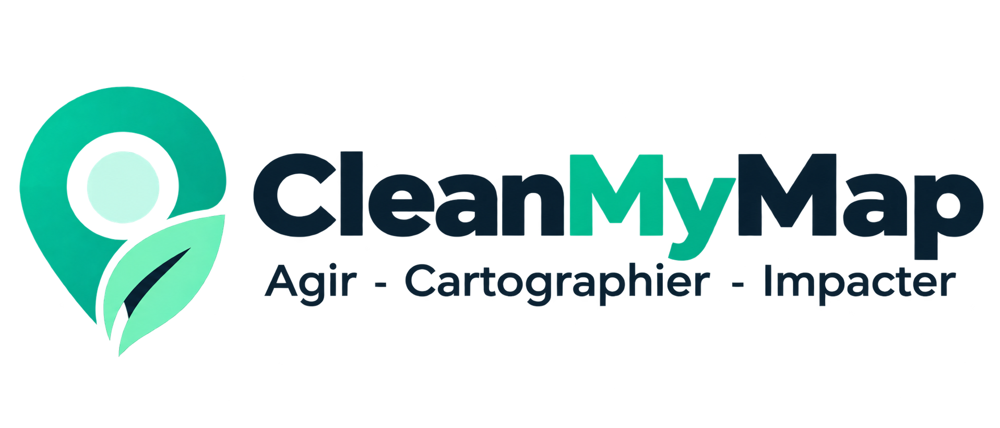
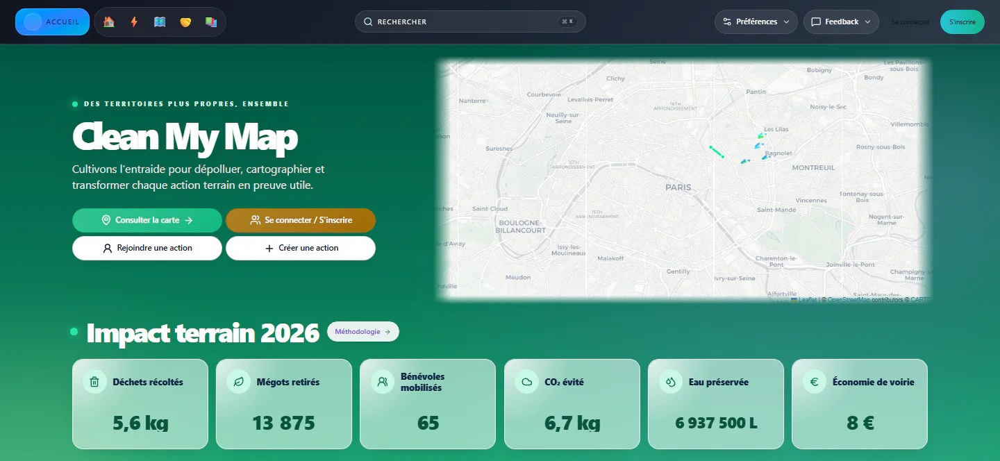
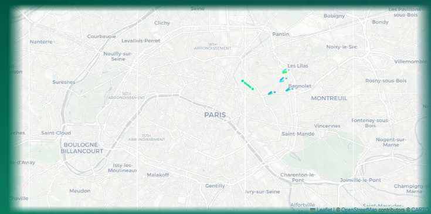

# CleanMyMap

<p align="center">
  
</p>

<p align="center">
  <strong>Agir localement. Mesurer collectivement.</strong><br />
  Plateforme civic-tech pour repérer, organiser, mesurer et coordonner des actions citoyennes de dépollution.
</p>

<p align="center">
  <a href="https://cleanmymap.fr">Voir CleanMyMap</a> ·
  <a href="https://cleanmymap.fr/actions/map">Explorer la carte</a> ·
  <a href="./documentation/README.md">Lire la documentation</a>
</p>

<p align="center">
  
  <a href="https://github.com/maxd4/CleanMyMap/actions/workflows/ci.yml"></a>
  <a href="https://github.com/maxd4/CleanMyMap/actions/workflows/codeql.yml"></a>
  
  
</p>

## Le problème

Une action de dépollution demande souvent de passer entre plusieurs outils pour repérer un besoin, préparer une intervention, réunir des participants, coordonner le terrain, déclarer ce qui a été fait et partager son impact.

## La proposition

CleanMyMap rassemble ce parcours dans un même espace local. La plateforme relie les observations de terrain, la cartographie, l'organisation des actions, la coordination entre acteurs et la lecture des résultats.

Elle s'adresse notamment aux citoyens, associations, collectivités et acteurs locaux qui veulent agir sur leur territoire avec des informations et des méthodes explicites.

## Capacités principales

- **Agir** — signaler, rejoindre, préparer ou organiser une action de terrain.
- **Cartographier & mesurer** — visualiser les actions, le contexte territorial et les impacts documentés.
- **Réseau & discussions** — échanger avec les bénévoles et les acteurs locaux dans les espaces adaptés.
- **Apprendre** — accéder à des ressources et parcours pédagogiques sur les déchets et les bonnes pratiques.
- **Open data & transparence** — consulter les méthodes, les données exposées et les résultats selon leurs contrats réels.

<p align="center">
  
</p>

<p align="center"><em>Vue réelle de l'accueil : carte des actions et indicateurs pour rendre l'impact lisible.</em></p>

<p align="center">
  
</p>

<p align="center"><em>Aperçu cartographique réel des actions visibles autour de Paris.</em></p>

Les rubriques et leurs routes sont répertoriées dans la [matrice produit](./documentation/product/matrice-rubriques.md) et l'[index des pages du site](./documentation/pages_site/INDEX.md).

## Architecture en bref

CleanMyMap est un monorepo composé de deux applications déployables qui partagent les contrats métier nécessaires :

```text
Web
├── Next.js / React — interface et routes API
└── Vercel — déploiement web

Mobile
└── Expo / React Native — parcours terrain natif

Web + Mobile
├── Clerk — identité et rôles
└── Supabase / PostgreSQL — données et persistance
```

La [documentation d'architecture](./documentation/architecture/README.md) décrit les frontières et décisions structurantes. La [méthodologie produit](./documentation/product/SCIENTIFIC_PROTOCOL.md) précise la lecture des mesures, estimations et limites.

## Stack

Next.js 16, React 19, TypeScript 7, Tailwind CSS 4, Clerk, Supabase/PostgreSQL, Vercel et Expo/React Native. Les versions exactes sont définies dans les manifestes du dépôt.

## Structure du monorepo

| Chemin | Rôle |
| --- | --- |
| `apps/web/` | Application web Next.js, interface et routes API |
| `apps/mobile/` | Application mobile Expo/React Native — développement actif, pas encore prête pour la production |
| `apps/web/supabase/` | Configuration et migrations Supabase du workspace web |
| `documentation/` | Documentation produit, architecture, sécurité, développement et opérations |
| `scripts/` | Contrôles et outils de maintenance du dépôt |

## Démarrage minimal

Pré-requis : Node.js 24.x et npm. Depuis la racine :

```bash
npm install
npm run dev
```

Le serveur de développement utilise le port `3000` lorsqu'il est disponible. Les instructions propres à l'application web sont dans [`apps/web/README.md`](./apps/web/README.md) et la documentation complète est indexée par [`documentation/README.md`](./documentation/README.md).

## Documentation et sécurité

- [Documentation générale](./documentation/README.md)
- [Produit et parcours](./documentation/product/README.md)
- [Architecture](./documentation/architecture/README.md)
- [Développement et validation](./documentation/development/README.md) · [tests](./documentation/development/TESTING.md)
- [Pages et routes](./documentation/pages_site/INDEX.md)
- [Sécurité, AuthN/AuthZ et RLS](./documentation/security/README.md)
- [Opérations et déploiement](./documentation/operations/README.md)
- [Politique de signalement](./SECURITY.md)

Les règles de confidentialité, mentions légales et autres contenus publics sont regroupés dans la [documentation juridique](./documentation/legal/README.md).

## Origine

CleanMyMap a été initié et conçu par [Maxence Deroome](./AUTHORS.md).

## Licence

Le code source propre à CleanMyMap est distribué sous la [GNU Affero General Public License v3.0](./LICENSE), SPDX `AGPL-3.0-only`. Cette licence concerne le code CleanMyMap ; les données personnelles ne sont pas placées sous licence ouverte, et les données tierces conservent leurs licences et conditions d'origine. Le nom, le logo et l'identité visuelle CleanMyMap restent réservés. Les frontières entre code, données, contenus et marque sont précisées dans la [documentation juridique](./documentation/legal/README.md).
