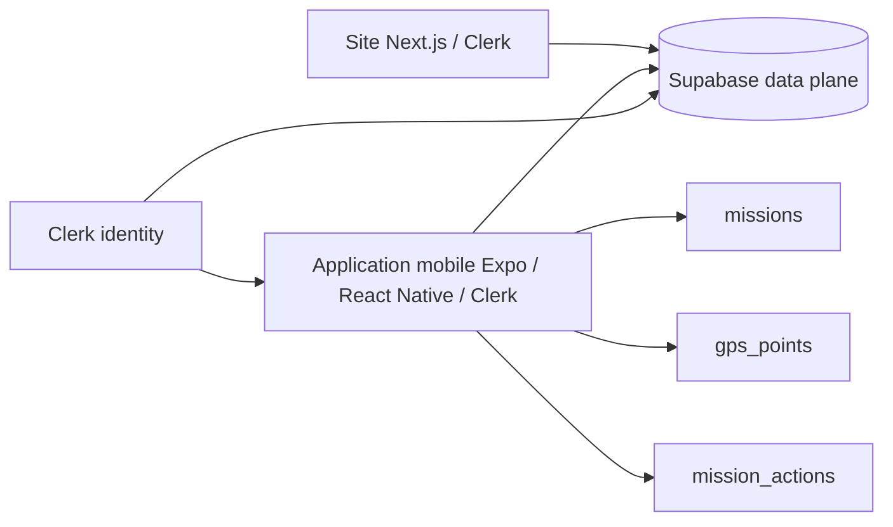

# Application mobile — CleanMyMap GPS Tracker

Application mobile Expo/React Native dédiée au suivi GPS des missions terrain.

Elle est issue de l'ancien `companion-app`, terme conservé uniquement pour
l'historique et les identifiants techniques (`cleanmymap-companion`,
`fr.cleanmymap.companion`). Elle appartient au même produit et au même
monorepo que `apps/web` ; elle n'est ni une copie ni un projet indépendant.

## Statut

**GELÉE — expérimentation long terme, non prête pour la production.**

Les lots 1, 2A et 2B de l'ADR-004 ont raccordé l'identité Clerk, les RLS
`missions`/`gps_points` et la finalisation propriétaire de distance. L'application
mobile est désormais gelée fonctionnellement. Aucune nouvelle capacité mobile
ni publication store ne doit être engagée dans l'état actuel.

Références :

```txt
documentation/architecture/adr/ADR-004-companion-identity.md
documentation/architecture/adr/ADR-006-supabase-migrations-source-of-truth.md
```

## Stack

```txt
Expo 57
React Native 0.87
TypeScript 7
Clerk Expo SDK
Supabase client (data plane)
SecureStore
AsyncStorage
expo-location
expo-task-manager
```

## Pourquoi une app native ?

Le suivi GPS fiable en arrière-plan nécessite les APIs natives du système.

L'app utilise notamment :

- permissions de localisation ;
- tâche background ;
- notification persistante Android ;
- stockage local pour les points non synchronisés.

Le navigateur web ne doit pas être considéré comme équivalent pour ce besoin.

## Architecture actuelle



Le site et l'application mobile partagent le même produit, le même projet
Supabase, Clerk et les contrats métier nécessaires.

## Identité Clerk

Le web et l'application mobile utilisent Clerk comme fournisseur d'identité
principal du produit.

Le LOT 1 de l'ADR-004 est accepté et implémenté : Clerk est l'unique identité
utilisateur de l'application mobile. L'interface utilise l'authentification hébergée
Clerk (Account Portal), avec les méthodes activées dans le compte Clerk.

Le `ClerkProvider` utilise le cache de token sécurisé Expo. Le client Supabase
reste uniquement un data plane : il utilise la clé publique anon pour le
transport et le token de session Clerk courant via `accessToken`. Supabase Auth
n'est pas le fournisseur d'identité de l'application mobile et aucune session
Supabase Auth n'est persistée ou observée.

Le chemin d'identité anonyme a été supprimé. Aucun JWT template legacy n'est
copié dans l'app et aucune clé `service_role` n'est embarquée.

Le contrat RLS lit le `sub` Clerk et le rapproche de `missions.volunteer_id`.
Il est porté par la migration additive du LOT 2A. L'application mobile ne doit
toujours pas être qualifiée de prête pour la production : les capacités
`mission_actions`, le renouvellement headless et l'usage opérationnel réel
restent non validés.

Voir `ADR-004`.

## Finalisation de mission : contrat finalisé puis gelé

Le code mobile appelle après le passage de la mission à `completed` :

`compute_mission_distance` est désormais exécutable par `authenticated` avec un
contrôle interne strict : `sub` Clerk non vide, mission existante et
`volunteer_id` correspondant. La fonction est `SECURITY DEFINER` avec
`search_path = pg_catalog`, écrit les colonnes dérivées côté serveur et ne
réouvre pas les grants UPDATE mobiles sur `distance_m` ou `duration_s`.

`service_role` conserve son accès opérationnel ; `anon` et `public` n'ont aucun
EXECUTE. `stopTracking` vérifie explicitement l'erreur RPC et ne retourne pas
un succès complet lorsque le calcul serveur échoue. Le mobile ne calcule ni la
distance ni la durée lui-même.

## Variables d'environnement

Créer :

```txt
apps/mobile/.env
```

à partir de :

```txt
apps/mobile/.env.example
```

Variables publiques attendues :

```txt
EXPO_PUBLIC_SUPABASE_URL
EXPO_PUBLIC_SUPABASE_ANON_KEY
EXPO_PUBLIC_CLERK_PUBLISHABLE_KEY
```

Ne jamais ajouter :

```txt
SUPABASE_SERVICE_ROLE_KEY
```

dans l'app mobile.

## Installation depuis la racine du monorepo

```bash
npm install
npm run typecheck -w apps/mobile
npm start -w apps/mobile
```

## GPS background

Expo Go ne suffit pas pour valider le suivi en arrière-plan.

Utiliser un development build :

```bash
npx expo run:android
```

ou sur macOS :

```bash
npx expo run:ios
```

Le TaskManager demande le token Clerk courant avant toute écriture Supabase.
Lorsqu'un réveil headless ne dispose pas d'un token Clerk valide, il ne tente
aucune authentification alternative : les points sont conservés dans le buffer
local sécurisé et la synchronisation est différée.

Le LOT 2B ne prétend pas résoudre le renouvellement d'un token Clerk lorsque le
TaskManager est réveillé sans contexte JavaScript Clerk complet. Sans token
valide, les données restent dans le buffer local et aucune authentification
alternative n'est tentée. Cette limite, ainsi que `mission_actions`, demeure
hors production et motive le gel long terme.

## Structure

```txt
apps/mobile/
├── App.tsx
├── index.ts
├── app.json
├── lib/
│   ├── supabase.ts
│   ├── storage.ts
│   ├── storage-upload.ts
│   └── tracking-service.ts
├── tasks/
│   └── gps-task.ts
└── types/
    └── mission.ts
```

## Supabase

Ne pas exécuter manuellement le SQL du README dans le dashboard.

Les migrations sont versionnées dans le dépôt.

Workspace CLI actuel :

```txt
apps/web/supabase/
```

Les migrations sont maintenues uniquement dans `apps/web/supabase/`. Voir
`ADR-006` pour la décision de source de vérité.

## Contrôles avant production

```txt
☑ Identité mobile alignée avec Clerk côté SDK et token provider (LOT 1)
☑ Intégration Clerk Third-Party Auth configurée et RLS missions validées (LOTS 2A/2B)
☑ Ownership des missions testé
☑ RLS missions testée
☑ RLS gps_points testée
□ RLS mission_actions testée
☑ Finalisation distance côté serveur ou RPC sûre (LOT 2B)
☑ Erreur de calcul de distance traitée
☑ Buffer offline conservé sans token Clerk
□ Restauration mission active testée
□ Refus de permissions testé
☑ Cache de token Clerk dans SecureStore configuré (LOT 1)
□ Renouvellement du token Clerk en background headless
□ Usage opérationnel web et validation production
```

## Validation actuelle

```bash
npm run typecheck
```

Le prochain niveau recommandé est d'ajouter des tests unitaires pour :

- stockage offline ;
- synchronisation ;
- finalisation ;
- permissions ;
- identité ;
- erreurs Supabase.
