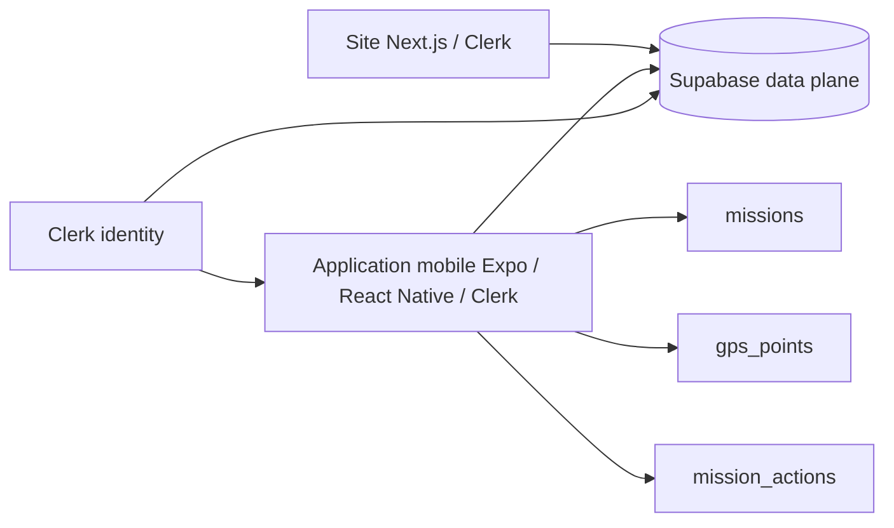

# Application mobile — CleanMyMap GPS Tracker

Application mobile Expo/React Native dédiée au suivi GPS des missions terrain.

Elle est issue de l'ancien `companion-app`, terme conservé uniquement pour
l'historique et les identifiants techniques (`cleanmymap-companion`,
`fr.cleanmymap.companion`). Elle appartient au même produit et au même
monorepo que `apps/web` ; elle n'est ni une copie ni un projet indépendant.

## Statut

**CURRENT / ACTIVE DEVELOPMENT — NOT_PRODUCTION_READY.**

Les lots 1, 2A et 2B de l'ADR-004 ont raccordé l'identité Clerk, les RLS
`missions`/`gps_points` et la finalisation propriétaire de distance. L'application
mobile est officiellement rouverte par le lot M0 pour reprendre son
développement. La baseline conserve un frontend volontairement réduit et
réutilise les surfaces web existantes lorsque cela suffit. L'application reste
non prête pour la production : le background headless, l'usage opérationnel réel
et plusieurs capacités restent à valider.

Références :

- [Architecture GPS companion](./architecture_gps_companion.md)

```txt
documentation/architecture/adr/ADR-004-companion-identity.md
documentation/architecture/adr/ADR-006-supabase-migrations-source-of-truth.md
```

## Périmètre V1

La V1 mobile s'adresse aux bénévoles terrain et reste volontairement réduite
pour être stabilisée et publiée rapidement. Le site web reste la surface
complète du produit et continue d'évoluer indépendamment ; l'application mobile
ne cherche pas à reproduire toutes ses pages ou capacités.

Les deux axes qui pourront recevoir un développement mobile approfondi sont :

- le mode activité GPS live avec carte et tracé temps réel ;
- les contacts d'urgence.

Les autres capacités réutilisent au maximum les contrats, données et services
existants du backend commun. La V1 ne crée ni package `shared` générique, ni
second modèle métier, ni gamification parallèle côté mobile.

## Shell mobile V1

Le shell expose cinq destinations simples : `Accueil`, `Carte`, `Agir`,
`Messages` et `Profil`.

`Agir` présente quatre choix :

- `Démarrer une action` ouvre une surface locale marquée `FUTUR LOT` pour le
  futur mode activité GPS ; la carte live, le tracé et le nouveau moteur
  d'activité ne sont pas implémentés dans cette baseline ;
- `Rejoindre une action` ouvre `/sections/rejoindre-une-action` sur le web ;
- `Organiser une action` ouvre `/actions/new` sur le web ;
- `Signaler un déchet` ouvre `/signalement` sur le web.

La destination `Carte` ouvre `/actions/map` pour la consultation existante et
`Messages` ouvre `/sections/messagerie`. Le mobile n'implémente pas de deuxième
messagerie. `Profil` donne accès aux surfaces web `/profil` et `/reglages` et
réserve seulement un emplacement non fonctionnel pour `Contact d'urgence`.

## Stack

```txt
Expo 57
React Native 0.87
TypeScript 7
Clerk Expo SDK
Supabase client (data plane)
SecureStore
AsyncStorage
expo-location
expo-task-manager
```

## Pourquoi une app native ?

Le suivi GPS fiable en arrière-plan nécessite les APIs natives du système.

L'app utilise notamment :

- permissions de localisation ;
- tâche background ;
- notification persistante Android ;
- stockage local pour les points non synchronisés.

Le navigateur web ne doit pas être considéré comme équivalent pour ce besoin.

## Architecture actuelle


```mermaid
flowchart LR
  WEB[Site Next.js / Clerk] --> SB[(Supabase data plane)]
  APP[Application mobile Expo / React Native / Clerk] --> SB
  CLERK[Clerk identity] --> APP
  CLERK --> SB
  APP --> MISSIONS[missions]
  APP --> GPS[gps_points]
  APP --> ACTIONS[mission_actions]
```

Le site et l'application mobile partagent le même produit, le même projet
Supabase, Clerk et les contrats métier nécessaires.

Les effets métier restent produits par le backend commun : les missions mobiles
réutilisent les projections web existantes pour la gamification, l'impact, les
statistiques et les autres dérivés. Le mobile ne calcule ni ne persiste une
projection parallèle.

## Identité Clerk

Le web et l'application mobile utilisent Clerk comme fournisseur d'identité
principal du produit.

Le LOT 1 de l'ADR-004 est accepté et implémenté : Clerk est l'unique identité
utilisateur de l'application mobile. L'interface utilise l'authentification hébergée
Clerk (Account Portal), avec les méthodes activées dans le compte Clerk.

Le `ClerkProvider` utilise le cache de token sécurisé Expo. Le client Supabase
reste uniquement un data plane : il utilise la clé publique anon pour le
transport et le token de session Clerk courant via `accessToken`. Supabase Auth
n'est pas le fournisseur d'identité de l'application mobile et aucune session
Supabase Auth n'est persistée ou observée.

Le chemin d'identité anonyme a été supprimé. Aucun JWT template legacy n'est
copié dans l'app et aucune clé `service_role` n'est embarquée.

Le contrat RLS lit le `sub` Clerk et le rapproche de `missions.volunteer_id`.
Il est porté par la migration additive du LOT 2A. L'application mobile ne doit
toujours pas être qualifiée de prête pour la production : les capacités
`mission_actions`, le renouvellement headless et l'usage opérationnel réel
restent non validés.

Voir `ADR-004`.

## Finalisation de mission : contrat serveur invariant

Le mobile effectue le flush des points GPS, puis une seule mise à jour de la
mission vers `completed` avec `ended_at`. Un trigger `BEFORE UPDATE` serveur
calcule alors la distance Haversine et la durée dans `NEW`, puis la ligne
finalisée est renvoyée par le même `.select()`.

La fonction du trigger est `SECURITY INVOKER` avec `search_path = pg_catalog` :
la lecture des `gps_points` reste donc soumise aux RLS de l'appelant. Le
propriétaire Clerk peut finaliser sa mission ; un autre utilisateur et `anon`
ne peuvent pas atteindre cette mise à jour. Les grants mobiles restent limités
à `status`, `started_at` et `ended_at` ; `distance_m` et `duration_s` ne sont
jamais directement inscriptibles par le client. Le mobile ne calcule ni la
distance ni la durée lui-même.

## Variables d'environnement

Créer :

```txt
apps/mobile/.env
```

à partir de :

```txt
apps/mobile/.env.example
```

Variables publiques attendues :

```txt
EXPO_PUBLIC_SUPABASE_URL
EXPO_PUBLIC_SUPABASE_ANON_KEY
EXPO_PUBLIC_CLERK_PUBLISHABLE_KEY
# Optionnelle : base du site utilisée par les ponts web du shell mobile
EXPO_PUBLIC_WEB_URL
```

Ne jamais ajouter :

```txt
SUPABASE_SERVICE_ROLE_KEY
```

dans l'app mobile.

## Installation depuis la racine du monorepo

```bash
npm install
npm run mobile:typecheck
npm start -w apps/mobile
```

## GPS background

Expo Go ne suffit pas pour valider le suivi en arrière-plan.

Utiliser un development build :

```bash
npx expo run:android
```

ou sur macOS :

```bash
npx expo run:ios
```

Le TaskManager demande le token Clerk courant avant toute écriture Supabase.
Lorsqu'un réveil headless ne dispose pas d'un token Clerk valide, il ne tente
aucune authentification alternative : les points sont conservés dans le buffer
local sécurisé et la synchronisation est différée.

Le LOT 2B ne prétend pas résoudre le renouvellement d'un token Clerk lorsque le
TaskManager est réveillé sans contexte JavaScript Clerk complet. Sans token
valide, les données restent dans le buffer local et aucune authentification
alternative n'est tentée. Cette limite, ainsi que `mission_actions`, demeure
hors production et motive le statut `NOT_PRODUCTION_READY`.

## Structure

```txt
apps/mobile/
├── App.tsx
├── index.ts
├── app.json
├── screens/
│   ├── mobile-shell.tsx
│   └── mobile-shell-contract.ts
├── lib/
│   ├── supabase.ts
│   ├── storage.ts
│   ├── storage-upload.ts
│   └── tracking-service.ts
├── tasks/
│   └── gps-task.ts
└── types/
    └── mission.ts
```

## Supabase

Ne pas exécuter manuellement le SQL du README dans le dashboard.

Les migrations sont versionnées dans le dépôt.

Workspace CLI actuel :

```txt
apps/web/supabase/
```

Les migrations sont maintenues uniquement dans `apps/web/supabase/`. Voir
`ADR-006` pour la décision de source de vérité.

## Baseline M0 et contrôles avant production

```txt
☑ Identité mobile alignée avec Clerk côté SDK et token provider (LOT 1)
☑ Intégration Clerk Third-Party Auth configurée et RLS missions validées (LOTS 2A/2B)
☑ Ownership des missions protégé par contrat
☑ RLS missions protégée par contrat
☑ RLS gps_points protégée par contrat
□ RLS mission_actions testée
☑ Finalisation distance côté serveur ou RPC sûre (LOT 2B)
☑ Erreur de calcul de distance traitée
☑ Buffer offline conservé sans token Clerk
☑ Restauration mission active testée
☑ Refus de permissions testé
☑ Cohérence identité Clerk → Supabase testée
☑ Cache de token Clerk dans SecureStore configuré (LOT 1)
□ Renouvellement du token Clerk en background headless
□ Usage opérationnel web et validation production
```

## Validation actuelle

```bash
npm run mobile:typecheck
npm run mobile:test
```

La baseline M0 couvre désormais par tests unitaires et contractuels :

- restauration d'une mission active ;
- stockage offline ;
- replay du buffer GPS ;
- refus des permissions GPS ;
- finalisation d'une mission ;
- erreurs Supabase ;
- propriété de mission via RLS ;
- cohérence identité Clerk → Supabase ;
- absence d'écriture client directe des métriques dérivées.

Le contrat du shell protège aussi les cinq destinations V1 et les ponts vers les
surfaces web existantes.
