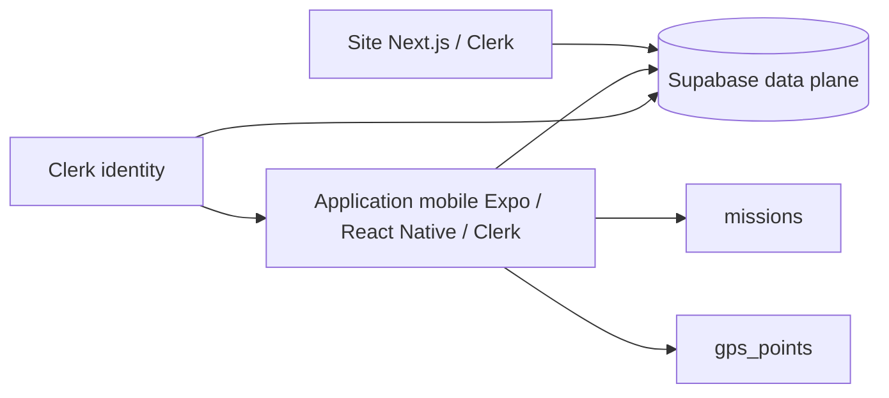

# Application mobile — CleanMyMap GPS Tracker

Application mobile Expo/React Native dédiée au suivi GPS des missions terrain.

Elle est issue de l'ancien `companion-app`, terme conservé uniquement pour
l'historique et les identifiants techniques (`cleanmymap-companion`,
`fr.cleanmymap.companion`). Elle appartient au même produit et au même
monorepo que `apps/web` ; elle n'est ni une copie ni un projet indépendant.

## Statut

**CURRENT / ACTIVE DEVELOPMENT — NOT_PRODUCTION_READY.**

Les lots 1, 2A et 2B de l'ADR-004 ont raccordé l'identité Clerk, les RLS
`missions`/`gps_points` et la finalisation propriétaire de distance. L'application
mobile est officiellement rouverte par le lot M0 pour reprendre son
développement. La baseline conserve un frontend volontairement réduit et
réutilise les surfaces web existantes lorsque cela suffit. La V1 fonctionnelle
couvre le GPS avec carte et tracé, la reprise/offline, la finalisation serveur
et le contact d'urgence. L'application reste non prête pour la production tant
que le background headless et l'usage opérationnel réel ne sont pas validés.

Références :

- [Architecture GPS companion](./architecture_gps_companion.md)

```txt
documentation/architecture/adr/ADR-004-companion-identity.md
documentation/architecture/adr/ADR-006-supabase-migrations-source-of-truth.md
```

## Périmètre V1

La V1 mobile s'adresse aux bénévoles terrain et reste volontairement réduite
pour être stabilisée et publiée rapidement. Le site web reste la surface
complète du produit et continue d'évoluer indépendamment ; l'application mobile
ne cherche pas à reproduire toutes ses pages ou capacités.

La V1 fonctionnelle inclut :

- le mode activité GPS live avec carte, restauration du tracé et suivi temps réel ;
- les contacts d'urgence.

Les autres capacités réutilisent au maximum les contrats, données et services
existants du backend commun. La V1 ne crée ni package `shared` générique, ni
second modèle métier, ni gamification parallèle côté mobile.

## Shell mobile V1

Le shell expose cinq destinations simples : `Accueil`, `Carte`, `Agir`,
`Messages` et `Profil`.

`Agir` présente quatre choix :

- `Démarrer une action` vérifie une seule fois les permissions GPS avant de créer
  une mission `pending` owner-scoped avec le `sub` Clerk, puis réutilise
  `startTracking` pour afficher la mission active. Si le démarrage GPS échoue,
  la mission créée est annulée et l'écran actif n'est pas affiché. La mission
  active restaure les `gps_points` owner-scoped, fusionne son tracé UX local et
  reprend le suivi foreground au retour au premier plan et relance le replay du
  buffer local dès que la session Clerk est disponible. Ce suivi ne réécrit pas
  les points ni les métriques dans Supabase. Aucun formulaire d'action natif ni
  upload/photo mobile n'est requis pour cette V1 ; `mission_actions` reste une
  évolution future du produit ;
- `Rejoindre une action` ouvre `/sections/rejoindre-une-action` sur le web ;
- `Organiser une action` ouvre `/actions/new` sur le web ;
- `Signaler un déchet` ouvre `/signalement` sur le web.

La destination `Carte` ouvre `/actions/map` pour la consultation existante et
`Messages` ouvre `/sections/messagerie`. Le mobile n'implémente pas de deuxième
messagerie. `Profil` donne accès aux surfaces web `/profil` et `/reglages` et
permet d'enregistrer un unique contact d'urgence dans le SecureStore local.
Pendant une mission active, le bénévole peut confirmer l'ouverture d'un appel
vers ce contact ou vers le 112 via `tel:` ; aucune position n'est envoyée
automatiquement.

## Stack

```txt
Expo 57
React Native 0.87.1
TypeScript 7
expo-dev-client (development build)
expo-splash-screen
Clerk Expo SDK
Supabase client (data plane)
SecureStore
AsyncStorage
expo-location
expo-task-manager
```

Les mises à jour OTA via EAS Update sont explicitement désactivées pour cette
phase (`updates.enabled = false`). Leur activation devra faire l'objet d'une
décision de déploiement dédiée, avec validation de la stratégie de version et
de signature.

Le SDK Expo 57 cible officiellement React Native 0.86.x. Le dépôt conserve
volontairement le pin React Native 0.87.1 déjà établi ; `expo-doctor` signale
donc cet écart ainsi que les écarts de versions TypeScript/AsyncStorage
existants. Ce lot ne les masque pas et ne les rétrograde pas arbitrairement.

## Candidate de build EAS

`eas.json` porte trois profils bornés :

- `development` : development client et distribution interne ;
- `preview` : distribution interne, avec APK Android pour le partage d'équipe ;
- `production` : artefact destiné aux stores (AAB Android par défaut).

Le versioning de départ est explicite et local : `version` `1.0.0`,
`android.versionCode` `1` et `ios.buildNumber` `1`. Toute nouvelle release doit
incrémenter les compteurs natifs selon les règles des stores ; aucun compteur
n'est auto-incrémenté ou stocké dans un service distant par cette configuration.

Les identifiants durables restent inchangés : slug
`cleanmymap-companion`, scheme `companion`, package Android et bundle iOS
`fr.cleanmymap.companion`, et domaine `cleanmymap.fr`. Le placeholder
`extra.eas.projectId` a été retiré : le rattachement à un projet Expo réel doit
être effectué par le propriétaire EAS au premier build, sans inventer d'ID.

Les profils EAS doivent recevoir les valeurs réelles de
`EXPO_PUBLIC_SUPABASE_URL`, `EXPO_PUBLIC_SUPABASE_ANON_KEY` et
`EXPO_PUBLIC_CLERK_PUBLISHABLE_KEY` via l'environnement de build. La clé
`GOOGLE_MAPS_API_KEY` est également requise pour les tuiles Google Maps Android
d'un binaire standalone ; elle est volontairement absente du dépôt. Ces valeurs
ne sont pas des secrets serveur : aucune `service_role` ne doit être fournie à
l'application mobile.

La configuration native conserve les liens entrants `https://cleanmymap.fr/mission/start`
et `applinks:cleanmymap.fr`, ainsi que le scheme `companion`. Le shell mobile
utilise actuellement les ponts web sortants ; l'association Android/iOS du
domaine et le parcours entrant complet restent à vérifier sur les services et
appareils réels avant de les qualifier.

La configuration de localisation est portée par le plugin `expo-location` :
foreground et background iOS, `ACCESS_BACKGROUND_LOCATION`,
`FOREGROUND_SERVICE` et `FOREGROUND_SERVICE_LOCATION` Android. Le mode
`fetch` iOS inutile au suivi GPS a été retiré. Les options Expo SDK 57 devenues
invalides (`newArchEnabled`, `android.edgeToEdgeEnabled` et la clé `splash`
legacy) ont été supprimées ou migrées vers `expo-splash-screen`.

## Pourquoi une app native ?

Le suivi GPS fiable en arrière-plan nécessite les APIs natives du système.

L'app utilise notamment :

- permissions de localisation ;
- tâche background ;
- notification persistante Android ;
- stockage local pour les points non synchronisés.

Le navigateur web ne doit pas être considéré comme équivalent pour ce besoin.

## Architecture actuelle


```mermaid
flowchart LR
  WEB[Site Next.js / Clerk] --> SB[(Supabase data plane)]
  APP[Application mobile Expo / React Native / Clerk] --> SB
  CLERK[Clerk identity] --> APP
  CLERK --> SB
  APP --> MISSIONS[missions]
  APP --> GPS[gps_points]
```

Le site et l'application mobile partagent le même produit, le même projet
Supabase, Clerk et les contrats métier nécessaires.

Le runtime mobile V1 n'utilise pas `mission_actions` et ne porte pas de
stockage photo terrain. Le contrat serveur et la table restent conservés pour
les parcours web et une évolution mobile ultérieure.

Les effets métier restent produits par le backend commun : les missions mobiles
réutilisent les projections web existantes pour la gamification, l'impact, les
statistiques et les autres dérivés. Le mobile ne calcule ni ne persiste une
projection parallèle.

## Identité Clerk

Le web et l'application mobile utilisent Clerk comme fournisseur d'identité
principal du produit.

Le LOT 1 de l'ADR-004 est accepté et implémenté : Clerk est l'unique identité
utilisateur de l'application mobile. L'interface utilise l'authentification hébergée
Clerk (Account Portal), avec les méthodes activées dans le compte Clerk.

Le `ClerkProvider` utilise le cache de token sécurisé Expo. Le client Supabase
reste uniquement un data plane : il utilise la clé publique anon pour le
transport et le token de session Clerk courant via `accessToken`. Supabase Auth
n'est pas le fournisseur d'identité de l'application mobile et aucune session
Supabase Auth n'est persistée ou observée.

Le chemin d'identité anonyme a été supprimé. Aucun JWT template legacy n'est
copié dans l'app et aucune clé `service_role` n'est embarquée.

Le contrat RLS lit le `sub` Clerk et le rapproche de `missions.volunteer_id`.
Il est porté par la migration additive du LOT 2A. L'application mobile ne doit
toujours pas être qualifiée de prête pour la production : le background headless
et l'usage opérationnel réel restent à valider. `mission_actions` et la photo
native sont volontairement hors V1 et deviennent des évolutions futures. Le
renouvellement Clerk headless est maintenant câblé et couvert par des tests
automatisés ; il doit encore être confirmé sur development build.

Voir `ADR-004`.

## Finalisation de mission : contrat serveur invariant

Le mobile effectue le flush des points GPS, puis une seule mise à jour de la
mission vers `completed` avec `ended_at`. Un trigger `BEFORE UPDATE` serveur
calcule alors la distance Haversine et la durée dans `NEW`, puis la ligne
finalisée est renvoyée par le même `.select()`.

La fonction du trigger est `SECURITY INVOKER` avec `search_path = pg_catalog` :
la lecture des `gps_points` reste donc soumise aux RLS de l'appelant. Le
propriétaire Clerk peut finaliser sa mission ; un autre utilisateur et `anon`
ne peuvent pas atteindre cette mise à jour. Les grants mobiles restent limités
à `status`, `started_at` et `ended_at` ; `distance_m` et `duration_s` ne sont
jamais directement inscriptibles par le client. Le mobile ne calcule ni la
distance ni la durée lui-même.

Après une finalisation réussie, l'écran affiche directement la durée, la
distance et l'état de synchronisation renvoyés par le serveur, puis propose de
revenir à l'accueil. Un échec de synchronisation ou de finalisation conserve la
mission active et son suivi.

## Variables d'environnement

Créer :

```txt
apps/mobile/.env
```

à partir de :

```txt
apps/mobile/.env.example
```

Variables publiques attendues :

```txt
EXPO_PUBLIC_SUPABASE_URL
EXPO_PUBLIC_SUPABASE_ANON_KEY
EXPO_PUBLIC_CLERK_PUBLISHABLE_KEY
# Base du site utilisée par les ponts web du shell mobile
EXPO_PUBLIC_WEB_URL
EXPO_PUBLIC_WEB_APP_URL
GOOGLE_MAPS_API_KEY
```

Ne jamais ajouter :

```txt
SUPABASE_SERVICE_ROLE_KEY
```

dans l'app mobile.

## Installation depuis la racine du monorepo

```bash
npm install
npm run mobile:typecheck
npm start -w apps/mobile
```

## GPS background

Expo Go ne suffit pas pour valider le suivi en arrière-plan.

Utiliser un development build :

```bash
npx expo run:android
```

ou sur macOS :

```bash
npx expo run:ios
```

Le TaskManager demande le token Clerk courant avant toute écriture Supabase.
Lorsqu'un réveil headless intervient après un kill ou une reprise réseau, le
singleton Clerk est initialisé avec le publishable key et le `tokenCache`
SecureStore, puis chargé avant la demande du token. Si aucun token valide n'est
disponible, aucune authentification alternative n'est tentée : les points sont
conservés dans le buffer local sécurisé et seront rejoués lors d'un réveil
ultérieur avec une session valide. Cette résilience automatisée ne remplace pas
la validation terrain ; `mission_actions` demeure hors runtime V1 et pourra être
réintroduit dans une évolution dédiée.

## Structure

```txt
apps/mobile/
├── App.tsx
├── index.ts
├── app.json
├── screens/
│   ├── mobile-shell.tsx
│   └── mobile-shell-contract.ts
├── lib/
│   ├── supabase.ts
│   ├── storage.ts
│   └── tracking-service.ts
├── tasks/
│   └── gps-task.ts
└── types/
    └── mission.ts
```

## Supabase

Ne pas exécuter manuellement le SQL du README dans le dashboard.

Les migrations sont versionnées dans le dépôt.

Workspace CLI actuel :

```txt
apps/web/supabase/
```

Les migrations sont maintenues uniquement dans `apps/web/supabase/`. Voir
`ADR-006` pour la décision de source de vérité.

## Baseline M0 et contrôles avant production

```txt
☑ Identité mobile alignée avec Clerk côté SDK et token provider (LOT 1)
☑ Intégration Clerk Third-Party Auth configurée et RLS missions validées (LOTS 2A/2B)
☑ Ownership des missions protégé par contrat
☑ RLS missions protégée par contrat
☑ RLS gps_points protégée par contrat
☑ `mission_actions` hors runtime V1 ; contrat serveur conservé pour les autres parcours
☑ Finalisation distance côté serveur ou RPC sûre (LOT 2B)
☑ Erreur de calcul de distance traitée
☑ Buffer offline conservé sans token Clerk et rejoué sans flush concurrent doublé
  ☑ Restauration mission active et du tracé après reprise/relaunch testée
  ☑ Fusion serveur/local sans doublons visibles testée
  ☑ Échec de flush/finalisation conservant la mission récupérable testé
  ☑ Écran mission terrain-first : carte dominante, état GPS/sync, métriques live indicatives
☑ Refus de permissions testé
☑ Cohérence identité Clerk → Supabase testée
☑ Cache de token Clerk dans SecureStore configuré (LOT 1)
☑ Renouvellement du token Clerk en background headless (câblage + tests automatisés)
□ Usage opérationnel web et validation production
```

## Validation actuelle

```bash
npm run mobile:typecheck
npm run mobile:test
npm run mobile:security
npm run mobile:lint
npm run quality:mobile-coverage
```

La baseline M0 couvre désormais par tests unitaires et contractuels :

- restauration d'une mission active ;
- stockage offline ;
- replay du buffer GPS, y compris le flush concurrent sérialisé ;
- refus des permissions GPS ;
- finalisation d'une mission et conservation après erreur ;
- erreurs Supabase ;
- propriété de mission via RLS ;
- cohérence identité Clerk → Supabase ;
- absence d'écriture client directe des métriques dérivées.

Le contrat du shell protège aussi les cinq destinations V1 et les ponts vers les
surfaces web existantes.
