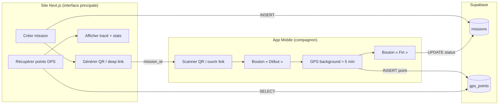
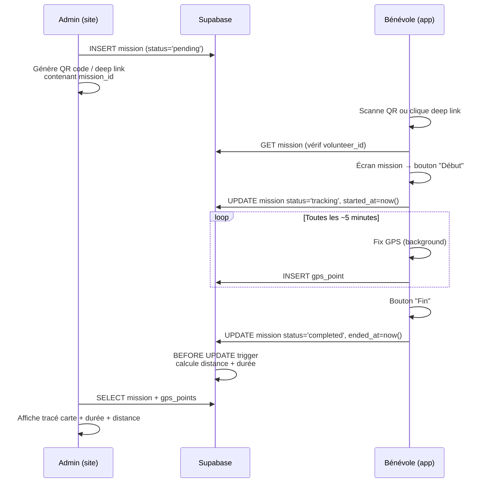

# Architecture Technique — Application Compagnon GPS

## 1. Vue d'ensemble



---

## 2. Architecture courante — Clerk, Supabase Third-Party Auth et RLS

L'application mobile utilise Clerk comme identité canonique, au même titre que
`apps/web`. Le flux courant est le suivant :

1. `ClerkProvider` initialise l'application avec le `tokenCache` sécurisé Expo ;
2. `useAuth` expose l'état de session et l'authentification hébergée Clerk ouvre
   le parcours de connexion ;
3. le client Supabase reste le data plane et reçoit le token Clerk courant via
   Third-Party Auth ; aucune session Supabase Auth n'est créée ou persistée ;
4. les appels mobiles aux missions et au GPS sont autorisés par les RLS à partir
   du `sub` Clerk transmis dans le JWT.

### Tables courantes

| Table | Colonne | Type | Contrat |
|---|---|---|---|
| `missions` | `volunteer_id` | `text` | Identifiant propriétaire correspondant au `sub` Clerk |
| `missions` | `created_by` | `text` | Identifiant Clerk du créateur côté site |
| `missions` | `status`, `started_at`, `ended_at` | états et timestamps | Seules ces colonnes sont directement modifiables par le mobile |
| `missions` | `distance_m`, `duration_s` | `integer` | Métriques dérivées finalisées par le trigger serveur |
| `gps_points` | `mission_id`, coordonnées et timestamps | schéma GPS | Accès autorisé seulement pour une mission appartenant au `sub` Clerk |

Les policies courantes ciblent le rôle `authenticated` et rapprochent le
`sub` du JWT Clerk de `missions.volunteer_id`. Les policies de `gps_points`
utilisent la même identité par l'intermédiaire de la mission liée. Le mobile
ne reçoit pas de droit d'écriture sur `distance_m` ou `duration_s`.

### Finalisation des métriques

La finalisation est portée par le trigger
`public.finalize_completed_mission_metrics()` de la migration corrective
`apps/web/supabase/migrations/20260827100000_clerk_mission_completion_metrics_trigger.sql`.
Lorsqu'une mission passe à `completed`, ce trigger `BEFORE UPDATE` lit les
`gps_points` visibles au propriétaire Clerk, calcule la distance Haversine et
la durée, puis renseigne `NEW.distance_m` et `NEW.duration_s`. Il est
`SECURITY INVOKER` et n'ajoute aucun droit d'écriture client sur ces colonnes.

L'identité Clerk, les RLS missions/GPS et la finalisation des métriques sont
finalisées puis gelées. Les seuls sujets encore ouverts sont le background
headless, `mission_actions`, la validation opérationnelle et l'évolution future
après dégel explicite.

### Proposition historique — non cible actuelle

La première proposition de cette fiche reposait sur Supabase Auth/anonyme, des
colonnes `profiles` en UUID et des policies de la forme `auth.uid() =
volunteer_id`. Elle prévoyait également un login Supabase et une finalisation
ancienne par RPC `compute_mission_distance(uuid)`. Ces éléments sont conservés
uniquement comme historique de conception : ils ne décrivent ni l'identité,
ni les policies, ni le flux de métriques courants et ne doivent pas être
réintroduits comme cible.

---

## 3. Flux utilisateur complet



### Détail des étapes

1. **Côté site** : l'admin crée la mission, elle passe en `pending`. Le site génère un QR code encodant : `https://monapp.fr/mission/{mission_id}` (deep link universel).

2. **Côté app** : la bénévole scanne le QR. L'app résout le deep link, extrait `mission_id`, puis les RLS vérifient dans Supabase que le `sub` Clerk courant correspond à la mission assignée.

3. **Début** : l'app met à jour `status → tracking` et `started_at`. Le service de localisation background démarre.

4. **Tracking** : un point GPS est enregistré toutes les ~5 minutes. Chaque point est envoyé à Supabase dès que possible (avec retry si hors réseau, stockage local temporaire).

5. **Fin** : la bénévole appuie sur "Fin". Le buffer GPS est d'abord vidé, puis
   `status → completed` et `ended_at` sont envoyés. Le trigger serveur calcule
   les métriques dans la même mise à jour.

6. **Consultation** : le site récupère les points, calcule le tracé (Leaflet/Mapbox), affiche durée et distance.

---

## 4. Contraintes Android vs iOS

| Aspect | Android | iOS |
|---|---|---|
| **GPS en arrière-plan** | ✅ Foreground Service avec notification persistante. Fiable, pas de kill. | ⚠️ `allowsBackgroundLocationUpdates` + `significantLocationChange`. Apple peut throttle. |
| **Fréquence 5 min** | ✅ Contrôle fin possible via Foreground Service | ⚠️ iOS ne garantit pas un intervalle fixe en background. `significantLocationChange` donne ~500m de déplacement OU ~15 min. Alternative : `startMonitoringVisits`. |
| **Kill par l'OS** | Rare avec Foreground Service | Possible si pression mémoire. Relance partielle via `significantLocationChange`. |
| **Notification obligatoire** | Oui (notification persistante du Foreground Service) | Non obligatoire mais recommandée pour UX |
| **Précision atteignable** | GPS fin (~5m) même en background | GPS fin en foreground, dégradé possible en background prolongé |
| **Permissions** | `ACCESS_FINE_LOCATION` + `ACCESS_BACKGROUND_LOCATION` (popup séparée Android 11+) | `Always` location (2 étapes : "When In Use" → "Always" via Settings) |

> [!WARNING]
> **iOS est le point dur.** Apple limite volontairement le GPS background pour économiser la batterie. Un intervalle strict de 5 min n'est pas garanti. En pratique, avec `significantLocationChange` + `allowsBackgroundLocationUpdates`, on obtient un point toutes les 5-15 minutes selon le mouvement. C'est acceptable pour le besoin exprimé.

### Stratégie iOS recommandée

- Utiliser `Background Location` capability
- Combiner `significantLocationChange` (pour le réveil de l'app) + un fix GPS ponctuel haute précision à chaque réveil
- Stocker les points localement (SQLite/AsyncStorage) et sync vers Supabase quand le réseau est disponible

---

## 5. Permissions nécessaires

### Android
| Permission | Quand |
|---|---|
| `ACCESS_FINE_LOCATION` | Au lancement |
| `ACCESS_BACKGROUND_LOCATION` | Avant le premier tracking (popup séparée sur Android 11+) |
| `FOREGROUND_SERVICE_LOCATION` | Déclaré dans le manifest |
| `POST_NOTIFICATIONS` | Android 13+ pour la notification du foreground service |

### iOS
| Permission | Quand |
|---|---|
| `NSLocationWhenInUseUsageDescription` | Au lancement |
| `NSLocationAlwaysAndWhenInUseUsageDescription` | Quand l'utilisateur demande le tracking |
| Background Mode `location` | Déclaré dans `Info.plist` |

> [!IMPORTANT]
> **App Store Review** : Apple exige une justification claire de l'usage "Always" location. Le cas d'usage "suivi de mission bénévole" est légitime mais doit être bien documenté dans la soumission.

---

## 6. Comparatif des options techniques

| Critère | **Capacitor** | **React Native (Expo)** |
|---|---|---|
| **Réutilisation du code site** | ✅ Très forte (même React/TS) | ✅ Forte (React/TS, mais composants natifs) |
| **GPS Background** | ⚠️ Plugin `@capacitor-community/background-geolocation` — maintenu par la communauté, moins fiable | ✅ `expo-location` avec `startLocationUpdatesAsync` — bien documenté, API officielle |
| **Foreground Service Android** | ⚠️ Nécessite un plugin tiers ou du code natif | ✅ Géré nativement par `expo-location` + `expo-task-manager` |
| **iOS Background** | ⚠️ Dépend du plugin WebView, moins de contrôle natif | ✅ Accès direct aux APIs natives via le bridge |
| **Taille de l'app** | ~5-10 MB (WebView) | ~15-25 MB (runtime RN) |
| **Complexité de setup** | Faible (wrapper sur le site existant) | Moyenne (nouveau projet, mais SDK bien outillé) |
| **Fiabilité du tracking** | ⚠️ Moyenne — le WebView peut être suspendu | ✅ Haute — code natif réel |
| **Publication stores** | ✅ OK | ✅ OK (EAS Build pour Expo) |
| **Maintenance** | ⚠️ Plugins communautaires moins stables | ✅ Expo SDK maintenu par l'équipe Expo |

---

## 7. Historique — recommandation MVP initiale

Cette section conserve la recommandation technique initiale pour référence. Elle
ne constitue pas une nouvelle cible : l'identité Clerk, les RLS missions/GPS et
la finalisation des métriques sont déjà finalisées puis gelées. Les seuls sujets
ouverts restent le background headless, `mission_actions`, la validation
opérationnelle et l'évolution future après dégel explicite.

> [!TIP]
> **Expo (React Native) avec `expo-location` + `expo-task-manager`**

### Pourquoi Expo

1. **Fiabilité GPS background** : `expo-location.startLocationUpdatesAsync()` est la solution la plus testée et documentée pour le GPS background en React Native. Elle gère nativement :
   - Android : Foreground Service avec notification
   - iOS : `significantLocationChange` + `allowsBackgroundLocationUpdates`

2. **Stack compatible** : React + TypeScript → même langage que le site Next.js. Le client Supabase JS (`@supabase/supabase-js`) fonctionne tel quel.

3. **Build simplifié** : EAS Build génère les binaires iOS/Android sans Xcode/Android Studio en local.

4. **App minimale** : 2-3 écrans max (login, mission, tracking). Pas besoin de navigation complexe.

### Architecture de l'app Expo

```
apps/mobile/
├── app/
│   ├── _layout.tsx          # Root layout + auth check
│   ├── login.tsx            # Auth Clerk hébergée
│   ├── scan.tsx             # Scanner QR / réception deep link
│   └── tracking.tsx         # Écran mission (Début/Fin + status)
├── lib/
│   ├── supabase.ts          # Client Supabase
│   ├── location.ts          # Wrapper expo-location
│   └── storage.ts           # Buffer local (points non envoyés)
├── tasks/
│   └── gps-task.ts          # TaskManager background task
└── app.json                 # Config Expo
```

### Code clé — Task GPS background

```typescript
// tasks/gps-task.ts
import * as TaskManager from 'expo-task-manager';
import { supabase } from '../lib/supabase';
import { getStoredMissionId, bufferPoint, flushBuffer } from '../lib/storage';

const TASK_NAME = 'GPS_TRACKING';

TaskManager.defineTask(TASK_NAME, async ({ data, error }) => {
  if (error || !data) return;

  const { locations } = data as { locations: Location.LocationObject[] };
  const missionId = await getStoredMissionId();
  if (!missionId) return;

  for (const loc of locations) {
    const point = {
      mission_id: missionId,
      latitude: loc.coords.latitude,
      longitude: loc.coords.longitude,
      accuracy_m: loc.coords.accuracy,
      altitude_m: loc.coords.altitude,
      recorded_at: new Date(loc.timestamp).toISOString(),
    };

    // Tenter l'envoi, sinon buffer local
    const { error } = await supabase.from('gps_points').insert(point);
    if (error) {
      await bufferPoint(point);
    }
  }

  // Tenter de flush les points buffered
  await flushBuffer();
});
```

### Démarrage du tracking

```typescript
import * as Location from 'expo-location';

async function startTracking() {
  await Location.startLocationUpdatesAsync('GPS_TRACKING', {
    accuracy: Location.Accuracy.Balanced,    // ~100m, économe en batterie
    timeInterval: 5 * 60 * 1000,             // 5 min (Android)
    distanceInterval: 100,                    // 100m min entre 2 points
    deferredUpdatesInterval: 5 * 60 * 1000,  // iOS deferred
    showsBackgroundLocationIndicator: true,   // iOS : indicateur bleu
    foregroundService: {                      // Android : notification
      notificationTitle: 'Mission en cours',
      notificationBody: 'Suivi GPS actif',
      notificationColor: '#4F46E5',
    },
  });
}
```

---

## 8. Deep Link / QR Code

### Format du lien

```
https://monsite.fr/mission/start?id={mission_id}
```

### Expo deep link (app.json)

```json
{
  "expo": {
    "scheme": "companion",
    "android": {
      "intentFilters": [{
        "action": "VIEW",
        "data": { "scheme": "https", "host": "monsite.fr", "pathPrefix": "/mission/start" }
      }]
    },
    "ios": {
      "associatedDomains": ["applinks:monsite.fr"]
    }
  }
}
```

Si l'app est installée → elle s'ouvre directement. Sinon → le lien redirige vers le store.

### QR Code côté site

```typescript
// Côté Next.js — composant React
import QRCode from 'qrcode.react';

function MissionQR({ missionId }: { missionId: string }) {
  const url = `https://monsite.fr/mission/start?id=${missionId}`;
  return <QRCode value={url} size={200} />;
}
```

---

## 9. Affichage côté site (post-mission)

### Récupération des données

```typescript
// Côté Next.js
const { data: points } = await supabase
  .from('gps_points')
  .select('latitude, longitude, recorded_at')
  .eq('mission_id', missionId)
  .order('recorded_at');

const { data: mission } = await supabase
  .from('missions')
  .select('started_at, ended_at, distance_m, duration_s')
  .eq('id', missionId)
  .single();
```

### Affichage carte (Leaflet)

```typescript
import { MapContainer, TileLayer, Polyline, Marker } from 'react-leaflet';

function MissionMap({ points }) {
  const positions = points.map(p => [p.latitude, p.longitude]);
  return (
    <MapContainer center={positions[0]} zoom={13}>
      <TileLayer url="https://{s}.tile.openstreetmap.org/{z}/{x}/{y}.png" />
      <Polyline positions={positions} color="#4F46E5" />
      <Marker position={positions[0]} /> {/* Départ */}
      <Marker position={positions.at(-1)} /> {/* Arrivée */}
    </MapContainer>
  );
}
```

---

## 10. Limites et compromis

| Limite | Impact | Mitigation |
|---|---|---|
| iOS throttle le GPS background | Points espacés de 5-15 min au lieu de 5 min pile | Acceptable pour le besoin. Combiner `significantLocationChange`. |
| Pas de réseau pendant la mission | Points non envoyés en temps réel | Buffer local SQLite/AsyncStorage + sync au retour réseau. |
| Batterie | ~2-5% / heure avec GPS balanced | `Accuracy.Balanced` au lieu de `High`. Notification claire à l'utilisateur. |
| Permission "Always" iOS | UX friction (2 étapes) | Guidage in-app avec screenshots expliquant comment activer. |
| Review App Store | Apple peut questionner l'usage location | Justification claire : suivi mission bénévole, consentement explicite, durée limitée. |

---

## 11. Résumé des livrables MVP

| Livrable | Stack | Effort estimé |
|---|---|---|
| Tables Supabase + RLS + fonction distance | SQL | 0.5j |
| App Expo (login, scan, tracking) | Expo / React Native / TS | 3-4j |
| Composant QR côté site | Next.js / React | 0.5j |
| Page résultats mission (carte + stats) | Next.js / Leaflet | 1j |
| Tests + polish + deep links | — | 1-2j |
| **Total MVP** | | **~6-8 jours** |
