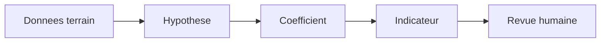

# Protocole scientifique

Ce document definit la methode de calcul des indicateurs utilises par CleanMyMap.
Les indicateurs sont des proxys de lecture et de pilotage, pas une mesure scientifique absolue.

## Schema de travail

## Principes

- chaque coefficient doit avoir une source ou une justification explicite ;
- les formules doivent rester simples, reproductibles et auditable ;
- une hypothese doit etre marquee comme hypothese ;
- un changement de coefficient doit etre trace dans la documentation technique partagee ;
- les indicateurs doivent aider a comparer des actions, pas a pretendre mesurer tout l'impact environnemental du monde.

## Indicateurs retenus

### Eau preservee

Hypothese prudente : un megot peut polluer entre 500 et 1000 litres d'eau.

Formule de travail :

`Eau_preservee (L) = Nombre_megots x 500`

### CO2 evite

L'effet est estime a partir du poids des dechets collectes et d'un coefficient de matiere.

Formule de travail :

`CO2_evite (kg) = Poids_dechets (kg) x Coefficient_matiere`

### Surface nettoyee

La surface est une proxy utile quand le poids seul ne raconte pas toute l'action.

Formule de travail :

`Surface (m2) = (Poids (kg) x 15) + (Temps (min) x 2)`

### Score de pollution

Le score sert a comparer des zones entre elles et a prioriser des actions.

Formule de travail :

`Score = (Densite_megots x 3) + (Densite_plastiques x 2) + (Densite_encombrants x 5)`

## Gouvernance

- revoir les coefficients a intervalle fixe ;
- documenter la source de chaque changement ;
- garder une trace des hypothèses dans un seul endroit ;
- refuser toute presentation qui ferait croire a une precision artificielle.

## Lecture correcte

Le protocole n'a pas pour but de sur-vendre l'impact. Il sert a rendre l'impact comparable, discutable et ameliorable.
