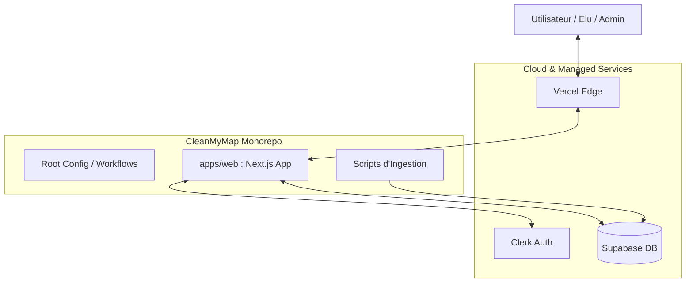
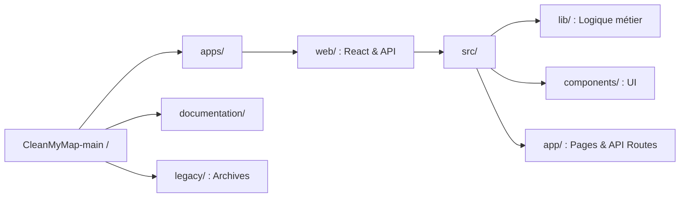
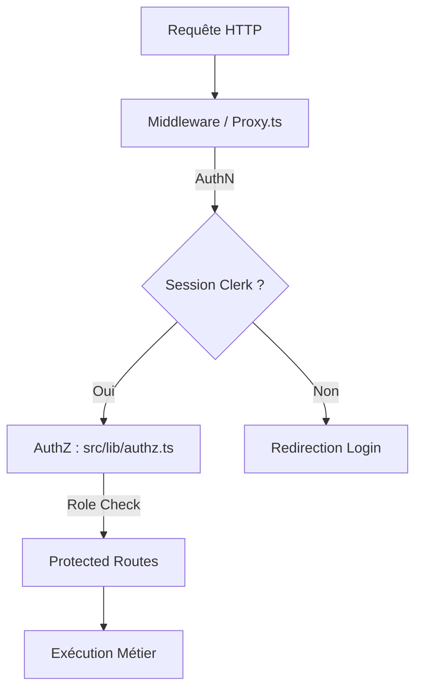

# Master Architecture : CleanMyMap

Ce document constitue la source de vérité pour l'architecture globale du projet. Il lie les concepts métier aux implémentations techniques et à la structure physique du dépôt.

---

## 1. Vision Systémique Globale
Ce schéma montre comment les services externes interagissent avec l'application cœur.



---

## 2. Structure du Monorépo
Organisation physique des fichiers et dépendances.



---

## 3. Flux de Données Unifié
Comment les actions passent de la source à l'écran.

```mermaid
flowchart LR
    G_SHEETS[Google Sheets] --> UNIFIED[unified-source.ts]
    DB_PROPER[(Supabase Actions)] --> UNIFIED
    FORM[Formulaires Directs] --> UNIFIED
    
    UNIFIED --> API[/api/actions/map]
    API --> UI[Dashboard / Carte]
```

---

## 4. Pile de Sécurité (Cascade)
Les couches de protection appliquées à chaque requête.



---

## Liens vers les détails techniques
*   [Vue système complète](./system-overview.md)
*   [Séparation frontend/backend](./frontend-backend-boundaries.md)
*   [Modules et dépendances](./modules-cles-et-dependances.md)
*   [Traçabilité code/doc](./traceability-matrix.md)
*   [Gouvernance des données](./data-governance.md)
*   [Sécurité approfondie](../security/authz-authn-regles.md)
*   [Runbook de déploiement](../operations/runbook-deploiement.md)
*   [Normalisation des imports](../operations/data-import/schema-normalisation.md)
*   [Plan de découpage monolithe](./monolith-split-plan.md)
*   [Migrations techniques](./migrations-techniques.md)

---

## 5. Conventions d'architecture front-end
Ces règles structurent les pages métier et évitent les dérives de composition.

- **Cockpit-first** : les surfaces complexes doivent rester denses et orientées pilotage.
- **Split-screen par défaut** : pour les rubriques analytiques, préférer `grid-cols-1 lg:grid-cols-[1fr_1.5fr]` afin de séparer analyse et exploration.
- **Composants stateless** : la responsabilité du routage et des filtres appartient au conteneur parent, pas aux sous-rubriques.
- **Source de données unifiée** : les flux métier passent par les contrats communs, puis vers Supabase ou les APIs dédiées.
- **Client léger** : privilégier `useSWR` ou des hooks dédiés pour les données réactives plutôt que du couplage lourd dans les pages.
- **Export natif** : l'impression PDF reste gérée nativement via `@media print` quand c'est suffisant.
