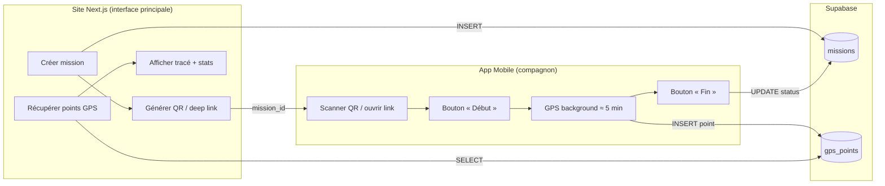
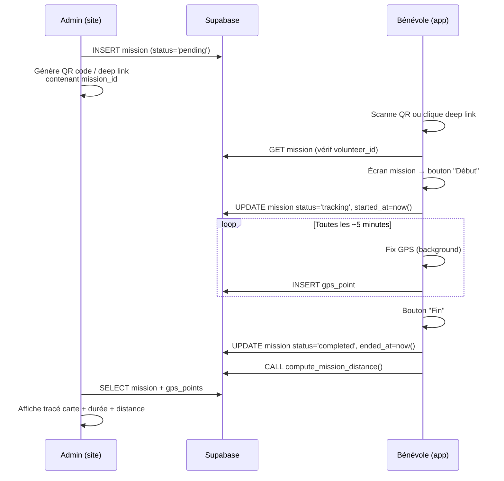

# Architecture Technique — Application Compagnon GPS

## 1. Vue d'ensemble



---

## 2. Schéma Supabase

### Table `missions`

| Colonne | Type | Description |
|---|---|---|
| `id` | `uuid` PK default `gen_random_uuid()` | Identifiant unique |
| `volunteer_id` | `uuid` FK → `profiles.id` | Bénévole assignée |
| `created_by` | `uuid` FK → `profiles.id` | Créateur (admin/site) |
| `label` | `text` | Description courte de la mission |
| `status` | `text` check `('pending','tracking','completed','cancelled')` | État courant |
| `started_at` | `timestamptz` | Heure réelle de début (set par l'app) |
| `ended_at` | `timestamptz` | Heure réelle de fin (set par l'app) |
| `distance_m` | `integer` | Distance calculée en mètres (post-traitement) |
| `duration_s` | `integer` | Durée réelle en secondes (`ended_at - started_at`) |
| `created_at` | `timestamptz` default `now()` | — |

```sql
create table public.missions (
  id uuid primary key default gen_random_uuid(),
  volunteer_id uuid references public.profiles(id),
  created_by uuid references public.profiles(id),
  label text not null,
  status text not null default 'pending'
    check (status in ('pending','tracking','completed','cancelled')),
  started_at timestamptz,
  ended_at timestamptz,
  distance_m integer,
  duration_s integer,
  created_at timestamptz not null default now()
);

-- RLS
alter table public.missions enable row level security;

-- La bénévole voit ses missions
create policy "volunteer_read" on public.missions
  for select using (auth.uid() = volunteer_id);

-- L'app mobile peut update status/started_at/ended_at
create policy "volunteer_update" on public.missions
  for update using (auth.uid() = volunteer_id)
  with check (auth.uid() = volunteer_id);
```

### Table `gps_points`

| Colonne | Type | Description |
|---|---|---|
| `id` | `bigint` PK generated always as identity | Auto-incrémenté |
| `mission_id` | `uuid` FK → `missions.id` | Référence mission |
| `latitude` | `double precision` | — |
| `longitude` | `double precision` | — |
| `accuracy_m` | `real` | Précision du fix en mètres |
| `altitude_m` | `real` | Altitude (nullable) |
| `recorded_at` | `timestamptz` | Timestamp du fix GPS |
| `created_at` | `timestamptz` default `now()` | Timestamp d'insertion |

```sql
create table public.gps_points (
  id bigint primary key generated always as identity,
  mission_id uuid not null references public.missions(id) on delete cascade,
  latitude double precision not null,
  longitude double precision not null,
  accuracy_m real,
  altitude_m real,
  recorded_at timestamptz not null,
  created_at timestamptz not null default now()
);

-- Index pour récupérer les points d'une mission rapidement
create index idx_gps_points_mission on public.gps_points(mission_id, recorded_at);

-- RLS
alter table public.gps_points enable row level security;

-- L'app insère des points pour les missions de la bénévole
create policy "volunteer_insert" on public.gps_points
  for insert with check (
    exists (
      select 1 from public.missions
      where id = mission_id and volunteer_id = auth.uid()
    )
  );

-- Lecture par la bénévole et les admins
create policy "volunteer_read" on public.gps_points
  for select using (
    exists (
      select 1 from public.missions
      where id = mission_id and volunteer_id = auth.uid()
    )
  );
```

### Fonction de calcul de distance (post-traitement)

```sql
-- Fonction Haversine pour calculer la distance totale d'une mission
create or replace function public.compute_mission_distance(p_mission_id uuid)
returns integer as $$
declare
  total_m double precision := 0;
  prev record;
  curr record;
begin
  for curr in
    select latitude, longitude, recorded_at
    from public.gps_points
    where mission_id = p_mission_id
    order by recorded_at
  loop
    if prev is not null then
      total_m := total_m + (
        6371000 * 2 * asin(sqrt(
          sin(radians(curr.latitude - prev.latitude) / 2) ^ 2 +
          cos(radians(prev.latitude)) * cos(radians(curr.latitude)) *
          sin(radians(curr.longitude - prev.longitude) / 2) ^ 2
        ))
      );
    end if;
    prev := curr;
  end loop;

  update public.missions
  set distance_m = total_m::integer,
      duration_s = extract(epoch from (ended_at - started_at))::integer
  where id = p_mission_id;

  return total_m::integer;
end;
$$ language plpgsql security definer;
```

---

## 3. Flux utilisateur complet



### Détail des étapes

1. **Côté site** : l'admin crée la mission, elle passe en `pending`. Le site génère un QR code encodant : `https://monapp.fr/mission/{mission_id}` (deep link universel).

2. **Côté app** : la bénévole scanne le QR. L'app résout le deep link, extrait `mission_id`, vérifie dans Supabase que la mission existe et lui est assignée.

3. **Début** : l'app met à jour `status → tracking` et `started_at`. Le service de localisation background démarre.

4. **Tracking** : un point GPS est enregistré toutes les ~5 minutes. Chaque point est envoyé à Supabase dès que possible (avec retry si hors réseau, stockage local temporaire).

5. **Fin** : la bénévole appuie sur "Fin". `status → completed`, `ended_at` est set. Le calcul de distance est déclenché.

6. **Consultation** : le site récupère les points, calcule le tracé (Leaflet/Mapbox), affiche durée et distance.

---

## 4. Contraintes Android vs iOS

| Aspect | Android | iOS |
|---|---|---|
| **GPS en arrière-plan** | ✅ Foreground Service avec notification persistante. Fiable, pas de kill. | ⚠️ `allowsBackgroundLocationUpdates` + `significantLocationChange`. Apple peut throttle. |
| **Fréquence 5 min** | ✅ Contrôle fin possible via Foreground Service | ⚠️ iOS ne garantit pas un intervalle fixe en background. `significantLocationChange` donne ~500m de déplacement OU ~15 min. Alternative : `startMonitoringVisits`. |
| **Kill par l'OS** | Rare avec Foreground Service | Possible si pression mémoire. Relance partielle via `significantLocationChange`. |
| **Notification obligatoire** | Oui (notification persistante du Foreground Service) | Non obligatoire mais recommandée pour UX |
| **Précision atteignable** | GPS fin (~5m) même en background | GPS fin en foreground, dégradé possible en background prolongé |
| **Permissions** | `ACCESS_FINE_LOCATION` + `ACCESS_BACKGROUND_LOCATION` (popup séparée Android 11+) | `Always` location (2 étapes : "When In Use" → "Always" via Settings) |

> [!WARNING]
> **iOS est le point dur.** Apple limite volontairement le GPS background pour économiser la batterie. Un intervalle strict de 5 min n'est pas garanti. En pratique, avec `significantLocationChange` + `allowsBackgroundLocationUpdates`, on obtient un point toutes les 5-15 minutes selon le mouvement. C'est acceptable pour le besoin exprimé.

### Stratégie iOS recommandée

- Utiliser `Background Location` capability
- Combiner `significantLocationChange` (pour le réveil de l'app) + un fix GPS ponctuel haute précision à chaque réveil
- Stocker les points localement (SQLite/AsyncStorage) et sync vers Supabase quand le réseau est disponible

---

## 5. Permissions nécessaires

### Android
| Permission | Quand |
|---|---|
| `ACCESS_FINE_LOCATION` | Au lancement |
| `ACCESS_BACKGROUND_LOCATION` | Avant le premier tracking (popup séparée sur Android 11+) |
| `FOREGROUND_SERVICE_LOCATION` | Déclaré dans le manifest |
| `POST_NOTIFICATIONS` | Android 13+ pour la notification du foreground service |

### iOS
| Permission | Quand |
|---|---|
| `NSLocationWhenInUseUsageDescription` | Au lancement |
| `NSLocationAlwaysAndWhenInUseUsageDescription` | Quand l'utilisateur demande le tracking |
| Background Mode `location` | Déclaré dans `Info.plist` |

> [!IMPORTANT]
> **App Store Review** : Apple exige une justification claire de l'usage "Always" location. Le cas d'usage "suivi de mission bénévole" est légitime mais doit être bien documenté dans la soumission.

---

## 6. Comparatif des options techniques

| Critère | **Capacitor** | **React Native (Expo)** |
|---|---|---|
| **Réutilisation du code site** | ✅ Très forte (même React/TS) | ✅ Forte (React/TS, mais composants natifs) |
| **GPS Background** | ⚠️ Plugin `@capacitor-community/background-geolocation` — maintenu par la communauté, moins fiable | ✅ `expo-location` avec `startLocationUpdatesAsync` — bien documenté, API officielle |
| **Foreground Service Android** | ⚠️ Nécessite un plugin tiers ou du code natif | ✅ Géré nativement par `expo-location` + `expo-task-manager` |
| **iOS Background** | ⚠️ Dépend du plugin WebView, moins de contrôle natif | ✅ Accès direct aux APIs natives via le bridge |
| **Taille de l'app** | ~5-10 MB (WebView) | ~15-25 MB (runtime RN) |
| **Complexité de setup** | Faible (wrapper sur le site existant) | Moyenne (nouveau projet, mais SDK bien outillé) |
| **Fiabilité du tracking** | ⚠️ Moyenne — le WebView peut être suspendu | ✅ Haute — code natif réel |
| **Publication stores** | ✅ OK | ✅ OK (EAS Build pour Expo) |
| **Maintenance** | ⚠️ Plugins communautaires moins stables | ✅ Expo SDK maintenu par l'équipe Expo |

---

## 7. Recommandation MVP

> [!TIP]
> **Expo (React Native) avec `expo-location` + `expo-task-manager`**

### Pourquoi Expo

1. **Fiabilité GPS background** : `expo-location.startLocationUpdatesAsync()` est la solution la plus testée et documentée pour le GPS background en React Native. Elle gère nativement :
   - Android : Foreground Service avec notification
   - iOS : `significantLocationChange` + `allowsBackgroundLocationUpdates`

2. **Stack compatible** : React + TypeScript → même langage que le site Next.js. Le client Supabase JS (`@supabase/supabase-js`) fonctionne tel quel.

3. **Build simplifié** : EAS Build génère les binaires iOS/Android sans Xcode/Android Studio en local.

4. **App minimale** : 2-3 écrans max (login, mission, tracking). Pas besoin de navigation complexe.

### Architecture de l'app Expo

```
companion-app/
├── app/
│   ├── _layout.tsx          # Root layout + auth check
│   ├── login.tsx            # Auth Supabase (email/magic link)
│   ├── scan.tsx             # Scanner QR / réception deep link
│   └── tracking.tsx         # Écran mission (Début/Fin + status)
├── lib/
│   ├── supabase.ts          # Client Supabase
│   ├── location.ts          # Wrapper expo-location
│   └── storage.ts           # Buffer local (points non envoyés)
├── tasks/
│   └── gps-task.ts          # TaskManager background task
└── app.json                 # Config Expo
```

### Code clé — Task GPS background

```typescript
// tasks/gps-task.ts
import * as TaskManager from 'expo-task-manager';
import { supabase } from '../lib/supabase';
import { getStoredMissionId, bufferPoint, flushBuffer } from '../lib/storage';

const TASK_NAME = 'GPS_TRACKING';

TaskManager.defineTask(TASK_NAME, async ({ data, error }) => {
  if (error || !data) return;

  const { locations } = data as { locations: Location.LocationObject[] };
  const missionId = await getStoredMissionId();
  if (!missionId) return;

  for (const loc of locations) {
    const point = {
      mission_id: missionId,
      latitude: loc.coords.latitude,
      longitude: loc.coords.longitude,
      accuracy_m: loc.coords.accuracy,
      altitude_m: loc.coords.altitude,
      recorded_at: new Date(loc.timestamp).toISOString(),
    };

    // Tenter l'envoi, sinon buffer local
    const { error } = await supabase.from('gps_points').insert(point);
    if (error) {
      await bufferPoint(point);
    }
  }

  // Tenter de flush les points buffered
  await flushBuffer();
});
```

### Démarrage du tracking

```typescript
import * as Location from 'expo-location';

async function startTracking() {
  await Location.startLocationUpdatesAsync('GPS_TRACKING', {
    accuracy: Location.Accuracy.Balanced,    // ~100m, économe en batterie
    timeInterval: 5 * 60 * 1000,             // 5 min (Android)
    distanceInterval: 100,                    // 100m min entre 2 points
    deferredUpdatesInterval: 5 * 60 * 1000,  // iOS deferred
    showsBackgroundLocationIndicator: true,   // iOS : indicateur bleu
    foregroundService: {                      // Android : notification
      notificationTitle: 'Mission en cours',
      notificationBody: 'Suivi GPS actif',
      notificationColor: '#4F46E5',
    },
  });
}
```

---

## 8. Deep Link / QR Code

### Format du lien

```
https://monsite.fr/mission/start?id={mission_id}
```

### Expo deep link (app.json)

```json
{
  "expo": {
    "scheme": "companion",
    "android": {
      "intentFilters": [{
        "action": "VIEW",
        "data": { "scheme": "https", "host": "monsite.fr", "pathPrefix": "/mission/start" }
      }]
    },
    "ios": {
      "associatedDomains": ["applinks:monsite.fr"]
    }
  }
}
```

Si l'app est installée → elle s'ouvre directement. Sinon → le lien redirige vers le store.

### QR Code côté site

```typescript
// Côté Next.js — composant React
import QRCode from 'qrcode.react';

function MissionQR({ missionId }: { missionId: string }) {
  const url = `https://monsite.fr/mission/start?id=${missionId}`;
  return <QRCode value={url} size={200} />;
}
```

---

## 9. Affichage côté site (post-mission)

### Récupération des données

```typescript
// Côté Next.js
const { data: points } = await supabase
  .from('gps_points')
  .select('latitude, longitude, recorded_at')
  .eq('mission_id', missionId)
  .order('recorded_at');

const { data: mission } = await supabase
  .from('missions')
  .select('started_at, ended_at, distance_m, duration_s')
  .eq('id', missionId)
  .single();
```

### Affichage carte (Leaflet)

```typescript
import { MapContainer, TileLayer, Polyline, Marker } from 'react-leaflet';

function MissionMap({ points }) {
  const positions = points.map(p => [p.latitude, p.longitude]);
  return (
    <MapContainer center={positions[0]} zoom={13}>
      <TileLayer url="https://{s}.tile.openstreetmap.org/{z}/{x}/{y}.png" />
      <Polyline positions={positions} color="#4F46E5" />
      <Marker position={positions[0]} /> {/* Départ */}
      <Marker position={positions.at(-1)} /> {/* Arrivée */}
    </MapContainer>
  );
}
```

---

## 10. Limites et compromis

| Limite | Impact | Mitigation |
|---|---|---|
| iOS throttle le GPS background | Points espacés de 5-15 min au lieu de 5 min pile | Acceptable pour le besoin. Combiner `significantLocationChange`. |
| Pas de réseau pendant la mission | Points non envoyés en temps réel | Buffer local SQLite/AsyncStorage + sync au retour réseau. |
| Batterie | ~2-5% / heure avec GPS balanced | `Accuracy.Balanced` au lieu de `High`. Notification claire à l'utilisateur. |
| Permission "Always" iOS | UX friction (2 étapes) | Guidage in-app avec screenshots expliquant comment activer. |
| Review App Store | Apple peut questionner l'usage location | Justification claire : suivi mission bénévole, consentement explicite, durée limitée. |

---

## 11. Résumé des livrables MVP

| Livrable | Stack | Effort estimé |
|---|---|---|
| Tables Supabase + RLS + fonction distance | SQL | 0.5j |
| App Expo (login, scan, tracking) | Expo / React Native / TS | 3-4j |
| Composant QR côté site | Next.js / React | 0.5j |
| Page résultats mission (carte + stats) | Next.js / Leaflet | 1j |
| Tests + polish + deep links | — | 1-2j |
| **Total MVP** | | **~6-8 jours** |
