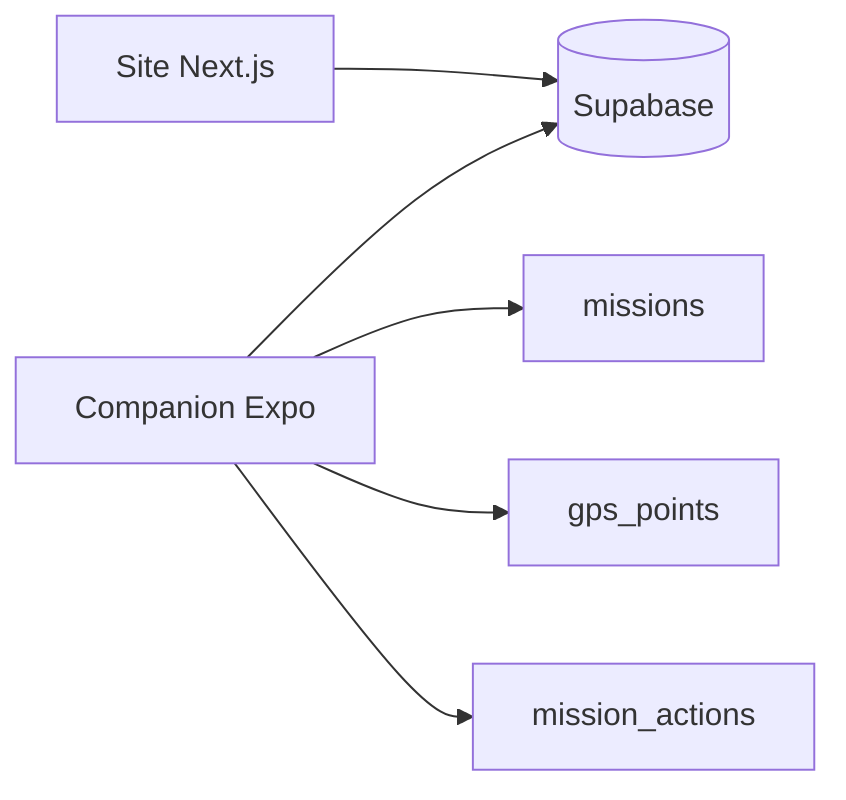

# companion-app — CleanMyMap GPS Tracker

Application mobile Expo/React Native dédiée au suivi GPS des missions terrain.

## Statut

**Expérimentale — ne pas considérer comme prête pour la production tant que les deux contrats suivants ne sont pas stabilisés :**

1. identité mobile ↔ profil Clerk ;
2. finalisation serveur du calcul de distance.

Références :

```txt
documentation/architecture/adr/ADR-004-companion-identity.md
documentation/architecture/adr/ADR-006-supabase-migrations-source-of-truth.md
```

## Stack

```txt
Expo 54
React Native 0.81
TypeScript 5.9
Supabase client
SecureStore
AsyncStorage
expo-location
expo-task-manager
```

## Pourquoi une app native ?

Le suivi GPS fiable en arrière-plan nécessite les APIs natives du système.

L'app utilise notamment :

- permissions de localisation ;
- tâche background ;
- notification persistante Android ;
- stockage local pour les points non synchronisés.

Le navigateur web ne doit pas être considéré comme équivalent pour ce besoin.

## Architecture actuelle



Le site et l'app partagent le même projet Supabase.

## Identité : limite actuelle

Le web utilise Clerk comme fournisseur d'identité principal.

L'app compagnon utilise actuellement Supabase Auth directement et propose une connexion anonyme.

Cette divergence ne doit pas être considérée comme un contrat final.

Problème à résoudre :

```txt
auth.uid() Supabase
≠ automatiquement
profiles.id Clerk
```

Avant production, choisir et tester un modèle d'identité explicite.

Décision proposée :

- Clerk reste l'identité canonique ;
- Supabase reçoit une identité vérifiable compatible avec RLS ;
- aucune identité anonyme n'est assimilée implicitement à un profil Clerk ;
- aucune clé `service_role` n'est embarquée dans l'app.

Voir `ADR-004`.

## Finalisation de mission : limite actuelle

Le code mobile appelle actuellement :

```txt
compute_mission_distance
```

Or les migrations courantes restreignent cette RPC au rôle `service_role`.

Un client mobile authentifié comme utilisateur ne doit pas recevoir `service_role`.

La correction ne consiste donc pas à ouvrir aveuglément la fonction au public.

Architectures sûres possibles :

1. endpoint serveur authentifié qui vérifie la mission puis appelle la RPC ;
2. RPC accessible aux utilisateurs authentifiés avec contrôle d'ownership interne strict ;
3. trigger serveur lors du passage à `completed`.

La décision doit être cohérente avec l'identité mobile retenue.

## Variables d'environnement

Créer :

```txt
companion-app/.env
```

à partir de :

```txt
companion-app/.env.example
```

Variables publiques attendues :

```txt
EXPO_PUBLIC_SUPABASE_URL
EXPO_PUBLIC_SUPABASE_ANON_KEY
```

Ne jamais ajouter :

```txt
SUPABASE_SERVICE_ROLE_KEY
```

dans l'app mobile.

## Installation

```bash
cd companion-app
npm install
npm run typecheck
npm start
```

## GPS background

Expo Go ne suffit pas pour valider le suivi en arrière-plan.

Utiliser un development build :

```bash
npx expo run:android
```

ou sur macOS :

```bash
npx expo run:ios
```

## Structure

```txt
companion-app/
├── App.tsx
├── index.ts
├── app.json
├── lib/
│   ├── supabase.ts
│   ├── storage.ts
│   ├── storage-upload.ts
│   └── tracking-service.ts
├── tasks/
│   └── gps-task.ts
└── types/
    └── mission.ts
```

## Supabase

Ne pas exécuter manuellement le SQL du README dans le dashboard.

Les migrations sont versionnées dans le dépôt.

Workspace CLI actuel :

```txt
apps/web/supabase/
```

Un miroir historique existe encore à la racine. Voir `ADR-006` avant toute suppression.

## Contrôles avant production

```txt
□ Identité mobile alignée avec Clerk
□ Ownership des missions testé
□ RLS missions testée
□ RLS gps_points testée
□ RLS mission_actions testée
□ Finalisation distance côté serveur ou RPC sûre
□ Erreur de calcul de distance traitée
□ Buffer offline testé
□ Restauration mission active testée
□ Refus de permissions testé
□ SecureStore vérifié
□ Typecheck en CI
```

## Validation actuelle

```bash
npm run typecheck
```

Le prochain niveau recommandé est d'ajouter des tests unitaires pour :

- stockage offline ;
- synchronisation ;
- finalisation ;
- permissions ;
- identité ;
- erreurs Supabase.
