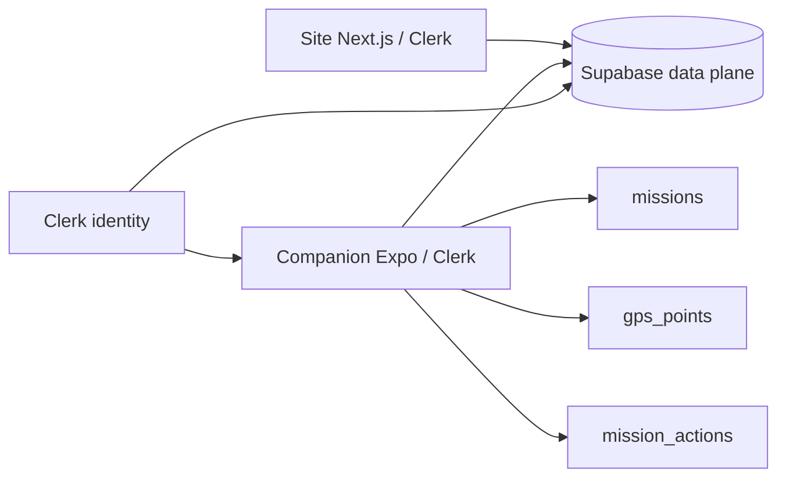

# companion-app — CleanMyMap GPS Tracker

Application mobile Expo/React Native dédiée au suivi GPS des missions terrain.

## Statut

**Expérimentale — ne pas considérer comme prête pour la production tant que les contrats suivants ne sont pas stabilisés :**

1. contrat RLS Clerk des missions et des points GPS ;
2. synchronisation fiable du GPS en background headless ;
3. finalisation serveur du calcul de distance.

Références :

```txt
documentation/architecture/adr/ADR-004-companion-identity.md
documentation/architecture/adr/ADR-006-supabase-migrations-source-of-truth.md
```

## Stack

```txt
Expo 57
React Native 0.87
TypeScript 7
Clerk Expo SDK
Supabase client (data plane)
SecureStore
AsyncStorage
expo-location
expo-task-manager
```

## Pourquoi une app native ?

Le suivi GPS fiable en arrière-plan nécessite les APIs natives du système.

L'app utilise notamment :

- permissions de localisation ;
- tâche background ;
- notification persistante Android ;
- stockage local pour les points non synchronisés.

Le navigateur web ne doit pas être considéré comme équivalent pour ce besoin.

## Architecture actuelle


```mermaid
flowchart LR
  WEB[Site Next.js / Clerk] --> SB[(Supabase data plane)]
  APP[Companion Expo / Clerk] --> SB
  CLERK[Clerk identity] --> APP
  CLERK --> SB
  APP --> MISSIONS[missions]
  APP --> GPS[gps_points]
  APP --> ACTIONS[mission_actions]
```

Le site et l'app partagent le même projet Supabase.

## Identité Clerk

Le web utilise Clerk comme fournisseur d'identité principal.

Le LOT 1 de l'ADR-004 est accepté et implémenté : Clerk est l'unique identité
utilisateur du companion-app. L'interface utilise l'authentification hébergée
Clerk (Account Portal), avec les méthodes activées dans le compte Clerk.

Le `ClerkProvider` utilise le cache de token sécurisé Expo. Le client Supabase
reste uniquement un data plane : il utilise la clé publique anon pour le
transport et le token de session Clerk courant via `accessToken`. Supabase Auth
n'est pas le fournisseur d'identité du companion et aucune session Supabase Auth
n'est persistée ou observée.

Le chemin d'identité anonyme a été supprimé. Aucun JWT template legacy n'est
copié dans l'app et aucune clé `service_role` n'est embarquée.

Le contrat RLS qui doit lire le `sub` Clerk et le rapprocher des colonnes
d'ownership n'est pas traité dans ce lot. Tant qu'il n'est pas validé, l'app ne
doit pas être qualifiée de prête pour la production.

Voir `ADR-004`.

## Finalisation de mission : limite actuelle

Le code mobile appelle actuellement :

```txt
compute_mission_distance
```

Or les migrations courantes restreignent cette RPC au rôle `service_role`.

Un client mobile authentifié comme utilisateur ne doit pas recevoir `service_role`.

La correction ne consiste donc pas à ouvrir aveuglément la fonction au public.

Architectures sûres possibles :

1. endpoint serveur authentifié qui vérifie la mission puis appelle la RPC ;
2. RPC accessible aux utilisateurs authentifiés avec contrôle d'ownership interne strict ;
3. trigger serveur lors du passage à `completed`.

La décision doit être cohérente avec l'identité mobile retenue.

## Variables d'environnement

Créer :

```txt
companion-app/.env
```

à partir de :

```txt
companion-app/.env.example
```

Variables publiques attendues :

```txt
EXPO_PUBLIC_SUPABASE_URL
EXPO_PUBLIC_SUPABASE_ANON_KEY
EXPO_PUBLIC_CLERK_PUBLISHABLE_KEY
```

Ne jamais ajouter :

```txt
SUPABASE_SERVICE_ROLE_KEY
```

dans l'app mobile.

## Installation

```bash
cd companion-app
npm install
npm run typecheck
npm start
```

## GPS background

Expo Go ne suffit pas pour valider le suivi en arrière-plan.

Utiliser un development build :

```bash
npx expo run:android
```

ou sur macOS :

```bash
npx expo run:ios
```

Le TaskManager demande le token Clerk courant avant toute écriture Supabase.
Lorsqu'un réveil headless ne dispose pas d'un token Clerk valide, il ne tente
aucune authentification alternative : les points sont conservés dans le buffer
local sécurisé et la synchronisation est différée.

Ce lot ne prétend pas résoudre le renouvellement d'un token Clerk lorsque le
TaskManager est réveillé sans contexte JavaScript Clerk complet. Le contrat de
réhydratation, de synchronisation background et les RLS correspondantes sont
explicitement réservés au LOT 2 de l'ADR-004.

## Structure

```txt
companion-app/
├── App.tsx
├── index.ts
├── app.json
├── lib/
│   ├── supabase.ts
│   ├── storage.ts
│   ├── storage-upload.ts
│   └── tracking-service.ts
├── tasks/
│   └── gps-task.ts
└── types/
    └── mission.ts
```

## Supabase

Ne pas exécuter manuellement le SQL du README dans le dashboard.

Les migrations sont versionnées dans le dépôt.

Workspace CLI actuel :

```txt
apps/web/supabase/
```

Les migrations sont maintenues uniquement dans `apps/web/supabase/`. Voir
`ADR-006` pour la décision de source de vérité.

## Contrôles avant production

```txt
☑ Identité mobile alignée avec Clerk côté SDK et token provider (LOT 1)
□ Intégration Clerk Third-Party Auth configurée et RLS missions validées
□ Ownership des missions testé
□ RLS missions testée
□ RLS gps_points testée
□ RLS mission_actions testée
□ Finalisation distance côté serveur ou RPC sûre
□ Erreur de calcul de distance traitée
□ Buffer offline testé
□ Restauration mission active testée
□ Refus de permissions testé
☑ Cache de token Clerk dans SecureStore configuré (LOT 1)
□ Renouvellement du token Clerk en background headless
□ Typecheck en CI
```

## Validation actuelle

```bash
npm run typecheck
```

Le prochain niveau recommandé est d'ajouter des tests unitaires pour :

- stockage offline ;
- synchronisation ;
- finalisation ;
- permissions ;
- identité ;
- erreurs Supabase.
