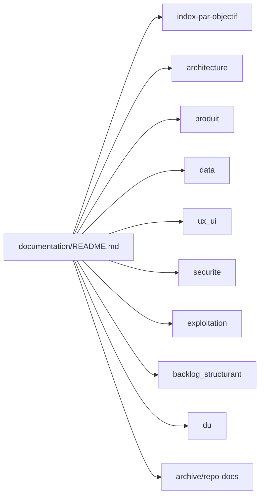

# Documentation CleanMyMap

Ce dossier est le point d'entree unique de la documentation produit, technique et exploitation.

## Schema de navigation documentaire (lecture 30s)

Fallback statique:
```md

```

## Parcours rapide
- [Index par objectif](./index-par-objectif.md)
- [Architecture](./architecture/system-overview.md)
- [Produit](./produit/vision-et-objectifs.md)
- [Data](./data/sources.md)
- [UX/UI](./ux_ui/principes-visuels.md)
- [Securite](./securite/gestion-secrets-et-env.md)
- [Exploitation](./exploitation/runbook-deploiement.md)
- [Backlog structurant](./backlog_structurant/refactors-prioritaires.md)
- [Audit par rubrique](./audit_rubrique)
- [Memoire DU/session](./du)

## Statut de transition
- Les contenus historiques sont conserves dans `documentation/repo-docs/` pendant la transition.
- Les nouveaux contenus doivent etre crees et maintenus prioritairement dans l'arborescence courante.

## Quand remplacer du texte par un visuel
- Appliquer la regle unique `visual-first`: des qu'un contenu depasse 5 lignes explicatives sur un processus, une interaction, une architecture ou un arbitrage, remplacer le bloc texte principal par un visuel.
- Formats autorises par defaut: `flowchart`, `sequence`, `architecture`, `decision tree` (voir `documentation/ux_ui/standards-visuels.md`).
- Garder le texte uniquement pour:
  - contexte court (objectif, hypothese, risque),
  - legendes de lecture (max 3 points),
  - decisions finales et impacts.
- Chaque visuel doit avoir:
  - un titre explicite,
  - un fallback image statique reference dans le meme document,
  - une source editable (`.mmd` ou bloc Mermaid) pour maintenance.
