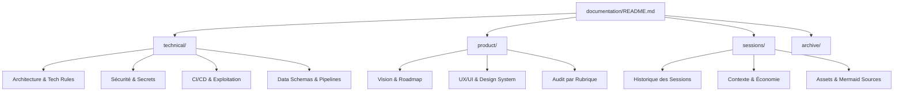

# Documentation CleanMyMap

Ce dossier est le point d'entrée unique de la documentation produit, technique et exploitation.
L'arborescence a été simplifiée pour une meilleure maintenabilité.

## Schéma de navigation (lecture 30s)

## Parcours rapide
- **[Technique](./technical/)** : 
  - [Architecture Globale](./technical/system-overview.md)
  - [Sécurité & Secrets](./technical/gestion-secrets-et-env.md)
  - [Déploiement (Runbook)](./technical/runbook-deploiement.md)
  - [Data Pipeline](./technical/pipeline-import.md)
- **[Produit](./product/)** :
  - [Vision & Objectifs](./product/vision-et-objectifs.md)
  - [Roadmap Priorisée](./product/roadmap-priorisee.md)
  - [Design System](./product/design-system.md)
  - [Audit par Rubrique](./product/audit/)
- **[Sessions & IA](./sessions/)** :
  - [Dernière Session IA](./sessions/history/latest-session.md)
  - [Contexte Projet](./sessions/context/fiche_projet.txt)
  - [Templates](./sessions/templates/)

## Principes de Documentation
- **Visual-First** : Remplacez tout texte > 5 lignes par un schéma Mermaid si possible.
- **Maintenance** : Gardez les sources Mermaid (`.mmd`) proches des documents.
- **Référentiel** : `project_context.md` et `AGENTS.md` à la racine du repo pilotent le comportement des agents.
