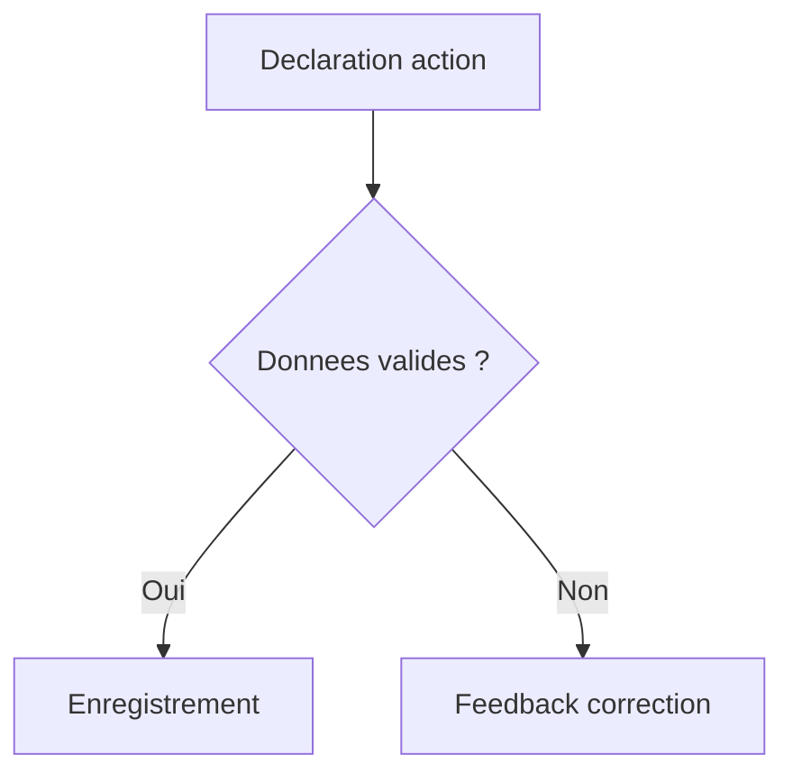
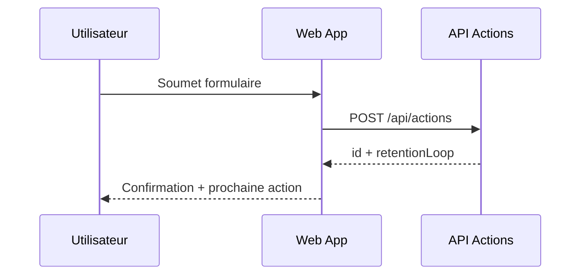
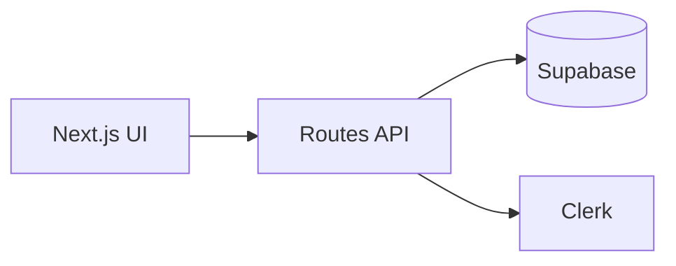
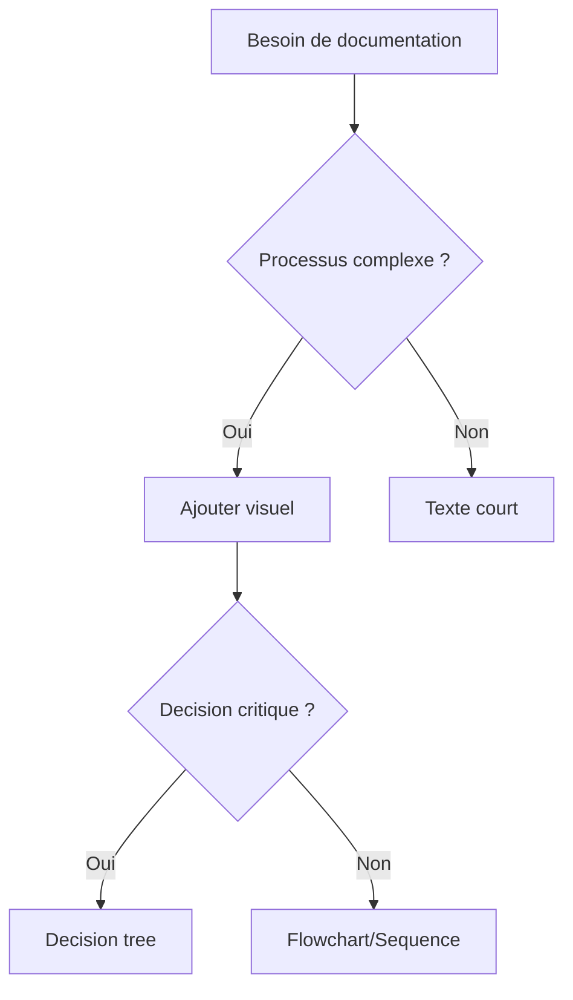

# Standards visuels de documentation

## Objectif
Standardiser les visuels de documentation pour accélérer la comprehension et limiter les ambiguïtés.

## Formats obligatoires
1. `flowchart`
2. `sequence`
3. `architecture`
4. `decision tree`

## Règles communes
- Titre obligatoire.
- Noms de noeuds et métiers explicites.
- Un fallback image statique obligatoire.
- Version editable conservée (Mermaid ou fichier `.mmd`).

## Exemples minimaux copiables

### 1) Flowchart (Mermaid)

Fallback statique:
```md

```

### 2) Sequence (Mermaid)

Fallback statique:
```md

```

### 3) Architecture (Mermaid)

Fallback statique:
```md

```

### 4) Decision tree (Mermaid)

Fallback statique:
```md

```
