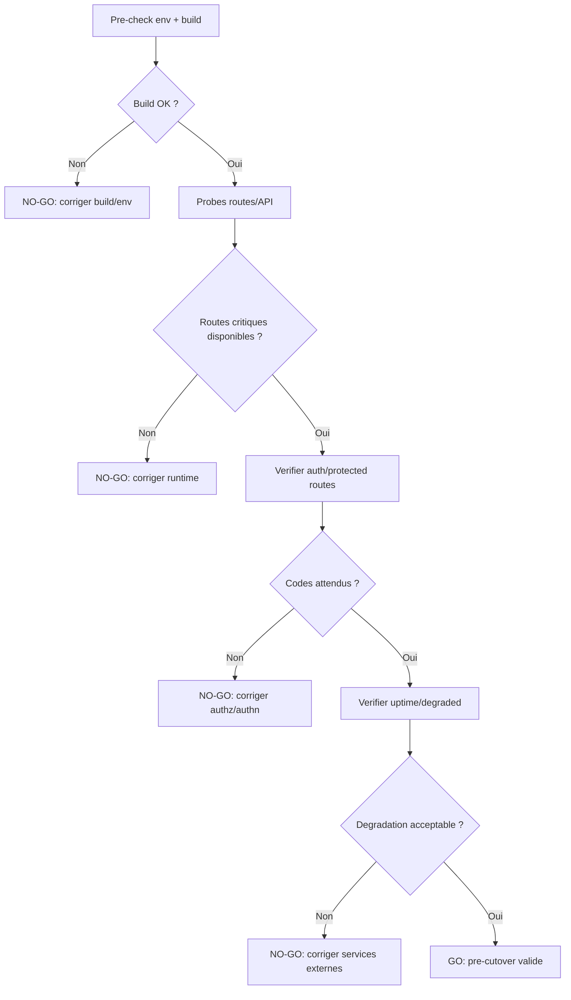

# Pre-Cutover Dry Run Report

Date: 2026-04-02 (Europe/Paris)  
Mode: local dry-run against `next start` build output

## Checklist graph pre-checks -> go/no-go

Fallback statique:
```md

```

## Scope executed
- Build validation (`npm.cmd run build`) before runtime probes.
- Runtime probes on:
  - `/`
  - `/api/health`
  - `/api/uptime`
  - `/api/services`
  - `/dashboard`
  - `/reports`
  - `/api/reports/actions.csv?limit=1&days=30`
  - `/actions/new`
  - `/actions/history`
  - `/actions/map`

## Dry-run artifacts
- Probe results JSON:
  - `apps/web/ops/runbooks/pre-cutover-dry-run-results.json`
- Runtime logs:
  - stdout: `apps/web/dryrun-start-20260402-212105.out.log`
  - stderr: `apps/web/dryrun-start-20260402-212105.err.log`

## Results summary
### Pass #1 (failed)
- HTTP probe status:
  - 10/10 routes failed with `500`.
- Root cause from stderr logs:
  - Clerk key misconfiguration (`Missing publishableKey` or `Publishable key not valid`).
- Impact:
  - No route reachable in runtime when Clerk keys are missing/invalid.

### Pass #2 (after env completion)
- Artifact: `apps/web/ops/runbooks/pre-cutover-dry-run-results.json`
- Probe status:
  - `200`: 10 routes
  - `401`: 1 route (`/api/reports/actions.csv?limit=1&days=30`, expected without session)
  - `503`: 1 route (`/api/uptime`, degraded mode)
- Interpretation:
  - Core app and UI routes are reachable.
  - Auth-protected API route correctly blocks anonymous access.
  - Uptime endpoint indicates degraded configuration, not runtime crash.

## Runbook mapping
- Cloudflare DNS steps: NOT EXECUTED (external systems).
- UptimeRobot monitor setup: NOT EXECUTED (external systems).
- App smoke checks: EXECUTED -> PASS WITH CAVEATS (`401` expected on protected CSV export, `/api/uptime` still degraded).
- Rollback playbook: READY (documented) but not triggered (local dry-run only).

## Current blockers / caveats
1. `/api/uptime` returns `503` because environment is still partially unconfigured (Sentry/Upstash URL validation warnings in stderr).
2. External runbook tranche still pending:
   - Cloudflare DNS verification
   - UptimeRobot monitor creation and alert rules

## Required remediation before next dry-run
1. Optional but recommended: complete Sentry/Upstash env values (or neutral placeholders removed) to eliminate false degraded signals.
2. Keep protected route checks with authenticated session in the next smoke pass.
3. Execute external cutover steps (Cloudflare + UptimeRobot) and record outcomes.
