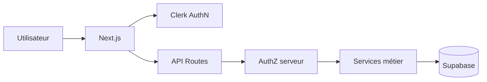

# CleanMyMap Architecture Snapshot

Entrée compacte pour assistants IA. La source globale reste `master-architecture.md`.

## Surfaces actives

```txt
apps/web/                       application web Next.js
apps/web/src/app/               pages et routes API
apps/web/src/components/        UI
apps/web/src/lib/               logique métier, auth, services et data
apps/web/supabase/              configuration et migrations du workspace web
companion-app/                  application mobile GPS
scripts/                        garde-fous et maintenance Node
maintenance/python/             maintenance Python hors runtime principal
documentation/                  architecture, produit, sécurité et opérations
```

## Fichiers d'entrée à forte valeur

```txt
apps/web/src/proxy.ts
apps/web/src/lib/auth/protected-routes.ts
apps/web/src/lib/authz.ts
apps/web/src/lib/actions/data-contract.ts
apps/web/src/lib/actions/unified-source.ts
apps/web/src/lib/actions/types.ts
apps/web/src/lib/sections-registry/config.ts
apps/web/src/app/api/
```

Pour la carte :

```txt
apps/web/src/app/(app)/actions/map/page.tsx
apps/web/src/components/actions/actions-map-feed.tsx
apps/web/src/lib/data/map-records.ts
```

## Auth et données



Règles :

- Clerk est l'identité principale du web ;
- Supabase stocke les données ;
- `service_role` reste serveur ;
- RLS ne doit pas être désactivée pour contourner un défaut ;
- les routes sensibles vérifient l'accès côté serveur.

## Application compagnon

`companion-app/` partage le projet Supabase mais son modèle d'identité doit être aligné avec Clerk avant production.

Ne pas considérer comme valide un flux où :

- une identité Supabase anonyme devient implicitement un profil Clerk ;
- le client mobile appelle une RPC réservée à `service_role`.

Voir :

```txt
documentation/architecture/adr/ADR-004-companion-identity.md
documentation/architecture/adr/ADR-006-supabase-migrations-source-of-truth.md
```

## Migrations

Le workspace Supabase actif possède :

```txt
apps/web/supabase/config.toml
apps/web/supabase/migrations/
```

Un second arbre existe encore :

```txt
supabase/migrations/
```

Ne pas modifier un seul arbre sans appliquer la stratégie de l'ADR-006.

## Budget de contexte

- commencer par la cible réelle ;
- lire 3 à 5 fichiers utiles avant d'élargir ;
- utiliser `git diff --name-only` et `rg` ciblé ;
- éviter `node_modules`, `.next`, artefacts, backups et lockfiles sauf nécessité.

## Validation

Ciblée :

```bash
npm run checks:changed
```

Complète :

```bash
npm run checks
```

E2E explicite :

```bash
npm run test:e2e
```

## Incident

Runbook :

```txt
documentation/operations/INCIDENT_RUNBOOK_SHORT.md
```
