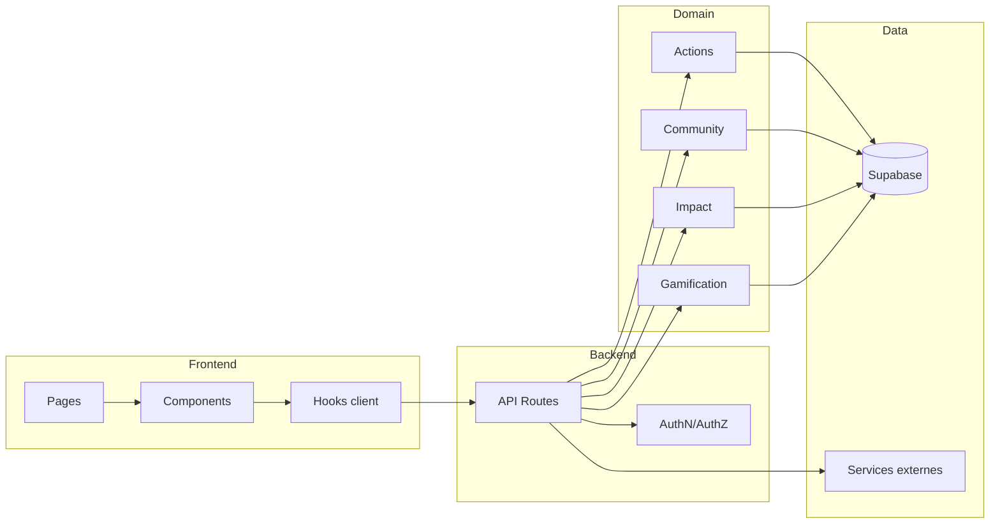

# Frontend / Backend Boundaries

## Vue d'ensemble



## Frontend

Chemins :

```txt
apps/web/src/app/
apps/web/src/components/
```

Responsabilités :

- rendu ;
- interaction ;
- états visuels ;
- accessibilité ;
- appels vers API ou hooks existants.

Le frontend ne doit pas :

- recevoir `service_role` ;
- décider seul d'une autorisation sensible ;
- contenir un secret ;
- accéder directement à une ressource privilégiée.

## API

Chemin :

```txt
apps/web/src/app/api/
```

Responsabilités :

- authentification si requise ;
- autorisation ;
- validation d'entrée ;
- appel domaine ;
- réponse normalisée ;
- gestion des erreurs.

Le proxy ne remplace pas les contrôles du handler.

## Domaine

Chemin principal :

```txt
apps/web/src/lib/
```

Contrats structurants :

```txt
actions/data-contract.ts
actions/unified-source.ts
actions/types.ts
domain-language.ts
```

Règles :

- ne pas dupliquer une règle métier dans plusieurs routes ;
- centraliser les capacités partagées ;
- maintenir les tests de contrat.

## Supabase

Les clients doivent être choisis selon le contexte :

- browser/anon lorsque RLS doit s'appliquer ;
- serveur lorsque le flux le nécessite ;
- service role uniquement côté serveur et seulement lorsqu'elle est justifiée.

## Server Components et Client Components

Préférer le serveur pour :

- secrets ;
- authz ;
- accès privilégié ;
- calcul métier stable ;
- réduction du bundle.

Utiliser le client pour :

- interactions navigateur ;
- état local ;
- APIs navigateur ;
- données réactives selon le pattern existant.

Ne pas ajouter `"use client"` à une arborescence entière pour faciliter un import.

## Leaflet

Les composants Leaflet sont chargés dynamiquement avec SSR désactivé.

```tsx
dynamic(() => import("./map"), { ssr: false })
```

Ne pas accéder à `window` pendant le SSR.

## Contrats à protéger par tests

- statuts actions ;
- géométrie ;
- navigation ↔ registre ;
- routes protégées ;
- API boundaries ;
- permissions ;
- RLS ;
- exports ;
- gamification ;
- quotas Vercel.

## Application compagnon

L'app mobile n'est pas un frontend de confiance privilégié.

Elle ne doit jamais embarquer `service_role`.

L'identité et l'ownership doivent rester vérifiables côté données ou serveur.

## Validation

Toute évolution de contrat backend doit avoir :

- test de régression ;
- validation API ;
- validation UI si la surface change ;
- documentation si la décision est durable.
