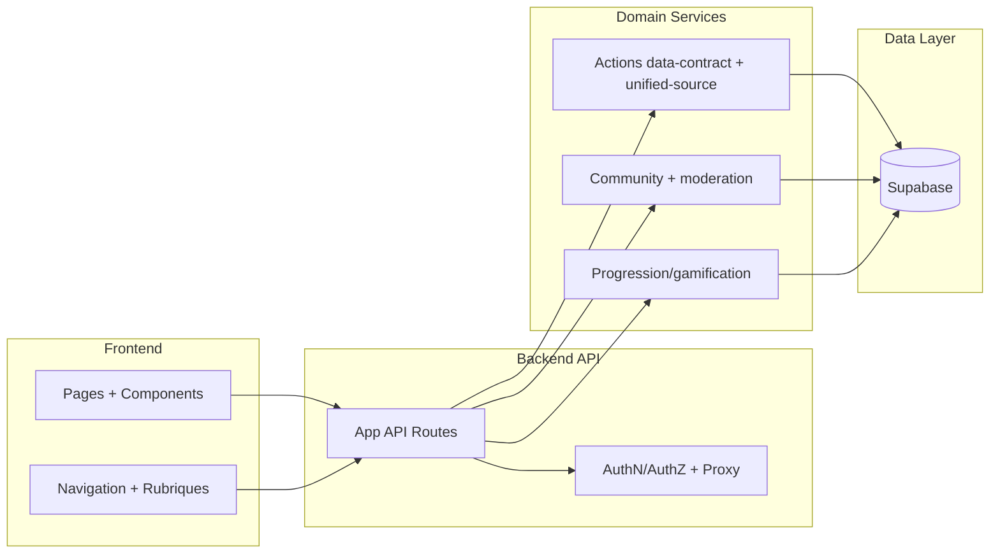

# Frontend / Backend Boundaries

## Architecture des zones UI/API/lib + contrats

Fallback statique:
```md

```

## Frontend (apps/web)
- Pages App Router: `apps/web/src/app/*`
- Components UI: `apps/web/src/components/*`
- Navigation/rubriques: `apps/web/src/lib/navigation.ts`, `apps/web/src/lib/sections-registry.ts`

## Backend (API routes + services)
- API routes: `apps/web/src/app/api/*`
- AuthN/AuthZ: `apps/web/src/lib/auth/*`, `apps/web/src/lib/authz.ts`, `apps/web/src/proxy.ts`
- Data access Supabase: `apps/web/src/lib/**` (domain modules)

## Contrats a stabiliser
- Contrat actions unifiees: `apps/web/src/lib/actions/data-contract.ts`
- Agrgation actions: `apps/web/src/lib/actions/unified-source.ts`
- Profil progression/gamification: `apps/web/src/lib/gamification/*`

## Regle
- Toute evolution de contrat backend doit avoir test de regression + validation API/UI associee.
