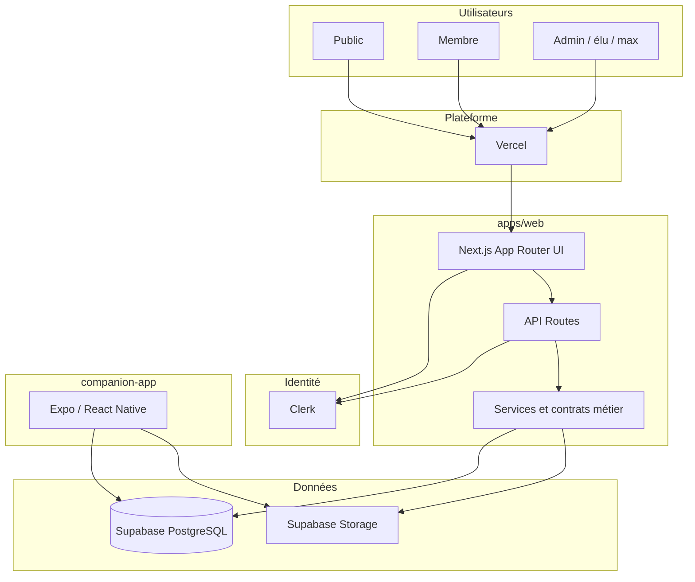
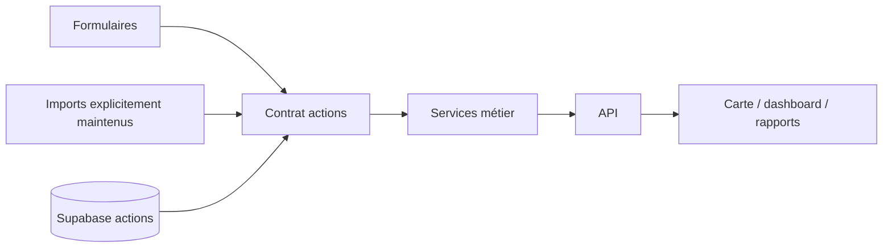
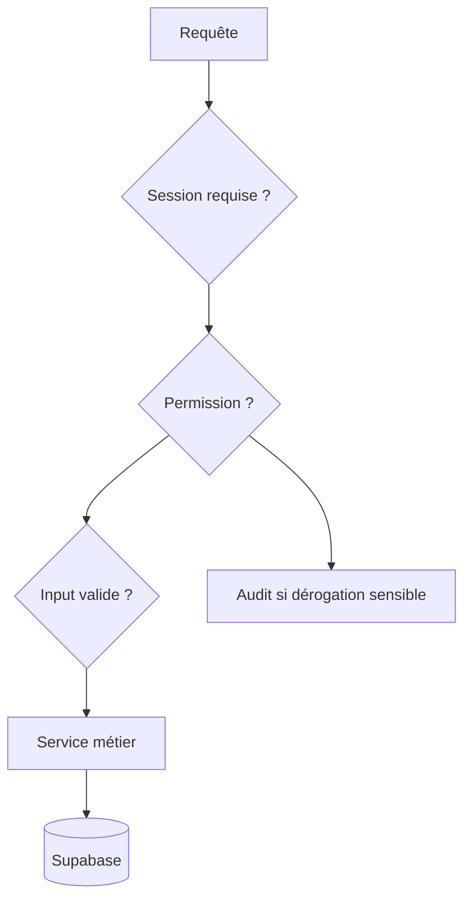

# Master Architecture — CleanMyMap

Source de vérité pour l'architecture globale du projet.

## Principes

CleanMyMap sépare :

- interface web ;
- identité ;
- domaine métier ;
- données ;
- application mobile ;
- services externes ;
- maintenance.

Les versions exactes sont définies dans les manifestes.

## Vue globale



## Structure du dépôt

```txt
CleanMyMap/
├── apps/
│   └── web/
│       ├── src/
│       │   ├── app/
│       │   ├── components/
│       │   └── lib/
│       └── supabase/
├── companion-app/
├── documentation/
├── scripts/
├── maintenance/
│   └── python/
├── .github/
├── .codex/
└── .agents/
```

## Application web

### Pages et API

```txt
apps/web/src/app/
```

Contient :

- pages App Router ;
- layouts ;
- route handlers API.

### UI

```txt
apps/web/src/components/
```

Les composants client doivent rester aussi minces que possible.

### Domaine

```txt
apps/web/src/lib/
```

Contient notamment :

- actions ;
- profils ;
- auth ;
- authz ;
- Supabase ;
- gamification ;
- rapports ;
- services tiers ;
- contrats.

## Identité

Clerk est l'identité principale du web.

Fichiers pivots :

```txt
apps/web/src/lib/auth/
apps/web/src/lib/authz.ts
apps/web/src/proxy.ts
apps/web/src/lib/profiles.ts
```

Supabase ne doit pas devenir un second fournisseur d'identité implicite pour le même utilisateur sans décision explicite.

Voir :

```txt
architecture/adr/ADR-001-clerk-auth.md
architecture/adr/ADR-004-companion-identity.md
```

## Données

Supabase fournit :

- PostgreSQL ;
- RLS ;
- RPC ;
- Storage.

Règles :

- `service_role` serveur uniquement ;
- migration versionnée ;
- ownership explicite ;
- validation des entrées ;
- tests RLS.

## Flux actions



Les anciens Google Sheets ne sont plus la source de vérité principale.

Ne pas réactiver un ancien import sans vérifier le contrat courant.

## Application compagnon

`companion-app/` assure le suivi GPS natif.

Statut architectural :

- surface séparée du workspace web ;
- même projet Supabase ;
- identité mobile à aligner avec Clerk ;
- finalisation de distance à sécuriser.

Voir ADR-004 et ADR-006.

## Supabase : source des migrations

Le workspace actif possède :

```txt
apps/web/supabase/config.toml
apps/web/supabase/migrations/
```

Un second arbre historique existe à la racine.

Voir :

```txt
architecture/adr/ADR-006-supabase-migrations-source-of-truth.md
```

## Sécurité



Une route protégée par proxy doit tout de même vérifier le contrat d'autorisation adapté au handler.

## Frontières serveur/client

- secret : serveur ;
- `service_role` : serveur ;
- authz sensible : serveur ;
- browser APIs : client ;
- Leaflet : client dynamique sans SSR ;
- données réactives : SWR ou mécanisme existant quand pertinent.

## Services externes

Exemples :

```txt
Clerk
Supabase
Vercel
Resend
Stripe
Sentry
PostHog
Pinecone
Upstash
```

Un service optionnel ne doit pas casser tout le runtime lorsqu'il est absent, sauf s'il est explicitement requis pour la route.

## Quotas

Le projet doit minimiser les coûts involontaires.

Références :

```txt
documentation/development/vercel-quota-governance.md
documentation/development/vercel-supabase-free-tier-rules.md
documentation/development/supabase-quota-guide.md
```

## Architecture UI

Principes :

- page métier ≠ landing décorative ;
- `PageHeader` comme header canonique ;
- famille de couleur via design system ;
- détails lourds à la demande ;
- client léger ;
- composants réutilisables ;
- états async explicites.

## Documentation

```txt
pages_site/      fonctionnel par page
architecture/    décisions et frontières
security/        doctrine et audits
development/     workflow technique
product/         vision et priorités
operations/      exploitation
```

Ne pas dupliquer une règle durable.

## Validation

Modification ciblée :

```bash
npm run checks:changed
```

Modification structurante :

```bash
npm run checks
```

E2E explicite :

```bash
npm run test:e2e
```
