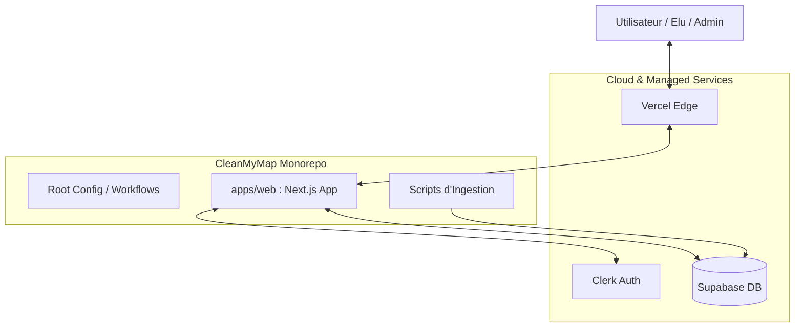
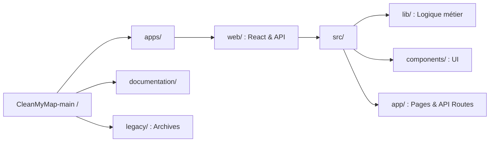
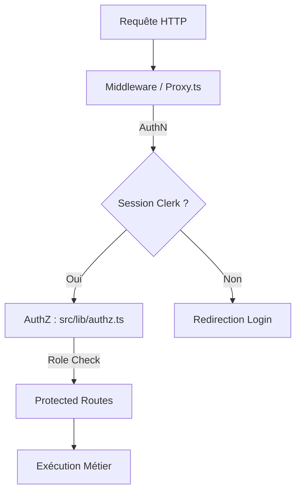

# Master Architecture : CleanMyMap

Ce document constitue la source de vérité pour l'architecture globale du projet. Il lie les concepts métier aux implémentations techniques et à la structure physique du dépôt.

---

## 1. Vision Systémique Globale
Ce schéma montre comment les services externes interagissent avec l'application cœur.



---

## 2. Structure du Monorépo
Organisation physique des fichiers et dépendances.



---

## 3. Flux de Données Unifié
Comment les actions passent de la source à l'écran.

```mermaid
flowchart LR
    G_SHEETS[Google Sheets] --> UNIFIED[unified-source.ts]
    DB_PROPER[(Supabase Actions)] --> UNIFIED
    FORM[Formulaires Directs] --> UNIFIED
    
    UNIFIED --> API[/api/actions/map]
    API --> UI[Dashboard / Carte]
```

---

## 4. Pile de Sécurité (Cascade)
Les couches de protection appliquées à chaque requête.



---

## Liens vers les détails techniques
*   [Sécurité approfondie](./securite/authz-authn-regles.md)
*   [Normalisation des données](./data/schema-normalisation.md)
*   [Processus de déploiement](./exploitation/runbook-deploiement.md)
