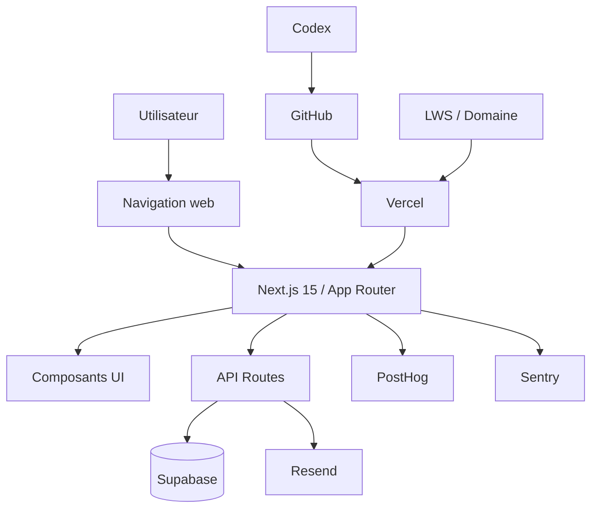

# Méthodologie de fonctionnement du site

Ce document décrit comment CleanMyMap fonctionne d'un point de vue technique et opérationnel. Il sert de fiche de lecture rapide pour comprendre l'architecture, les services connectés et le chemin réel d'une requête utilisateur.

## Périmètre

Le site repose sur `Next.js 15` avec App Router, `TypeScript` et `Tailwind CSS 4`.

Le dépôt est organisé comme un monorepo centré sur `apps/web`, avec :

- les pages dans `apps/web/src/app`;
- les composants réutilisables dans `apps/web/src/components`;
- la logique métier et les services dans `apps/web/src/lib`;
- la documentation dans `documentation/`.

La séparation attendue est simple :

- les pages orchestrent;
- les composants affichent;
- les modules `lib/` calculent et accèdent aux services;
- les routes API servent d'interface serveur.

## Schéma d'ensemble

## Architecture applicative

Le front et le back vivent dans la même application Next.js, mais avec des responsabilités séparées :

- les pages et layouts composent l'expérience;
- les composants client restent aussi légers que possible;
- les calculs sensibles et les accès aux données passent côté serveur;
- les appels à des services tiers sont encapsulés dans `lib/` ou dans des routes API.

La carte Leaflet suit une règle stricte :

- `react-leaflet` est chargé dynamiquement;
- le rendu se fait avec `ssr: false`;
- aucun accès à `window` ne doit avoir lieu au SSR;
- les couches cartes et marqueurs doivent rester compatibles avec le rendu initial.

## Données et backend

### Supabase

Supabase est la base de données et la couche backend principale.

Il sert à :

- stocker les données métier;
- exposer les accès sécurisés côté serveur;
- gérer certains flux de stockage;
- alimenter les pages de pilotage et les rapports.

La règle du projet reste la même :

- pas de SQL brut;
- clients Supabase uniquement;
- prudence maximale sur les accès serveur.

### Clerk

Clerk gère l'authentification et les sessions.

Le site s'appuie sur Clerk pour :

- identifier l'utilisateur;
- protéger les routes privées;
- injecter le contexte d'accès côté serveur;
- synchroniser les droits et profils.

## Services externes

### GitHub et Vercel

GitHub est le dépôt source. Vercel est la plateforme de déploiement.

Le flux standard est le suivant :

- commit sur GitHub;
- preview ou build Vercel;
- validation des routes et des variables d'environnement;
- déploiement en production après contrôle.

### Codex

Codex est l'outil utilisé pour modifier le code, créer des fichiers, corriger les bugs et vérifier les changements dans le dépôt.

Il n'exécute pas le site en production.
Son rôle est d'assister la production du code et de la documentation.

### PostHog

PostHog sert à l'analytics produit.

Il permet de suivre :

- les pages vues;
- certains événements clés;
- les parcours de navigation;
- les usages utiles au pilotage.

### Sentry

Sentry sert à remonter les erreurs techniques et les régressions observées en production.

Il est utilisé pour :

- détecter les exceptions;
- regrouper les incidents;
- raccourcir le diagnostic;
- conserver un historique d'erreurs exploitable.

### Resend

Resend gère les mails transactionnels et notifications sortantes.

Il intervient pour :

- les emails de contact;
- les messages transactionnels;
- les flux qui doivent être envoyés depuis le serveur.

### Nom de domaine LWS

Le nom de domaine du site est géré chez LWS et sert de point d'entrée public.

Dans la logique du projet, ce poste est un coût fixe à suivre, au même titre que l'hébergement et les autres dépendances d'infrastructure.

## Chaîne de fonctionnement

Lorsqu'un utilisateur agit sur le site :

- l'interface Next.js affiche la page ou le module concerné;
- les données nécessaires sont chargées depuis Supabase ou une route API;
- la carte Leaflet, si présente, est chargée sans SSR;
- les événements utiles sont envoyés vers PostHog;
- les erreurs sont capturées par Sentry;
- les notifications sortantes passent par Resend;
- les artefacts de build et de déploiement passent par GitHub et Vercel;
- le domaine LWS pointe vers l'instance publique du site.

## Points de contrôle

Cette méthodologie doit rester alignée avec les règles du dépôt :

- composants client minces;
- logique métier centralisée;
- pas de duplication inutile;
- carte dynamique pour Leaflet;
- traçabilité des changements;
- validation avant publication.

## Documents liés

- [Architecture globale](./master-architecture.md)
- [Vue système](./system-overview.md)
- [Services web stack](../operations/services-stack.md)
- [Fiche technique](../fiche-technique-cleanmymap.md)
- [Gouvernance des données](./data-governance.md)

