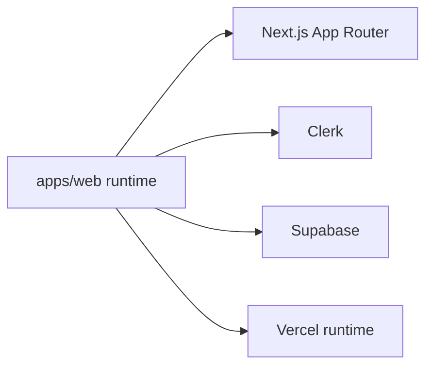

# Modules cles et dependances

## Carte des modules metier
```mermaid
flowchart TD
  NAV[navigation.ts + sections-registry.ts] --> UI[Section renderer / pages]
  ACT[lib/actions/*] --> APIA[/api/actions + /api/actions/map]
  GAM[lib/gamification/*] --> APIG[/api/gamification/*]
  COM[lib/community/*] --> APIC[/api/community/*]
  PIL[lib/pilotage/*] --> APIR[/api/reports/*]
  APIA --> DB[(Supabase)]
  APIG --> DB
  APIC --> DB
  APIR --> DB
  AUTH[Clerk + authz/proxy] --> APIA
  AUTH --> APIG
  AUTH --> APIC
  AUTH --> APIR
```
Fallback statique:
```md

```

## Dependances externes critiques

Fallback statique:
```md

```

## Arbre de decision: ou intervenir
```mermaid
flowchart TD
  A[Nouvelle demande] --> B{Sujet UI/navigation ?}
  B -- Oui --> C[navigation.ts + sections-registry.ts + components/sections]
  B -- Non --> D{Sujet API/data ?}
  D -- Oui --> E[app/api/* + lib/actions|community|gamification]
  D -- Non --> F{Sujet securite/acces ?}
  F -- Oui --> G[authz.ts + protected-routes.ts + proxy.ts]
  F -- Non --> H[pilotage/reports + docs backlog]
```
Fallback statique:
```md

```

## Couplages a surveiller
- Registry sections <-> navigation <-> renderer.
- Contrat actions <-> exports <-> rapports.
- Auth roles <-> routes protegees <-> endpoints admin.
