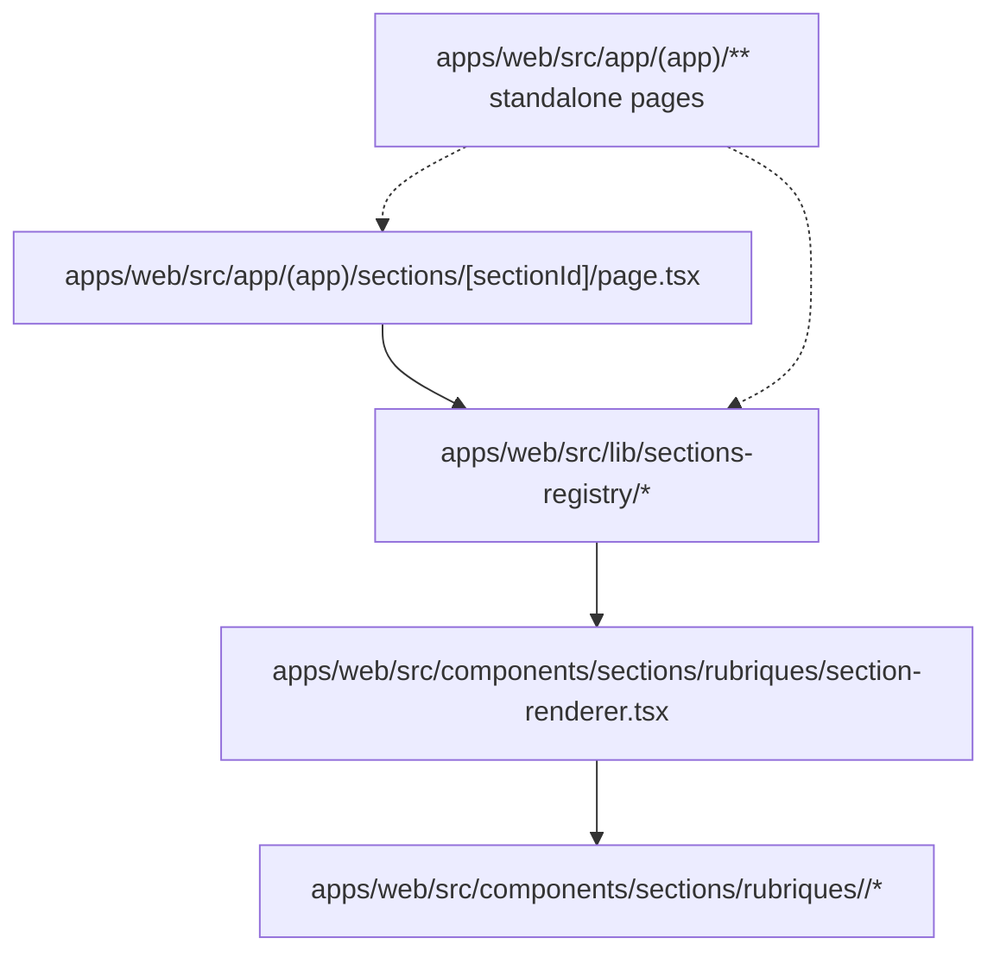

# Section Ownership Boundaries

## Goal

This document defines the ownership contract for the section system so that routes, metadata, and UI stay separated.

The repo uses a hybrid model:

- `apps/web/src/app/` owns routing entry points only.
- `apps/web/src/lib/sections-registry/` owns section metadata and navigation rules only.
- `apps/web/src/components/sections/rubriques/` owns feature UI and section composition only.
- `apps/web/src/components/sections/rubriques/section-renderer.tsx` is the UI assembly layer that maps a section id to the correct feature component.

## Ownership Map

## Responsibilities By Layer

### `apps/web/src/app/`

Route-only layer.

Allowed:

- page files
- redirects
- route params
- auth gating at the page boundary
- high-level composition

Not allowed:

- section registry rules
- UI selection logic for rubriques
- feature logic for a rubrique

Standalone pages stay here and are not added to the section registry.

### `apps/web/src/lib/sections-registry/`

Metadata and navigation layer.

Allowed:

- section ids
- labels and descriptions
- canonical routes
- aliases
- access flags
- ordering
- helper functions for lookup and navigation

Not allowed:

- React components
- JSX
- UI composition
- feature-specific rendering logic

This layer must not import rubrique components.

### `apps/web/src/components/sections/rubriques/`

Feature UI layer.

Allowed:

- section shells
- cards
- charts
- local hooks
- local helpers
- feature-specific subfolders when a rubrique needs them

Recommended structure:

- one file for a simple rubrique
- one folder for a complex rubrique with shared subviews or hooks

### `apps/web/src/components/sections/rubriques/section-renderer.tsx`

Assembly layer.

This file is responsible for:

- reading the section metadata
- selecting the correct rubrique component
- composing the final UI

It must not define navigation rules or domain metadata.

## How To Add A Standalone Page

1. Create the route in `apps/web/src/app/(app)/...`.
2. Keep the page self-contained or reuse shared UI from `components/`.
3. Do not add the route to `sections-registry`.
4. If the page becomes part of the global navigation, document it in the relevant route/navigation file instead of turning it into a rubrique.

## How To Add A Rubrique

1. Add the metadata entry in `apps/web/src/lib/sections-registry/config.ts`.
2. Expose the lookup data through the registry helpers if needed.
3. Implement the UI in `apps/web/src/components/sections/rubriques/`.
4. If the rubrique is complex, create a folder with an `index.tsx` entrypoint and keep the internals in sibling files or subfolders.
5. Register the rubrique in `section-renderer.tsx`.
6. Verify the route still resolves through the section page entry point.

## Placement Rules

Use this rule of thumb when choosing where a new file belongs:

| Need | Place it in |
| --- | --- |
| Route, redirect, auth gate, page composition | `apps/web/src/app/` |
| Canonical route, alias, label, access, order | `apps/web/src/lib/sections-registry/` |
| Visible UI, hooks, cards, charts, local helpers | `apps/web/src/components/sections/rubriques/` |
| Public entrypoint for a complex rubrique | `apps/web/src/components/sections/rubriques/<rubrique>/index.tsx` |

Recommended file patterns:

- simple rubrique: `components/sections/rubriques/<name>-section.tsx`
- complex rubrique: `components/sections/rubriques/<name>/index.tsx` + internal files
- registry helper: `lib/sections-registry/*.ts`
- standalone page: `app/(app)/.../page.tsx`

## Anti-Patterns

- importing React components from `lib/sections-registry`
- putting route logic inside rubrique components
- creating a pseudo-page under `components/` instead of `app/`
- adding standalone pages to the section registry
- duplicating section labels or aliases outside the registry

## Validation Rules

- Every visible section id must have a corresponding UI implementation.
- Every standalone page must remain outside the section registry.
- Canonical routes and aliases must stay stable unless there is an explicit migration plan.
- Registry files must stay free of React imports.
