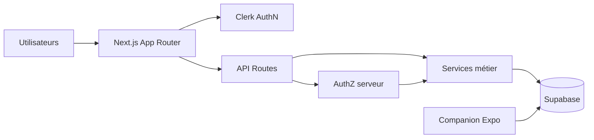
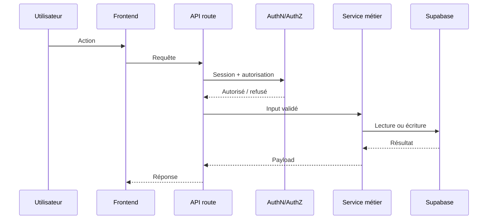
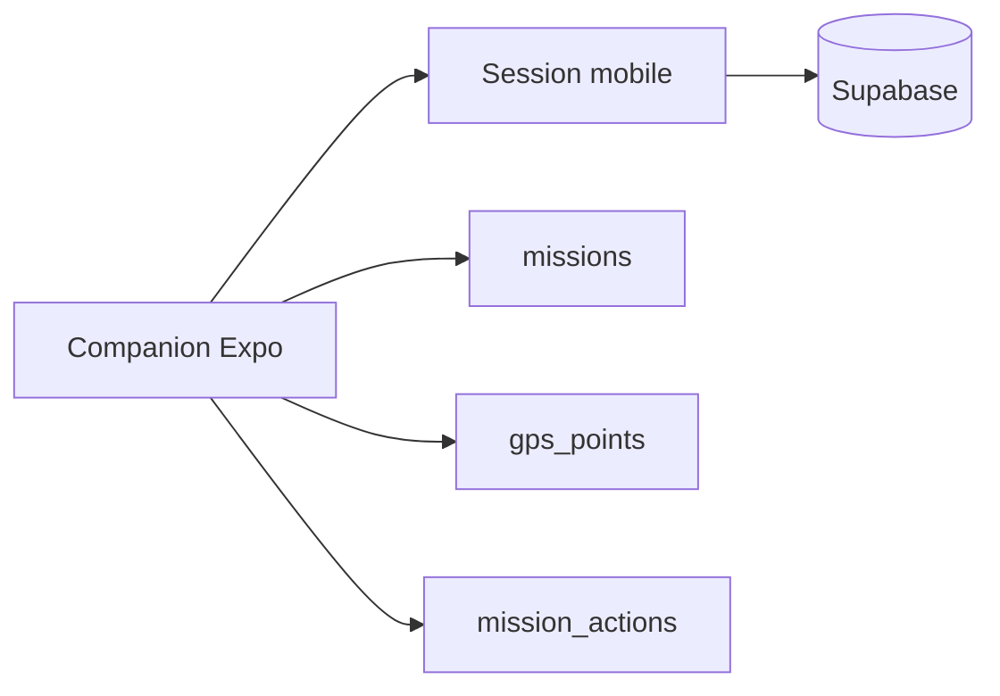

# System overview

## Vue runtime

## Responsabilités

| Couche | Responsabilité |
|---|---|
| `apps/web/src/app/` | pages et handlers API |
| `apps/web/src/components/` | rendu UI |
| `apps/web/src/lib/` | logique métier, auth, data, services |
| Clerk | identité web principale |
| Supabase | PostgreSQL, RLS, Storage, RPC |
| Vercel | hébergement et Functions |
| `companion-app/` | suivi GPS natif |
| `maintenance/python/` | maintenance hors runtime principal |

## Flux web

## Flux mobile

### Limite actuelle

L'identité mobile et la finalisation de distance doivent être stabilisées avant production :

- Clerk est l'identité principale du projet ;
- une identité Supabase anonyme ne doit pas être assimilée implicitement à un profil Clerk ;
- `compute_mission_distance` ne doit pas être appelée directement par un client si son droit d'exécution reste réservé à `service_role`.

Voir `ADR-004` et `ADR-006`.

## Zones critiques à lire en premier

1. `apps/web/src/lib/authz.ts`
2. `apps/web/src/lib/auth/protected-routes.ts`
3. `apps/web/src/proxy.ts`
4. `apps/web/src/lib/actions/data-contract.ts`
5. `apps/web/src/lib/actions/unified-source.ts`
6. `apps/web/src/lib/actions/types.ts`
7. `apps/web/src/app/api/admin/`
8. `apps/web/supabase/migrations/`

## Règle de lecture rapide

- localiser le flux ;
- ouvrir les fichiers pivots ;
- consulter l'ADR pertinent ;
- éviter la lecture exhaustive du dépôt avant d'avoir identifié l'impact réel.
