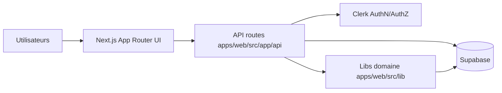
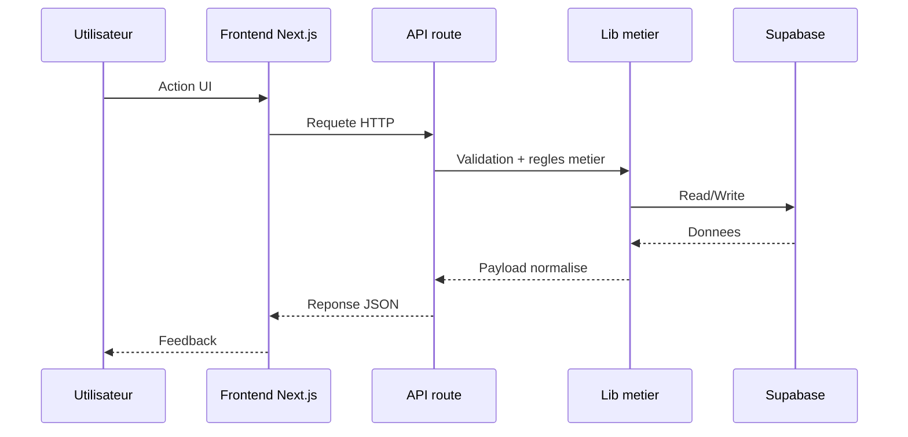

# System overview

## Vue globale runtime

Fallback statique:
```md

```

## Flux front -> API -> data

Fallback statique:
```md

```

## Zones critiques a lire en premier
1. `apps/web/src/lib/authz.ts`
2. `apps/web/src/lib/auth/protected-routes.ts`
3. `apps/web/src/proxy.ts`
4. `apps/web/src/lib/actions/data-contract.ts`
5. `apps/web/src/lib/actions/unified-source.ts`
6. `apps/web/src/app/api/admin/moderation/route.ts`

## Regle de lecture rapide
- Commencer par ce document, puis ouvrir uniquement les fichiers du flux concerne.
- Eviter la lecture exhaustive du repo avant de localiser le point d'impact.
