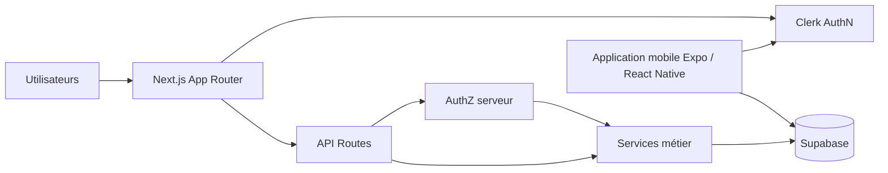
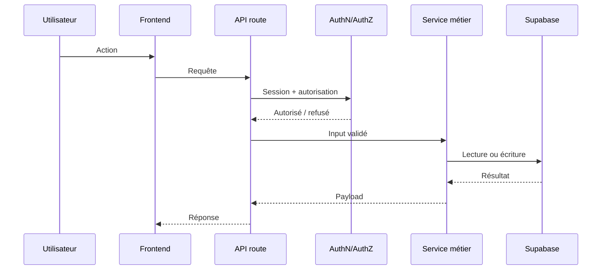
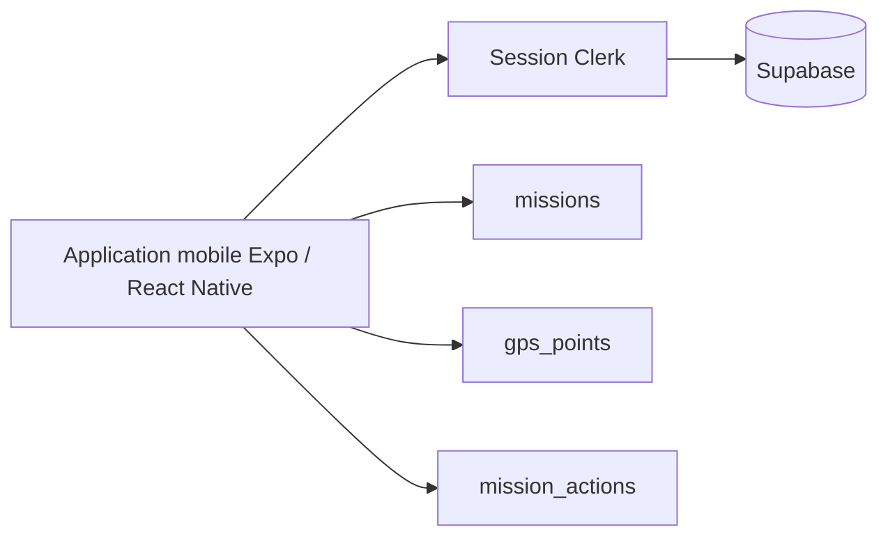

# System overview

## Vue runtime

```mermaid
flowchart LR
  U[Utilisateurs] --> WEB[Next.js App Router]
  WEB --> CLERK[Clerk AuthN]
  WEB --> API[API Routes]
  API --> AUTHZ[AuthZ serveur]
  API --> DOMAIN[Services métier]
  AUTHZ --> DOMAIN
  DOMAIN --> SB[(Supabase)]
  MOBILE[Application mobile Expo / React Native] --> CLERK
  MOBILE --> SB
```

## Responsabilités

| Couche | Responsabilité |
|---|---|
| `apps/web/src/app/` | pages et handlers API |
| `apps/web/src/components/` | rendu UI |
| `apps/web/src/lib/` | logique métier, auth, data, services |
| Clerk | identité partagée web et mobile, principale pour le produit |
| Supabase | PostgreSQL, RLS, Storage, RPC |
| Vercel | hébergement et Functions |
| `apps/mobile/` | suivi GPS natif |
| `maintenance/python/` | maintenance hors runtime principal |

## Flux web

```mermaid
sequenceDiagram
  participant User as Utilisateur
  participant Front as Frontend
  participant API as API route
  participant Auth as AuthN/AuthZ
  participant Domain as Service métier
  participant DB as Supabase

  User->>Front: Action
  Front->>API: Requête
  API->>Auth: Session + autorisation
  Auth-->>API: Autorisé / refusé
  API->>Domain: Input validé
  Domain->>DB: Lecture ou écriture
  DB-->>Domain: Résultat
  Domain-->>API: Payload
  API-->>Front: Réponse
```

## Flux mobile

```mermaid
flowchart LR
  APP[Application mobile Expo / React Native] --> AUTH[Session Clerk]
  AUTH --> SB[(Supabase)]
  APP --> M[missions]
  APP --> GPS[gps_points]
  APP --> ACT[mission_actions]
```

### État actuel et limites

CleanMyMap est un seul produit et un seul monorepo avec deux applications
déployables distinctes sous `apps/`. Le web et le mobile partagent Clerk,
Supabase et les contrats métier nécessaires. L'identité Clerk et la
finalisation des métriques par trigger invoker sont désormais finalisées puis
gelées ; elles ne constituent plus des lots de conception.

Les limites encore ouvertes sont :

- le traitement background headless ;
- la gestion complète de `mission_actions` ;
- la validation opérationnelle ;
- la future évolution produit de l'application mobile.

Les invariants de sécurité restent :

- Clerk est l'identité principale du projet ;
- une identité Supabase anonyme ne doit pas être assimilée implicitement à un profil Clerk ;
- la finalisation mobile doit passer par l'UPDATE propriétaire vers `completed` ;
  aucun client ne doit écrire directement `distance_m` ou `duration_s`.

Voir `ADR-004` et `ADR-006`.

## Zones critiques à lire en premier

1. `apps/web/src/lib/authz.ts`
2. `apps/web/src/lib/auth/protected-routes.ts`
3. `apps/web/src/proxy.ts`
4. `apps/web/src/lib/actions/data-contract.ts`
5. `apps/web/src/lib/actions/unified-source.ts`
6. `apps/web/src/lib/actions/types.ts`
7. `apps/web/src/app/api/admin/`
8. `apps/web/supabase/migrations/`

## Règle de lecture rapide

- localiser le flux ;
- ouvrir les fichiers pivots ;
- consulter l'ADR pertinent ;
- éviter la lecture exhaustive du dépôt avant d'avoir identifié l'impact réel.
