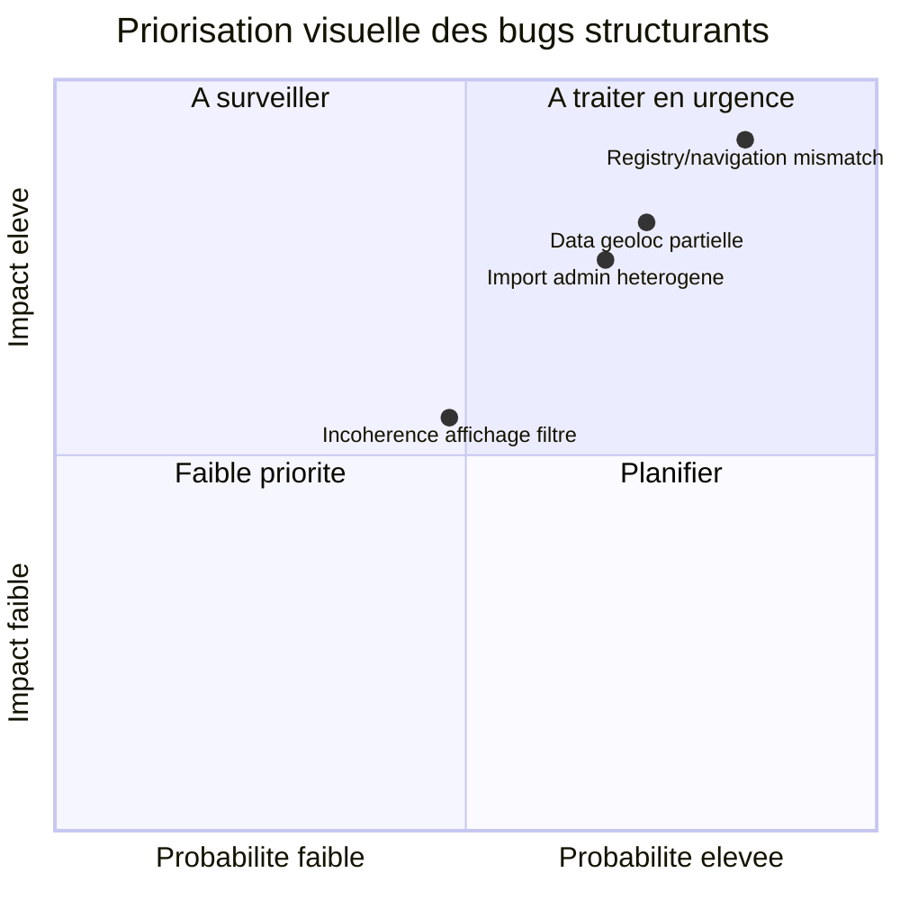

# Bugs structurants

## Matrice impact / probabilite

Fallback statique:
```md

```

- Ecarts potentiels entre registry/navigation/renderer.
- Cas limites data partielle geolocalisee.
- Robustesse des flux import admin en environnement heterogene.
