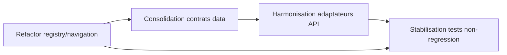

# Refactors prioritaires

## Roadmap visuelle avec dependances

Fallback statique:
```md

```

- Modularisation des zones metier encore fortement couplees.
- Harmonisation des contrats de donnees transverses (actions/spots/rapports).
- Consolidation des adaptateurs API pour limiter la duplication.
