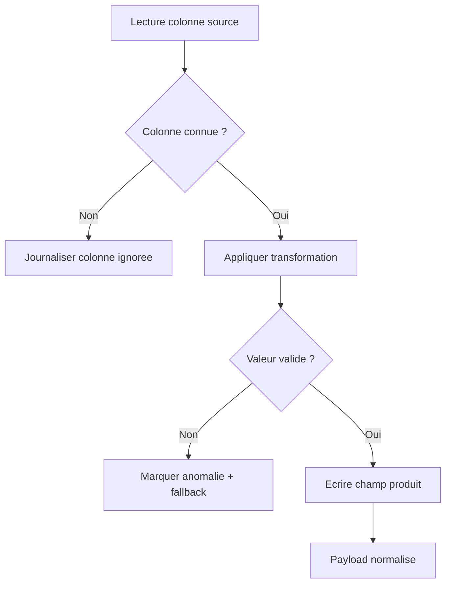

# Mapping colonnes

## Schema tabulaire de mapping
| Colonne source | Transformation | Champ produit |
|---|---|---|
| `action_date` | date ISO | `action_date` |
| `location_label` | trim + required | `location_label` |
| `latitude` + `longitude` | parse float + bornes | `geo.latitude` / `geo.longitude` |
| `association_name` | normalisation catalogue | `association_name` |
| `enterprise_name` | prefix `Entreprise -` | `enterprise_name` |
| `status` | mapping enum | `status` |
| `notes` | conserve + traces systeme | `notes` |

## Flowchart mapping source -> champ produit

Fallback statique:
```md

```

## Import admin (Google Sheet)
Voir le mapping de reference dans [pipeline-import.md](./pipeline-import.md).

## Regles de mapping
- Colonnes source explicites
- Valeurs nulles tracees
- Transformations documentees (normalisation status, association, entreprise)
