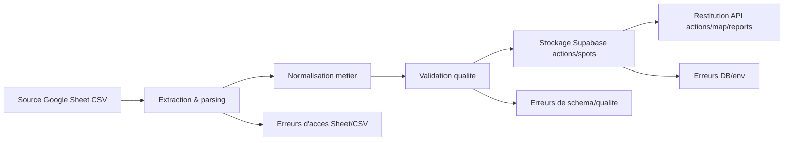
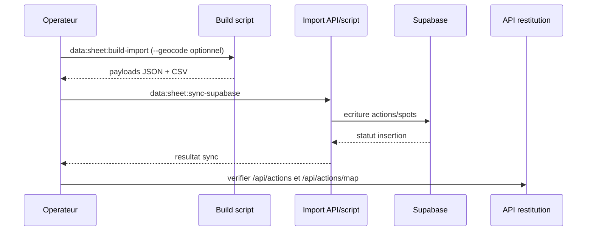
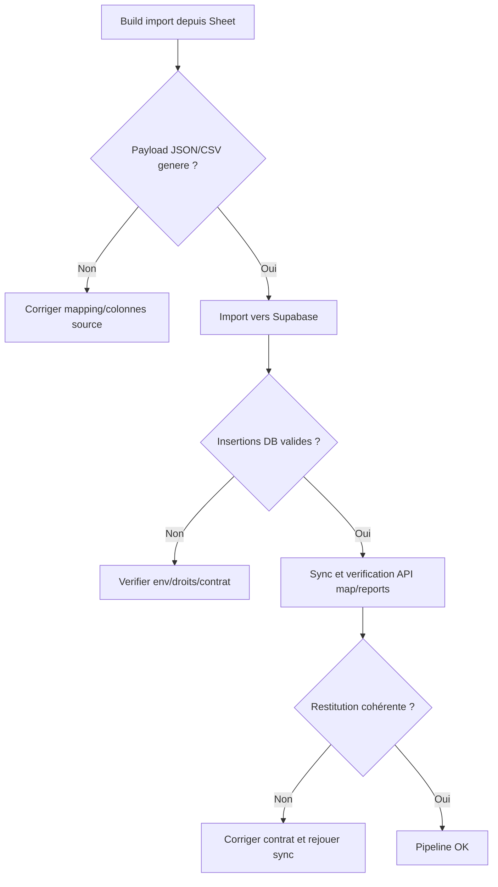
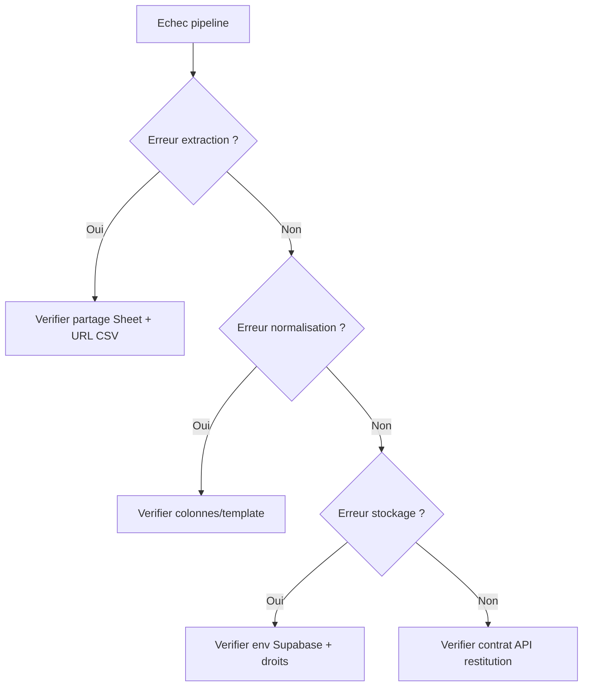

# Data pipeline import (visual-first)

## Diagramme global source -> normalisation -> stockage -> restitution

Fallback statique:
```md

```

## Etapes avec entree/sortie/erreurs connues
| Etape | Entree | Sortie | Erreurs connues |
|---|---|---|---|
| Extraction & parsing | URL CSV Google Sheet, snapshots locaux | CSV brut local | Sheet non accessible, HTML au lieu de CSV, encodage invalide |
| Normalisation metier | CSV brut + mapping colonnes | Payload JSON admin + payload lieux propres | Colonnes manquantes, types invalides, association non reconnue |
| Validation qualite | Payload normalise | Payload validable importable | Geoloc manquante/incoherente, dates invalides, champs requis absents |
| Stockage Supabase | Payload valide + env Supabase | Lignes `public.actions` et `public.spots` | `SUPABASE_SERVICE_ROLE_KEY` absente, echec insertion, conflit idempotence |
| Restitution API | Donnees stockees | `/api/actions`, `/api/actions/map`, exports reports | Contrat data casse, mismatch champs, reponse partielle |

## Sequence d'execution recommandee

Fallback statique:
```md

```

## Flowchart build -> import -> sync

Fallback statique:
```md

```

## Commandes
```bash
npm --prefix apps/web run data:sheet:build-import
npm --prefix apps/web run data:sheet:build-import -- --geocode
npm --prefix apps/web run data:sheet:sync-supabase
```

## Variables critiques
- `NEXT_PUBLIC_SUPABASE_URL`
- `SUPABASE_SERVICE_ROLE_KEY`
- `CLEANMYMAP_SHEET_URL` (si override source)

## Decision tree de depannage

Fallback statique:
```md

```
