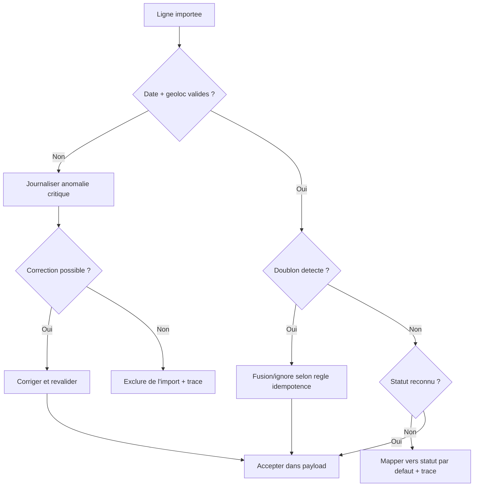

# Regles de nettoyage et cas limites

## Decision tree nettoyage / validation

Fallback statique:
```md

```

## Nettoyage
- Validation format date/coordonnees
- Filtrage des doublons source
- Standardisation des libelles organisation/zone

## Cas limites
- Donnees geoloc manquantes
- Actions rejetees/non qualifiees
- Lignes imports partielles

## Regle
- Ne jamais supprimer silencieusement: journaliser et rendre les exclusions auditable.
