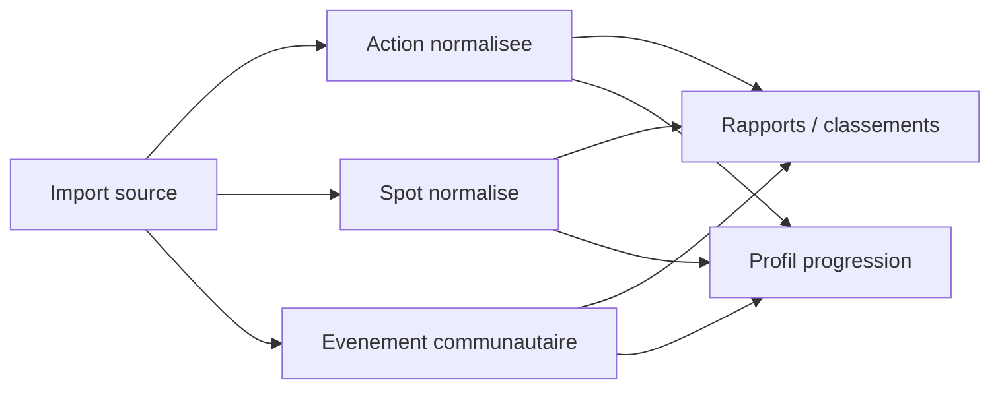

# Schema de normalisation

## Architecture entites + relations

Fallback statique:
```md

```

## Entites principales
- Action
- Spot
- Evenement communautaire
- Profil progression

## Principes
- Unifier les champs minimaux (date, localisation, statut, auteur/source)
- Normaliser les champs de volume/qualite avant agrgation
- Marquer explicitement les donnees estimees/proxy
