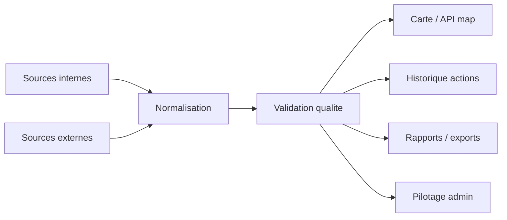

# Sources de donnees

## Flow complet sources -> normalisation -> usages

Fallback statique:
```md

```

## Sources internes
- Actions declarees (citoyens/collectifs)
- Spots et statuts de nettoyage
- Evenements communautaires et RSVPs

## Sources externes
- Imports Google Sheet admin
- Donnees contextuelles eventuelles (meteo/evenements locaux)

## Points de controle
- Traçabilite des imports
- Validation qualite avant exploitation analytique
