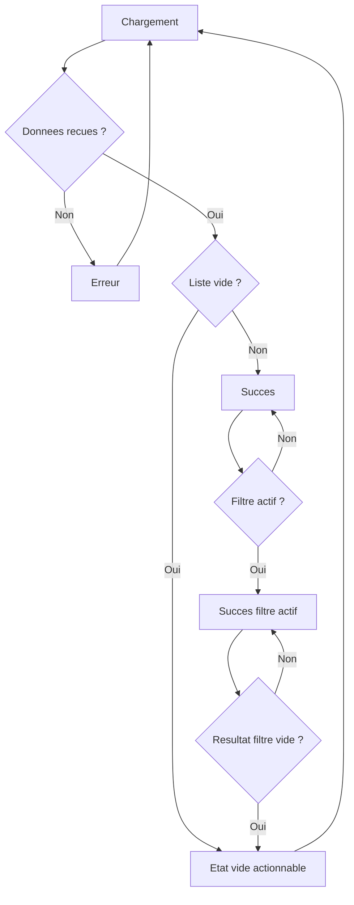

# Patterns cartes, filtres, etats

## Flowchart des etats UI et transitions

Fallback statique:
```md

```

## Cartes
- Information essentielle en premier (qui, quoi, ou, action).

## Filtres
- Filtres utiles au terrain: zone, type d'acteur, type d'action, statut.

## Etats
- Etats vides actionnables
- Etats d'erreur explicites
- Etats de chargement sobres
