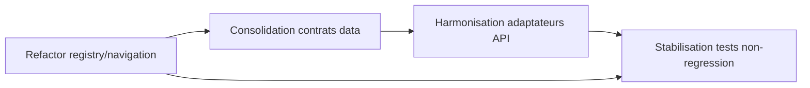

# Refactors prioritaires

## Roadmap visuelle avec dependances

Fallback statique:
```md

```

- Modularisation des zones metier encore fortement couplees.
- Harmonisation des contrats de donnees transverses (actions/spots/rapports).
- Consolidation des adaptateurs API pour limiter la duplication.

## Chantiers prioritaires TypeScript à reprendre plus tard

Ordre conseillé après stabilisation des hooks runtime et des frontières de données:

1. Réduire les warnings `@typescript-eslint/no-explicit-any` dans les grosses rubriques UI:
   - `src/components/sections/rubriques/weather-components.tsx`
   - `src/components/sections/rubriques/national-stats-section.tsx`
   - `src/components/sections/rubriques/community-section-components.tsx`
   - `src/components/sections/rubriques/recycling-components.tsx`
   - `src/components/sections/rubriques/trash-spotter-components.tsx`
2. Découper les fichiers trop volumineux et trop couplés:
   - `src/lib/authz.ts`
   - `src/lib/environmental-impact-estimator/project-signals.ts`
   - `src/lib/environmental-impact-estimator/service.ts`
   - `src/lib/supabase/storage-usage.ts`
   - `src/app/api/chat/route.ts`
3. Nettoyer les warnings de runtime React:
   - `src/app/learn/hub/page.tsx`
   - `src/components/actions/map-feed/use-map-feed-data.ts`
   - `src/components/admin/feature-flag-admin.tsx`
   - `src/components/ui/site-tooltips.tsx`
   - `src/hooks/use-form-analytics.ts`
4. Régler les warnings de surface et de contenu:
   - `src/app/reports/page.tsx`
   - `src/app/onboarding/page.tsx`
   - `src/app/(app)/missions/[id]/page.tsx`
   - `src/app/sign-in/[[...sign-in]]/page.tsx`
   - `src/app/sign-up/[[...sign-up]]/page.tsx`

## Critère de reprise

- Reprendre un chantier seulement s'il améliore la précision typée, la lisibilité ou la stabilité runtime.
- Si une correction commence à dégrader la logique, s'arrêter et créer un helper ou un type dédié.
