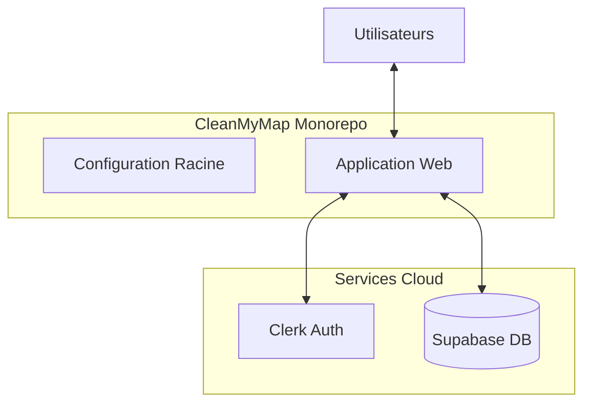
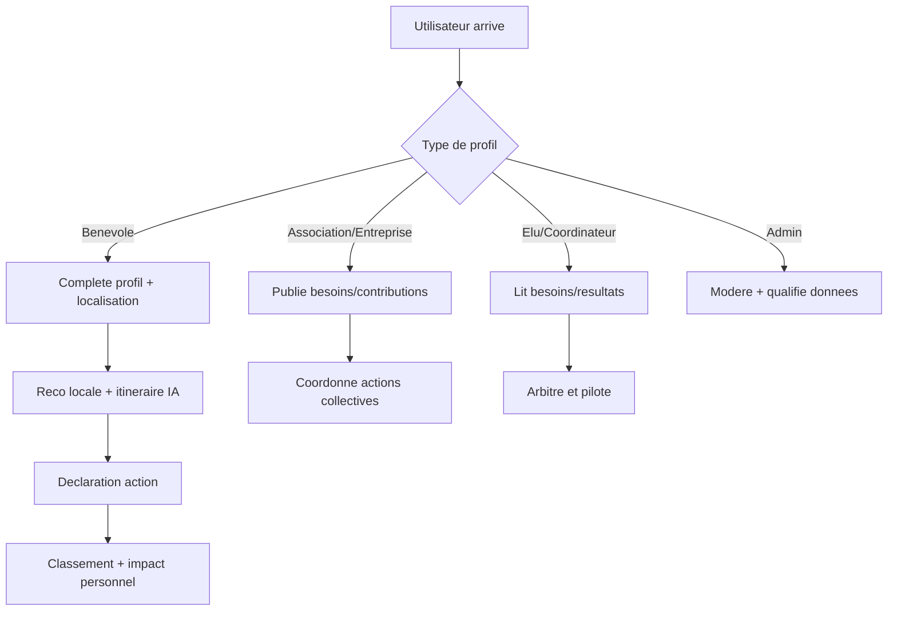
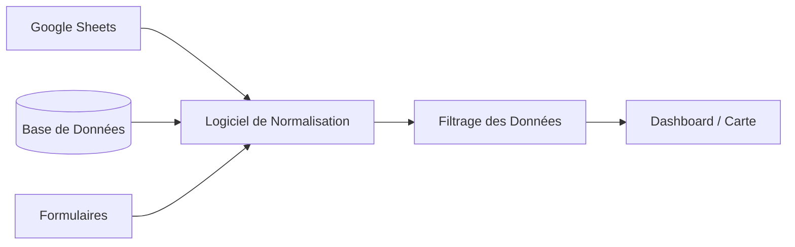
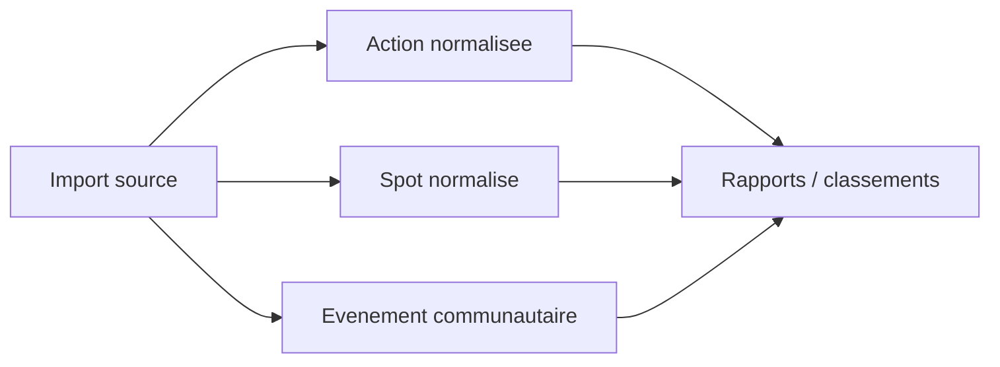
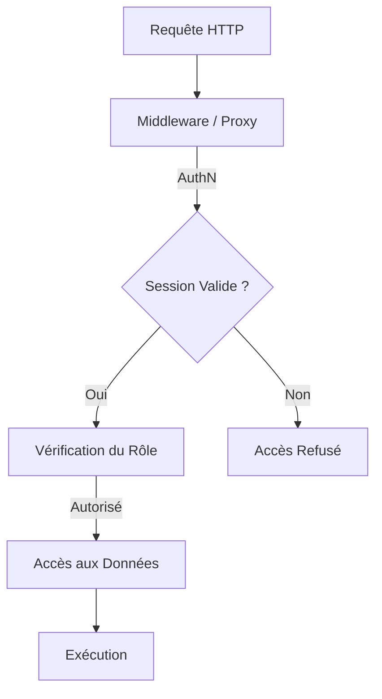
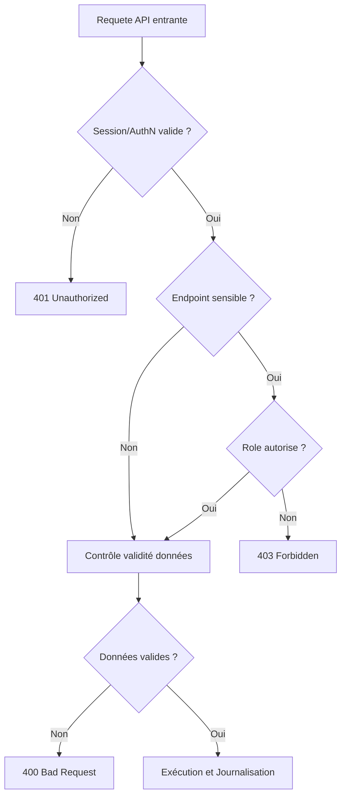
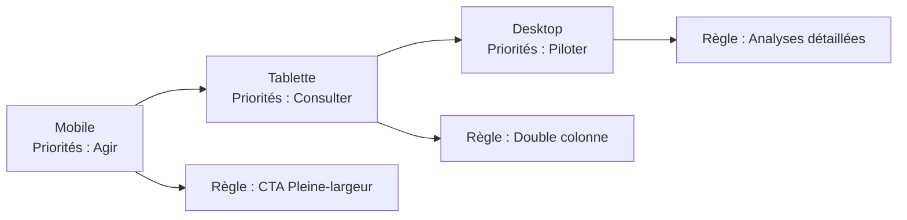

# Source des Schémas Techniques (pour Mermaid Live)

Ce document regroupe les codes sources de tous les schémas majeurs de votre projet. 
**Méthode :** Copiez le bloc de code (entre les ` ```mermaid `), collez-le sur [Mermaid.live](https://mermaid.live/), et choisissez le thème **"Neutral"** pour un rendu professionnel sobre.

---

## 1. VISION GLOBALE (Les "Incontournables")

### A. Écosystème CleanMyMap (Infrastructure)
*Utile pour : Montrer la solidité technologique et le choix des partenaires (Cloud).*


### B. Parcours Utilisateur (UX)
*Utile pour : Expliquer comment chaque rôle (Bénévole, Élu, Admin) utilise le site.*


---

## 2. DONNÉES ET IMPACT

### A. Cycle de Traitement des Données (Ingestion)
*Utile pour : Prouver la fiabilité des chiffres d'impact présentés.*


### B. Normalisation des Entités
*Utile pour : Montrer la rigueur de structure.*


---

## 3. SÉCURITÉ ET PROTECTION (RGPD)

### A. La Cascade de Sécurité (Protection des accès)
*Utile pour : Démontrer la protection de la vie privée.*


### B. Arbre de Décision API
*Utile pour : Illustrer la gestion des erreurs et des droits.*


---

## 4. CONCEPTION RESPONSIVE

### Adaptation Mobile First
*Utile pour : Montrer que le site est pensé pour le terrain (mobile).*

