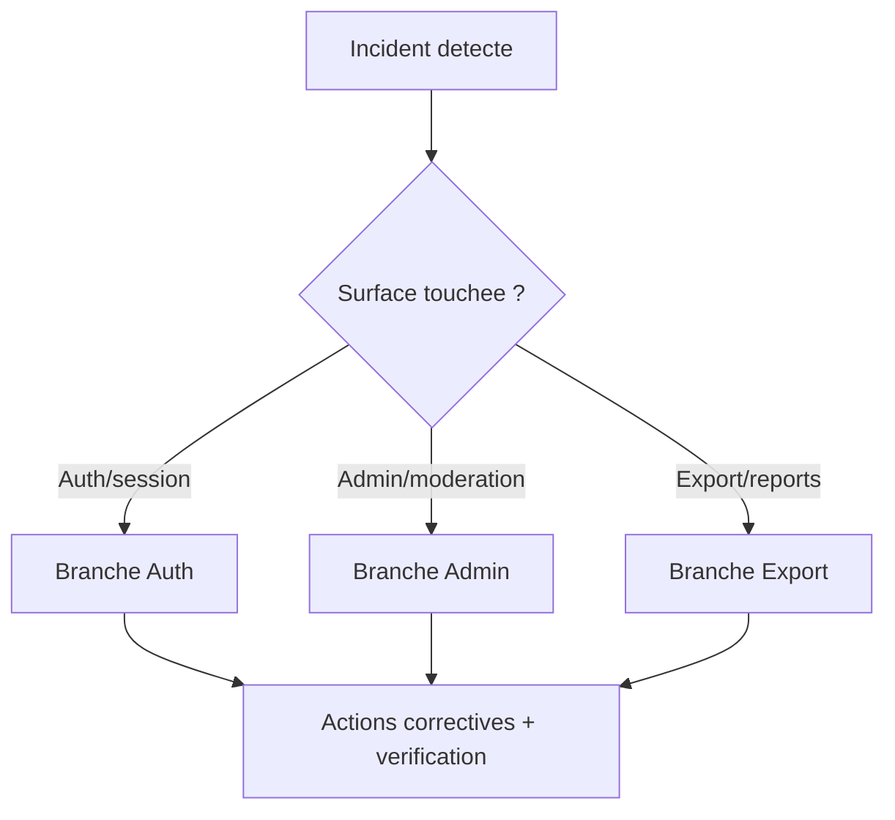
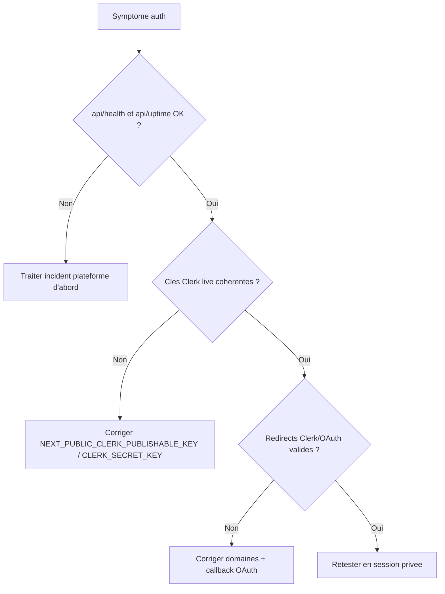
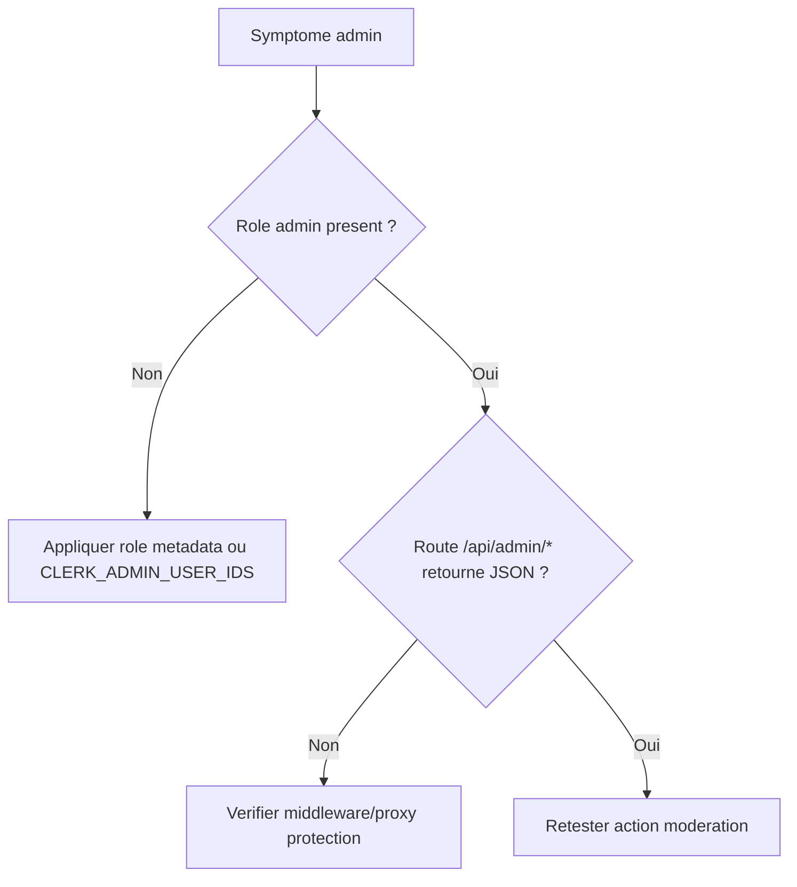
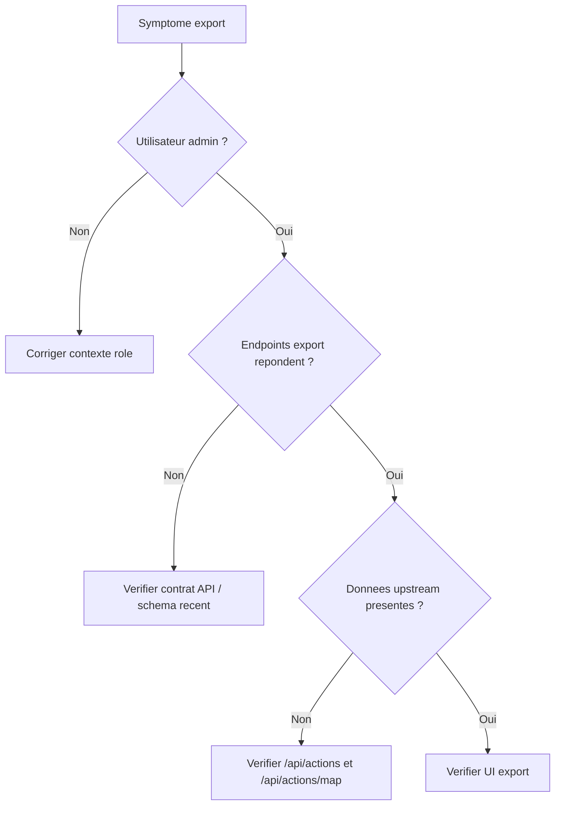
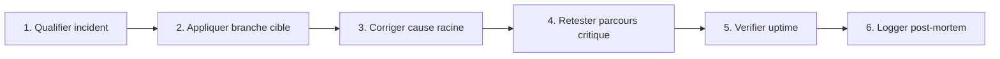
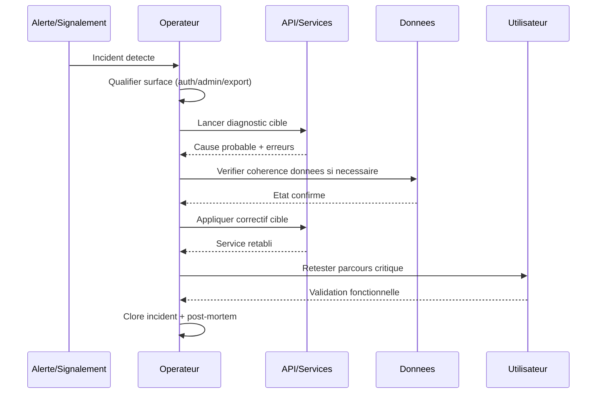

# Runbook incidents (auth/admin/export) - decision-first

## Arbre de diagnostic global

Fallback statique:
```md

```

## Branche Auth (login loop, OAuth, deconnexion)

Fallback statique:
```md

```

## Branche Admin (acces /admin ou moderation)

Fallback statique:
```md

```

## Branche Export (CSV/JSON)

Fallback statique:
```md

```

## Checklist visuelle de reprise

Fallback statique:
```md

```

## Sequence de remediation (incident -> retour stable)

Fallback statique:
```md

```

## Commandes minimales post-correctif
```bash
npm --prefix apps/web run lint
npm --prefix apps/web run build
npm run checks:changed:quick
```
