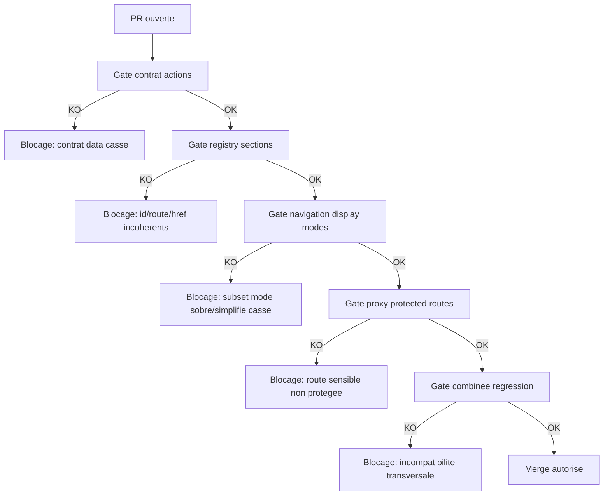

# Regression Gates (ordre d'implementation)

## But
Eviter les regressions quand des chantiers sont menes en parallele sur:
- contrat unifie actions
- registry/navigation
- auth/proxy

## Ordre obligatoire
1. Ajouter/adapter les tests de garde-fous.
2. Introduire des changements additifs et backward-compatible.
3. Migrer les consommateurs un par un.
4. Supprimer l'ancien code seulement apres validation stable.

## Gates CI minimales
- `npm run test -w apps/web -- src/lib/actions/contract-regression-gates.test.ts`
- `npm run test -w apps/web -- src/lib/sections-registry.invariants.test.ts`
- `npm run test -w apps/web -- src/lib/navigation.registry-consistency.test.ts`
- `npm run test -w apps/web -- src/proxy.protected-routes.test.ts`

## Gate combinee
- `npm run test:regression-gates -w apps/web`

## Flowchart des gates CI et points de blocage

Fallback statique:
```md

```

## Zones couvertes
- Contrat unifie: champs critiques pour carte, historique, KPI, exports.
- Registry/navigation: coherence id/route/href + subset sur modes sobre/simplifie.
- Auth/proxy: routes metier critiques toujours protegees.
