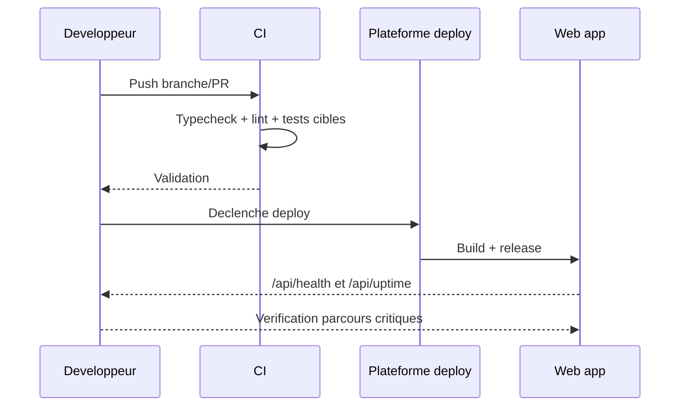

# Runbook deploiement

## Sequence deploiement (runtime web)

Fallback statique:
```md

```

## Avant deploy
- Validation locale/CI (typecheck, lint, tests cibles)
- Verification env critiques (Clerk/Supabase)

## Pendant deploy
- Suivre statut deployment (branche, root `apps/web`)
- Eviter changements paralleles non traces

## Apres deploy
- Verifier `/api/health` et `/api/uptime`
- Tester parcours critiques (auth, action, admin)
