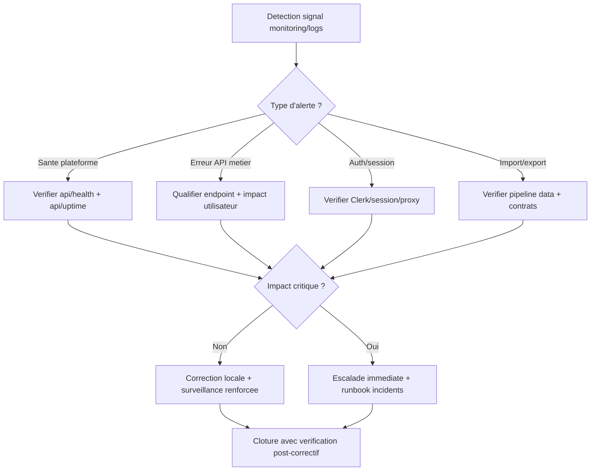

# Runbook monitoring logs

## Flowchart detection -> qualification -> escalade

Fallback statique:
```md

```

## Signaux de supervision
- `GET /api/health`
- `GET /api/uptime`

## Logs a suivre
- erreurs API metier
- erreurs auth/session
- erreurs import/export

## Escalade
- Si incident critique: appliquer le runbook `incidents-frequents-et-reprise.md`.
