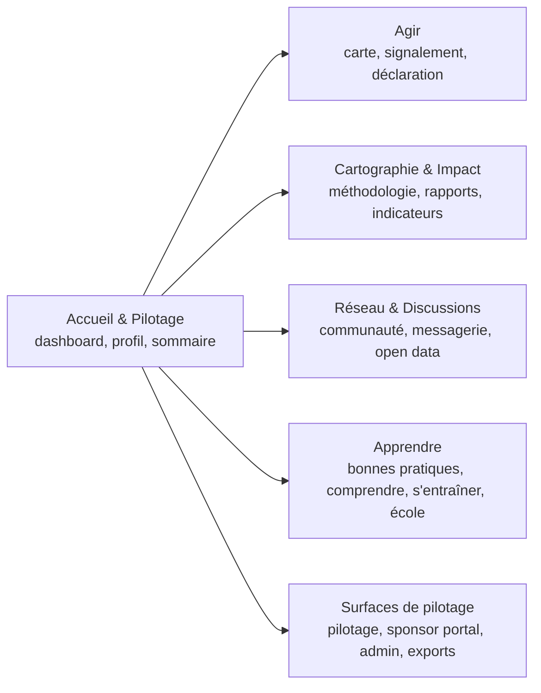

# Vision et objectifs

CleanMyMap structure l'action locale de dépollution en connectant citoyens, associations, collectivités, entreprises et acteurs de supervision.

## Architecture produit actuelle

Fallback statique:
```md

```

## Objectifs produit
- Accélérer les actions concrètes de terrain
- Rendre l'impact lisible, sourcé et exportable
- Conserver un réseau local actif et utile
- Donner des repères pédagogiques simples aux nouveaux venus

## Problème central

Le problème principal est la dissociation entre la réalité visible des déchets dans l'espace public et la capacité des acteurs locaux à agir vite, de manière coordonnée et mesurable.

Trois freins dominants structurent ce besoin :

- dispersion de l'information ;
- faible continuité de mobilisation ;
- difficulté de priorisation locale.

## Impact visé

L'objectif n'est pas seulement de signaler des déchets, mais de soutenir une boucle complète :

- action de terrain ;
- déclaration et valorisation d'une action ;
- coordination collective ;
- lecture de l'impact ;
- production de livrables exploitables.

## Bénéfices attendus

### Impact actuel

- base applicative fonctionnelle pour la collecte, la carte et le suivi ;
- parcours orientés par les rôles et les objectifs ;
- livrables et exports déjà utiles pour le pilotage.

### Impact potentiel

- meilleure continuité des actions locales ;
- meilleure priorisation territoriale ;
- meilleure exploitabilité institutionnelle des données ;
- coordination collective plus lisible entre citoyens, associations et acteurs publics.
