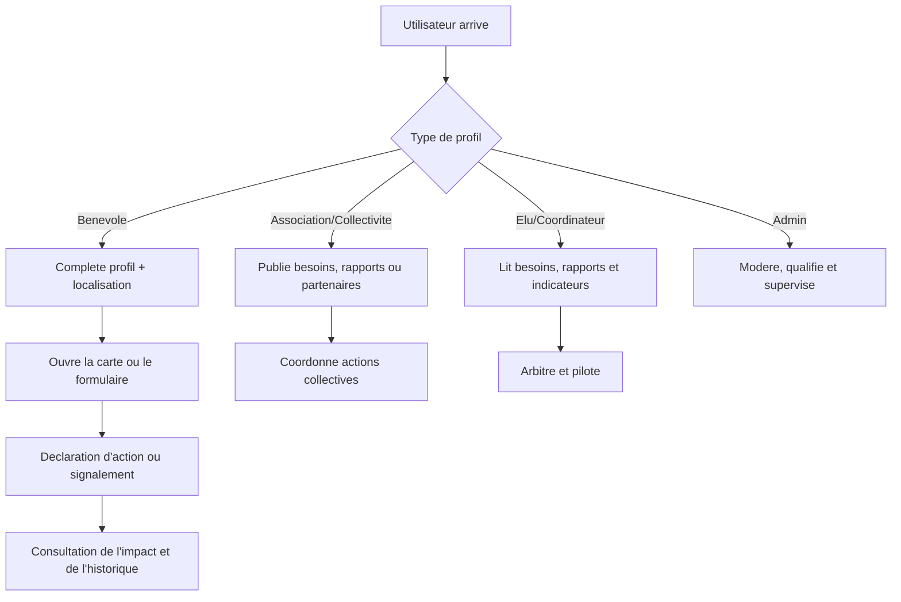

# Parcours utilisateurs

## Vue flowchart (parcours actuel)

Fallback statique:
```md

```

## Benevole
- Rejoint la plateforme, complete son profil et accede vite a la carte ou au formulaire.
- Contribue au signalement, a la declaration d'action et au suivi de l'impact.

## Association / collectivité / entreprise
- Se reference, publie ses besoins ou ses actions, puis coordonne les contributions.
- Utilise les rapports, la cartographie et les partenaires pour structurer la mobilisation.

## Elu / coordinateur
- Consulte les besoins, les rapports et les indicateurs -> arbitre -> pilote.
- Utilise les resultats pour prioriser, arbitrer et soutenir les actions utiles.

## Admin
- Modere, qualifie les donnees et maintient la gouvernance.
- Assume la supervision, la qualite des donnees et la coherence des livrables.

## Publics concernes

- Benevoles et citoyens contributeurs
- Coordinateurs associatifs
- Decideurs locaux et collectivites
- Acteurs de supervision et moderation
- Publics secondaires : partenaires, scolaires, structures de sensibilisation
- Les pages `learn/ecole` et `open-data` servent aussi de passerelles d'entrée pour la sensibilisation et la lecture publique.

## Acteurs impliques et responsabilites

- **Citoyens** : signalement, participation, execution terrain
- **Associations** : animation, coordination, suivi local
- **Collectivites** : arbitrage, priorisation, soutien institutionnel
- **Equipe projet / admin** : qualite des donnees, moderation, consolidation des livrables
