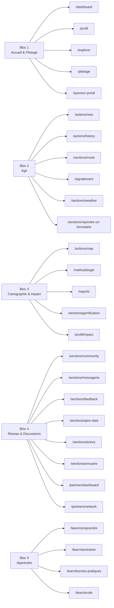

# Matrice rubriques

## Structure en 5 blocs (homepage)

## Familles autonomes

- Auth & Onboarding : `/sign-in`, `/sign-up`, `/onboarding`, `/onboarding/localisation`
- Institutionnel & Légal : `/contact`, `/conditions-*`, `/mentions-legales`, `/politique-*`, `/en`
- Système & Utilitaires : `/reglages`, `/form-comparison`, `/declaration-simple`, `/preview/actions/new`, `/error/429`
- Admin & Super-admin : `/admin`, `/admin/forms`, `/admin/services`, `/admin/godmode`
- Print & Export : `/prints/report`

## Correspondance bloc -> usage

| Bloc | Teinte | Rôle principal | Sortie attendue |
|---|---|---|---|
| Accueil & Pilotage | `amber` / `brun` | Entrée personnelle + gouvernance | reprendre, piloter, administrer |
| Agir | `emerald` | Passage à l'action terrain | déclaration, itinéraire, signalement |
| Cartographie & Impact | `sky` / `red` | Lecture territoriale + preuve | carte, rapports, méthodologie, badges |
| Réseau & Discussions | `indigo` | Mise en relation | partenaires, messagerie, open data, communauté |
| Apprendre | `yellow` | Montée en compétence | point de départ, quiz, guides, école |

## Blocs fusionnés (ancienne structure)

| Ancien bloc | Fusionné dans |
|---|---|
| Piloter | Bloc 1 — Accueil & Pilotage |
| Impact | Bloc 3 — Cartographie & Impact |
| Discussion | Bloc 4 — Réseau & Discussions |

## Source technique

- `apps/web/src/lib/navigation.ts`
- `documentation/pages_site/INDEX.md`

## Routes canoniques et alias

- `/explorer` et `/reports` sont les routes canoniques des pages Sommaire et Rapports.
- `/sections/feedback`, `/sections/community`, `/sections/messagerie`, `/sections/open-data` et `/sections/actors` sont les routes canoniques des sections publiques correspondantes.
- `/community`, `/messagerie`, `/open-data`, `/partners/network` et `/partners/network/pepite` restent des alias legacy ou des redirections techniques.
- `/declaration` redirige vers `/actions/new` et reste un alias legacy.
- `/sections/guide` redirige vers `/sections/weather`.
- `/learn/hub` et `/learn/ressources` sont des surfaces intégrées, plus des pages autonomes.
- `/observatoire` et `/sections/sandbox` ne sont plus des routes UI canoniques du repo actuel.

## Règle de maintenance

Quand un bloc change, mettre à jour cette matrice en même temps que `rubriques_utilite_impact_.md` et le registre de navigation. La matrice n'est pas un commentaire : c'est un contrat de navigation.
