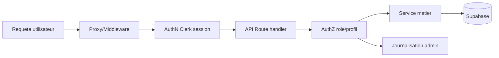
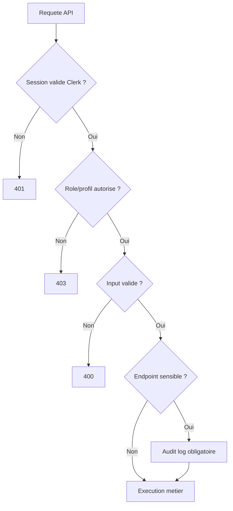
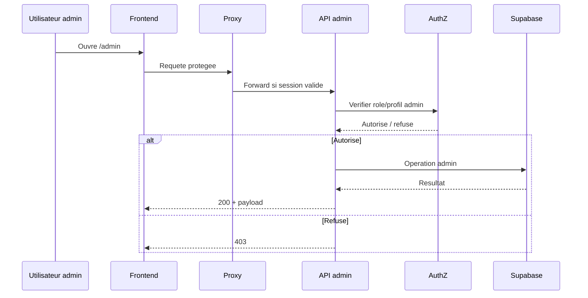

# AuthN/AuthZ + secrets + API boundaries

## Schema unifie (un ecran)
```mermaid
flowchart LR
  U[Utilisateur] --> UI[Frontend Next.js]
  UI --> CL[Clerk AuthN]
  UI --> API[API Routes]
  API --> AZ[AuthZ roles/profils]
  AZ --> ADM[/api/admin/*]
  AZ --> PUB[/api/actions|community|reports]
  API --> SB[(Supabase)]
  SEC[Secrets env] --> API
  SEC --> CL
```
Fallback statique:
```md

```

## Architecture des couches AuthN/AuthZ

Fallback statique:
```md

```

## Points de vigilance (visibles en un ecran)

Fallback statique:
```md

```

## Boundaries de securite a ne pas casser
| Boundary | Regle | Fichiers pivots |
|---|---|---|
| Secrets | jamais en clair dans git | `.env*`, runtime env |
| AuthN | session Clerk obligatoire sur routes protegees | `apps/web/src/lib/auth/*` |
| AuthZ | roles/profils verifies cote serveur | `apps/web/src/lib/authz.ts` |
| Middleware | routes sensibles filtrees avant handler | `apps/web/src/proxy.ts` |
| Admin API | acces strictement admin + audit | `apps/web/src/app/api/admin/*` |

## Checklist rapide avant merge/deploy
1. Verifier variables `CLERK_*` et `SUPABASE_*`.
2. Verifier protections `/admin` et `/api/admin/*`.
3. Verifier retours 401/403/400 sur cas invalides.
4. Verifier journalisation des operations sensibles.
5. Verifier que les endpoints publics n'exposent pas de donnees admin.

## Sequence acces admin

Fallback statique:
```md

```
