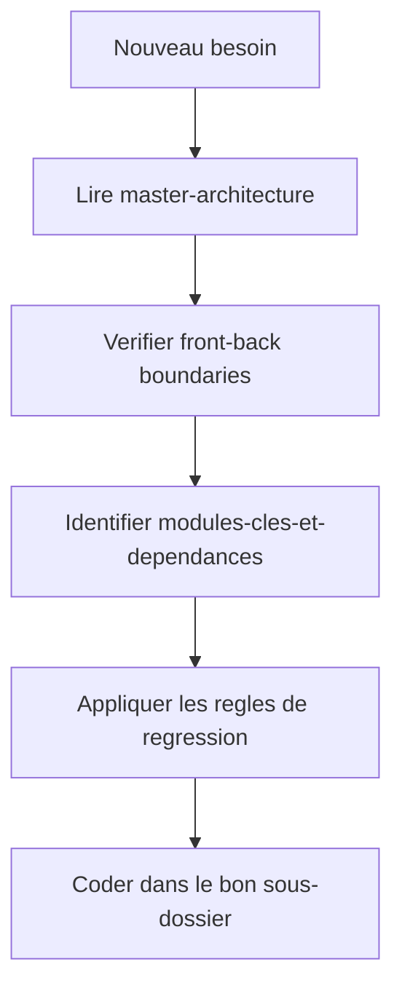
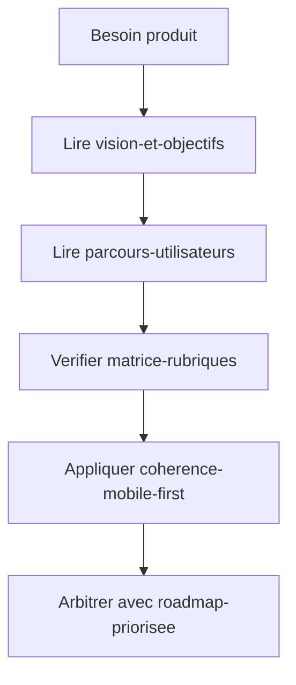
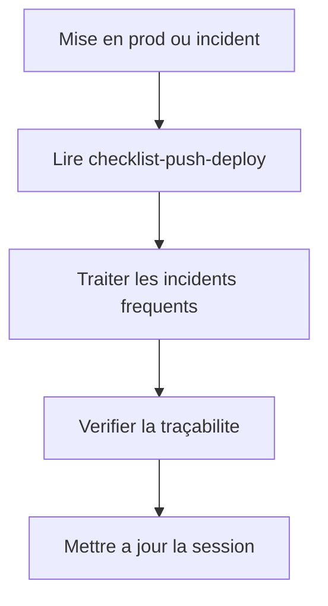

# Index par objectif

Ce document sert de table d'orientation pour aller du besoin a la bonne documentation, sans partir du mauvais dossier.

## 1. Construire une fonctionnalite

1. [architecture/master-architecture.md](./architecture/master-architecture.md)
2. [architecture/system-overview.md](./architecture/system-overview.md)
3. [architecture/frontend-backend-boundaries.md](./architecture/frontend-backend-boundaries.md)
4. [architecture/modules-cles-et-dependances.md](./architecture/modules-cles-et-dependances.md)
5. [development/regression-gates.md](./development/regression-gates.md)
6. [development/QUALITY_GUIDE.md](./development/QUALITY_GUIDE.md)

## 2. Verifier le produit

1. [product/vision-et-objectifs.md](./product/vision-et-objectifs.md)
2. [product/parcours-utilisateurs.md](./product/parcours-utilisateurs.md)
3. [product/matrice-rubriques.md](./product/matrice-rubriques.md)
4. [product/coherence-mobile-first.md](./product/coherence-mobile-first.md)
5. [product/SCIENTIFIC_PROTOCOL.md](./product/SCIENTIFIC_PROTOCOL.md)
6. [product/roadmap-priorisee.md](./product/roadmap-priorisee.md)

## 3. Publier et maintenir

1. [operations/checklist-push-deploy.md](./operations/checklist-push-deploy.md)
2. [operations/incidents-frequents-et-reprise.md](./operations/incidents-frequents-et-reprise.md)
3. Runbook de session interne
4. [architecture/traceability-matrix.md](./architecture/traceability-matrix.md)

## 4. Zones sensibles

Quand une modification touche aux routes, aux permissions, aux exports ou aux donnees, lire aussi :

1. [security/api-vigilance.md](./security/api-vigilance.md)
2. [security/authz-authn-regles.md](./security/authz-authn-regles.md)
3. [operations/pre-release-security-check.md](./operations/pre-release-security-check.md)
