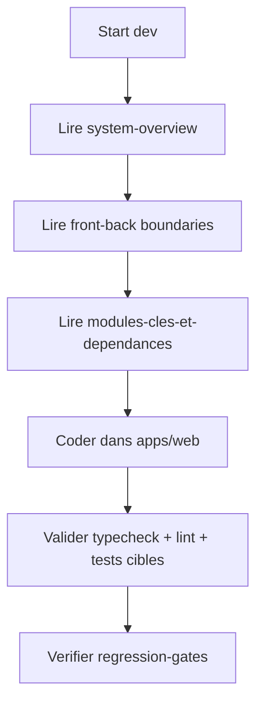
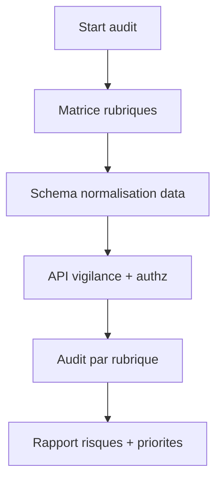
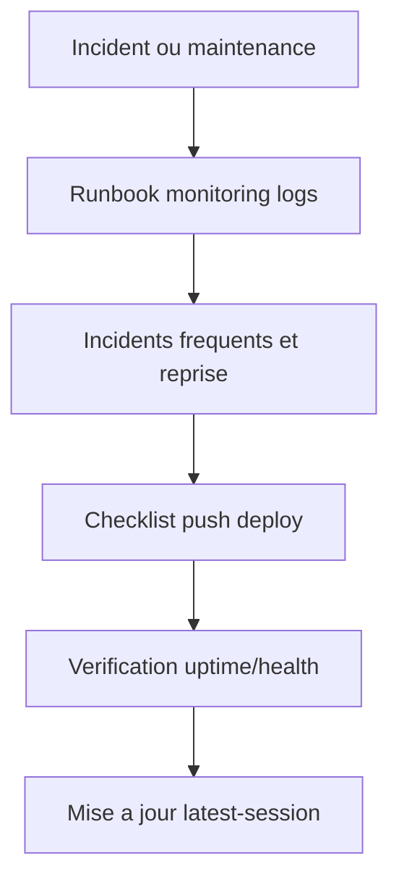

# Index par objectif

## Parcours visuel developpement (comprendre ou agir en < 5 min)

Fallback statique:
```md

```
1. [architecture/system-overview.md](./architecture/system-overview.md)
2. [architecture/frontend-backend-boundaries.md](./architecture/frontend-backend-boundaries.md)
3. [architecture/modules-cles-et-dependances.md](./architecture/modules-cles-et-dependances.md)
4. [exploitation/regression-gates.md](./exploitation/regression-gates.md)

## Parcours visuel audit

Fallback statique:
```md

```
1. [produit/matrice-rubriques.md](./produit/matrice-rubriques.md)
2. [data/schema-normalisation.md](./data/schema-normalisation.md)
3. [securite/api-vigilance.md](./securite/api-vigilance.md)
4. [audit_rubrique/](./audit_rubrique)

## Parcours visuel maintenance / production

Fallback statique:
```md

```
1. [exploitation/runbook-monitoring-logs.md](./exploitation/runbook-monitoring-logs.md)
2. [exploitation/incidents-frequents-et-reprise.md](./exploitation/incidents-frequents-et-reprise.md)
3. [securite/checklist-push-deploy.md](./securite/checklist-push-deploy.md)
4. [du/session/latest-session.md](./du/session/latest-session.md)
