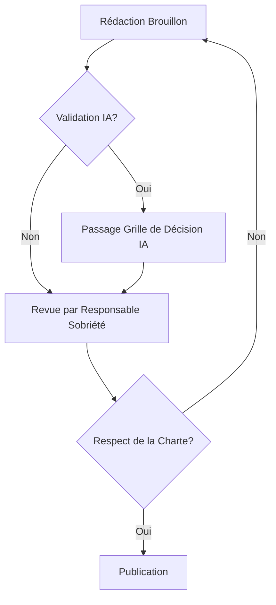

# Workflow de Validation des Contenus Environnementaux

Ce workflow garantit que toute communication liée à l'impact environnemental de CleanMyMap est fiable, transparente et exempte de "greenwashing".

## 1. Processus de Publication

## 2. Rôles et Responsabilités
- **Auteur** : Rédige le contenu en s'appuyant sur les données brutes (IUR).
- **Responsable Sobriété** : Vérifie l'exactitude des chiffres et la clarté des limites (incertitudes).
- **Validateur Institutionnel** : S'assure de l'alignement avec les valeurs du projet (DU).

## 3. Critères de Clarté (Audit G)
- **Fait vs Hypothèse** : Distinguer clairement ce qui est mesuré de ce qui est estimé.
- **Preuves** : Chaque chiffre doit être lié à une source (ex: `cicd-metrics-report.md`).
- **Accessibilité** : Utiliser un vocabulaire simple (ex: éviter les termes trop techniques comme "Hydration JS" sans explication).

## 4. Maintenance des Messages
Une revue trimestrielle des messages clés est obligatoire pour refléter l'évolution réelle de l'impact numérique du projet.
